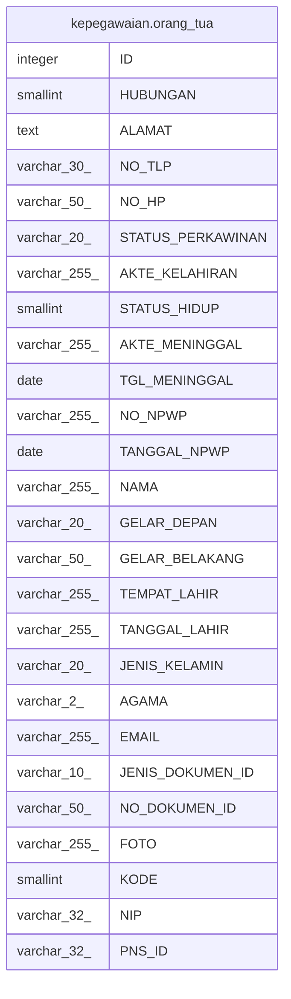

# kepegawaian.orang_tua

## Description

## Columns

| Name | Type | Default | Nullable | Children | Parents | Comment |
| ---- | ---- | ------- | -------- | -------- | ------- | ------- |
| ID | integer | nextval('kepegawaian."orang_tua_ID_seq"'::regclass) | false |  |  |  |
| HUBUNGAN | smallint |  | true |  |  |  |
| ALAMAT | text |  | true |  |  |  |
| NO_TLP | varchar(30) |  | true |  |  |  |
| NO_HP | varchar(50) |  | true |  |  |  |
| STATUS_PERKAWINAN | varchar(20) |  | true |  |  |  |
| AKTE_KELAHIRAN | varchar(255) |  | true |  |  |  |
| STATUS_HIDUP | smallint |  | true |  |  |  |
| AKTE_MENINGGAL | varchar(255) |  | true |  |  |  |
| TGL_MENINGGAL | date |  | true |  |  |  |
| NO_NPWP | varchar(255) |  | true |  |  |  |
| TANGGAL_NPWP | date |  | true |  |  |  |
| NAMA | varchar(255) |  | true |  |  |  |
| GELAR_DEPAN | varchar(20) |  | true |  |  |  |
| GELAR_BELAKANG | varchar(50) |  | true |  |  |  |
| TEMPAT_LAHIR | varchar(255) |  | true |  |  |  |
| TANGGAL_LAHIR | varchar(255) |  | true |  |  |  |
| JENIS_KELAMIN | varchar(20) |  | true |  |  |  |
| AGAMA | varchar(2) |  | true |  |  |  |
| EMAIL | varchar(255) |  | true |  |  |  |
| JENIS_DOKUMEN_ID | varchar(10) |  | true |  |  |  |
| NO_DOKUMEN_ID | varchar(50) |  | true |  |  |  |
| FOTO | varchar(255) |  | true |  |  |  |
| KODE | smallint |  | true |  |  | 1=AYAH 2=IBU |
| NIP | varchar(32) |  | true |  |  |  |
| PNS_ID | varchar(32) |  | true |  |  |  |

## Constraints

| Name | Type | Definition |
| ---- | ---- | ---------- |
| orang_tua_pkey | PRIMARY KEY | PRIMARY KEY ("ID") |

## Indexes

| Name | Definition |
| ---- | ---------- |
| orang_tua_pkey | CREATE UNIQUE INDEX orang_tua_pkey ON kepegawaian.orang_tua USING btree ("ID") |

## Relations

---

> Generated by [tbls](https://github.com/k1LoW/tbls)
