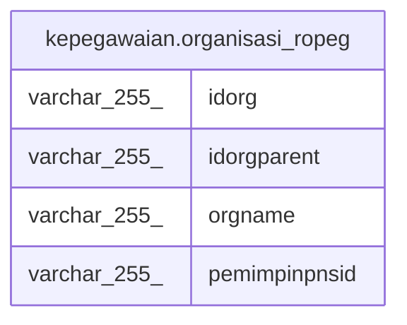

# kepegawaian.organisasi_ropeg

## Description

<details>
<summary><strong>Table Definition</strong></summary>

```sql
CREATE VIEW organisasi_ropeg AS (
 WITH RECURSIVE org AS (
         SELECT unitkerja."ID" AS idorg,
            unitkerja."DIATASAN_ID" AS idorgparent,
            unitkerja."NAMA_UNOR" AS orgname,
            unitkerja."PEMIMPIN_PNS_ID" AS pemimpinpnsid
           FROM kepegawaian.unitkerja
          WHERE ((unitkerja."ID")::text = '8ae483a8641f817901641fce97d21d1b'::text)
        UNION
         SELECT e."ID",
            e."DIATASAN_ID",
            e."NAMA_UNOR",
            e."PEMIMPIN_PNS_ID"
           FROM (kepegawaian.unitkerja e
             JOIN org s ON (((s.idorg)::text = (e."DIATASAN_ID")::text)))
        )
 SELECT idorg,
    idorgparent,
    orgname,
    pemimpinpnsid
   FROM org x
  ORDER BY idorg
)
```

</details>

## Columns

| Name | Type | Default | Nullable | Children | Parents | Comment |
| ---- | ---- | ------- | -------- | -------- | ------- | ------- |
| idorg | varchar(255) |  | true |  |  |  |
| idorgparent | varchar(255) |  | true |  |  |  |
| orgname | varchar(255) |  | true |  |  |  |
| pemimpinpnsid | varchar(255) |  | true |  |  |  |

## Referenced Tables

| Name | Columns | Comment | Type |
| ---- | ------- | ------- | ---- |
| [kepegawaian.unitkerja](kepegawaian.unitkerja.md) | 30 |  | BASE TABLE |
| [org](org.md) | 0 |  |  |

## Relations



---

> Generated by [tbls](https://github.com/k1LoW/tbls)
