# kepegawaian.pegawai

## Description

## Columns

| Name | Type | Default | Nullable | Children | Parents | Comment |
| ---- | ---- | ------- | -------- | -------- | ------- | ------- |
| id | integer | nextval('pegawai_id_seq'::regclass) | false |  |  |  |
| pns_id | varchar(36) |  | false | [kepegawaian.anak](kepegawaian.anak.md) [kepegawaian.pasangan](kepegawaian.pasangan.md) [kepegawaian.orang_tua](kepegawaian.orang_tua.md) [kepegawaian.riwayat_assesmen](kepegawaian.riwayat_assesmen.md) [kepegawaian.riwayat_diklat](kepegawaian.riwayat_diklat.md) [kepegawaian.riwayat_diklat_struktural](kepegawaian.riwayat_diklat_struktural.md) [kepegawaian.riwayat_golongan](kepegawaian.riwayat_golongan.md) [kepegawaian.riwayat_hukdis](kepegawaian.riwayat_hukdis.md) [kepegawaian.riwayat_jabatan](kepegawaian.riwayat_jabatan.md) [kepegawaian.riwayat_kursus](kepegawaian.riwayat_kursus.md) [kepegawaian.riwayat_pendidikan](kepegawaian.riwayat_pendidikan.md) [kepegawaian.riwayat_pindah_unit_kerja](kepegawaian.riwayat_pindah_unit_kerja.md) [kepegawaian.unit_kerja](kepegawaian.unit_kerja.md) [kepegawaian.update_mandiri](kepegawaian.update_mandiri.md) |  |  |
| nip_lama | varchar(9) |  | true |  |  |  |
| nip_baru | varchar(20) |  | true |  |  |  |
| nama | varchar(100) |  | true |  |  |  |
| gelar_depan | varchar(20) |  | true |  |  |  |
| gelar_belakang | varchar(50) |  | true |  |  |  |
| tempat_lahir_id | varchar(50) |  | true |  |  |  |
| tgl_lahir | date |  | true |  |  |  |
| jenis_kelamin | varchar(1) |  | true |  |  |  |
| agama_id | smallint |  | true |  | [kepegawaian.ref_agama](kepegawaian.ref_agama.md) |  |
| jenis_kawin_id | smallint |  | true |  | [kepegawaian.ref_jenis_kawin](kepegawaian.ref_jenis_kawin.md) |  |
| nik | varchar(20) |  | true |  |  |  |
| no_darurat | varchar(60) |  | true |  |  |  |
| no_hp | varchar(60) |  | true |  |  |  |
| email | varchar(60) |  | true |  |  |  |
| alamat | varchar(200) |  | true |  |  |  |
| npwp | varchar(20) |  | true |  |  |  |
| bpjs | varchar(20) |  | true |  |  |  |
| jenis_pegawai_id | smallint |  | true |  |  |  |
| kedudukan_hukum_id | integer |  | true |  |  |  |
| status_cpns_pns | varchar(20) |  | true |  |  |  |
| kartu_pegawai | varchar(30) |  | true |  |  |  |
| no_sk_cpns | varchar(100) |  | true |  |  |  |
| tgl_sk_cpns | date |  | true |  |  |  |
| tmt_cpns | date |  | true |  |  |  |
| tmt_pns | date |  | true |  |  |  |
| gol_awal_id | smallint |  | true |  | [kepegawaian.ref_golongan](kepegawaian.ref_golongan.md) |  |
| gol_id | smallint |  | true |  | [kepegawaian.ref_golongan](kepegawaian.ref_golongan.md) |  |
| tmt_golongan | date |  | true |  |  |  |
| mk_tahun | smallint |  | true |  |  |  |
| mk_bulan | smallint |  | true |  |  |  |
| jabatan_id | varchar(36) |  | true |  | [kepegawaian.ref_jabatan](kepegawaian.ref_jabatan.md) |  |
| tmt_jabatan | date |  | true |  |  |  |
| pendidikan_id | varchar(36) |  | true |  |  |  |
| tahun_lulus | smallint |  | true |  |  |  |
| kpkn_id | varchar(36) |  | true |  | [kepegawaian.ref_kpkn](kepegawaian.ref_kpkn.md) |  |
| lokasi_kerja_id | varchar(36) |  | true |  | [kepegawaian.ref_lokasi](kepegawaian.ref_lokasi.md) |  |
| unor_id | varchar(36) |  | true |  | [kepegawaian.unit_kerja](kepegawaian.unit_kerja.md) |  |
| unor_induk_id | varchar(36) |  | true |  |  |  |
| instansi_induk_id | varchar(36) |  | true |  | [kepegawaian.ref_instansi](kepegawaian.ref_instansi.md) |  |
| instansi_kerja_id | varchar(36) |  | true |  | [kepegawaian.ref_instansi](kepegawaian.ref_instansi.md) |  |
| satuan_kerja_induk_id | varchar(36) |  | true |  |  |  |
| satuan_kerja_kerja_id | varchar(36) |  | true |  |  |  |
| golongan_darah | varchar(10) |  | true |  |  |  |
| foto | varchar(200) |  | true |  |  |  |
| tmt_pensiun | date |  | true |  |  |  |
| lokasi_kerja | varchar(36) |  | true |  |  |  |
| jml_istri | smallint |  | true |  |  |  |
| jml_anak | smallint |  | true |  |  |  |
| no_surat_dokter | varchar(100) |  | true |  |  |  |
| tgl_surat_dokter | date |  | true |  |  |  |
| no_bebas_narkoba | varchar(100) |  | true |  |  |  |
| tgl_bebas_narkoba | date |  | true |  |  |  |
| no_catatan_polisi | varchar(100) |  | true |  |  |  |
| tgl_catatan_polisi | date |  | true |  |  |  |
| akte_kelahiran | varchar(50) |  | true |  |  |  |
| status_hidup | varchar(15) |  | true |  |  |  |
| akte_meninggal | varchar(50) |  | true |  |  |  |
| tgl_meninggal | date |  | true |  |  |  |
| no_askes | varchar(100) |  | true |  |  |  |
| no_taspen | varchar(100) |  | true |  |  |  |
| tgl_npwp | date |  | true |  |  |  |
| tempat_lahir | varchar(100) |  | true |  |  |  |
| tingkat_pendidikan_id | smallint |  | true |  | [kepegawaian.tingkat_pendidikan](kepegawaian.tingkat_pendidikan.md) |  |
| tempat_lahir_nama | varchar(200) |  | true |  |  |  |
| jenis_jabatan_nama | varchar(200) |  | true |  |  |  |
| jabatan_nama | varchar(200) |  | true |  |  |  |
| kpkn_nama | varchar(200) |  | true |  |  |  |
| instansi_induk_nama | varchar(200) |  | true |  |  |  |
| instansi_kerja_nama | varchar(200) |  | true |  |  |  |
| satuan_kerja_induk_nama | varchar(200) |  | true |  |  |  |
| satuan_kerja_nama | varchar(200) |  | true |  |  |  |
| jabatan_instansi_id | integer |  | true |  |  |  |
| bup | smallint | 58 | true |  |  |  |
| jabatan_instansi_nama | varchar(200) |  | true |  |  |  |
| jenis_jabatan_id | smallint |  | true |  |  |  |
| terminated_date | date |  | true |  |  |  |
| status_pegawai | smallint | 1 | true |  |  |  |
| jabatan_ppnpn | varchar(200) |  | true |  |  |  |
| jabatan_instansi_real_id | integer |  | true |  |  |  |
| created_by | integer |  | true |  |  |  |
| updated_by | integer |  | true |  |  |  |
| email_dikbud_bak | varchar(100) |  | true |  |  |  |
| email_dikbud | varchar(100) |  | true |  |  |  |
| kodecepat | varchar(100) |  | true |  |  |  |
| is_dosen | smallint |  | true |  |  |  |
| mk_tahun_swasta | smallint | 0 | true |  |  |  |
| mk_bulan_swasta | smallint | 0 | true |  |  |  |
| kk | varchar(30) |  | true |  |  |  |
| nidn | varchar(30) |  | true |  |  |  |
| ket | varchar(200) |  | true |  |  |  |
| no_sk_pemberhentian | varchar(100) |  | true |  |  |  |
| status_pegawai_backup | smallint |  | true |  |  |  |
| masa_kerja | varchar(50) |  | true |  |  |  |
| kartu_asn | varchar(50) |  | true |  |  |  |
| created_at | timestamp with time zone | now() | true |  |  |  |
| updated_at | timestamp with time zone | now() | true |  |  |  |
| deleted_at | timestamp with time zone |  | true |  |  |  |

## Constraints

| Name | Type | Definition |
| ---- | ---- | ---------- |
| fk_pegawai_agama | FOREIGN KEY | FOREIGN KEY (agama_id) REFERENCES ref_agama(id) |
| fk_pegawai_golongan | FOREIGN KEY | FOREIGN KEY (gol_id) REFERENCES ref_golongan(id) |
| fk_pegawai_golongan_awal | FOREIGN KEY | FOREIGN KEY (gol_awal_id) REFERENCES ref_golongan(id) |
| fk_pegawai_instansi_induk | FOREIGN KEY | FOREIGN KEY (instansi_induk_id) REFERENCES ref_instansi(id) |
| fk_pegawai_instansi_kerja | FOREIGN KEY | FOREIGN KEY (instansi_kerja_id) REFERENCES ref_instansi(id) |
| fk_pegawai_jabatan | FOREIGN KEY | FOREIGN KEY (jabatan_id) REFERENCES ref_jabatan(kode_jabatan) |
| fk_pegawai_jenis_kawin | FOREIGN KEY | FOREIGN KEY (jenis_kawin_id) REFERENCES ref_jenis_kawin(id) |
| fk_pegawai_kpkn | FOREIGN KEY | FOREIGN KEY (kpkn_id) REFERENCES ref_kpkn(id) |
| fk_pegawai_lokasi_kerja | FOREIGN KEY | FOREIGN KEY (lokasi_kerja_id) REFERENCES ref_lokasi(id) |
| pegawai_pkey | PRIMARY KEY | PRIMARY KEY (id) |
| pegawai_pns_id_key | UNIQUE | UNIQUE (pns_id) |
| fk_pegawai_pendidikan | FOREIGN KEY | FOREIGN KEY (tingkat_pendidikan_id) REFERENCES tingkat_pendidikan(id) |
| fk_pegawai_unor | FOREIGN KEY | FOREIGN KEY (unor_id) REFERENCES unit_kerja(id) |

## Indexes

| Name | Definition |
| ---- | ---------- |
| pegawai_pkey | CREATE UNIQUE INDEX pegawai_pkey ON kepegawaian.pegawai USING btree (id) |
| pegawai_pns_id_key | CREATE UNIQUE INDEX pegawai_pns_id_key ON kepegawaian.pegawai USING btree (pns_id) |

## Relations

```mermaid
erDiagram

"kepegawaian.anak" }o--o| "kepegawaian.pegawai" : "FOREIGN KEY (pns_id) REFERENCES pegawai(pns_id)"
"kepegawaian.pasangan" }o--o| "kepegawaian.pegawai" : "FOREIGN KEY (pns_id) REFERENCES pegawai(pns_id)"
"kepegawaian.orang_tua" }o--o| "kepegawaian.pegawai" : "FOREIGN KEY (pns_id) REFERENCES pegawai(pns_id)"
"kepegawaian.riwayat_assesmen" }o--o| "kepegawaian.pegawai" : "FOREIGN KEY (pns_id) REFERENCES pegawai(pns_id)"
"kepegawaian.riwayat_diklat" }o--o| "kepegawaian.pegawai" : "FOREIGN KEY (pns_orang_id) REFERENCES pegawai(pns_id)"
"kepegawaian.riwayat_diklat_struktural" }o--o| "kepegawaian.pegawai" : "FOREIGN KEY (pns_id) REFERENCES pegawai(pns_id)"
"kepegawaian.riwayat_golongan" }o--o| "kepegawaian.pegawai" : "FOREIGN KEY (pns_id) REFERENCES pegawai(pns_id)"
"kepegawaian.riwayat_hukdis" }o--o| "kepegawaian.pegawai" : "FOREIGN KEY (pns_id) REFERENCES pegawai(pns_id)"
"kepegawaian.riwayat_jabatan" }o--o| "kepegawaian.pegawai" : "FOREIGN KEY (pns_id) REFERENCES pegawai(pns_id)"
"kepegawaian.riwayat_kursus" }o--o| "kepegawaian.pegawai" : "FOREIGN KEY (pns_id) REFERENCES pegawai(pns_id)"
"kepegawaian.riwayat_pendidikan" }o--o| "kepegawaian.pegawai" : "FOREIGN KEY (pns_id) REFERENCES pegawai(pns_id)"
"kepegawaian.riwayat_pindah_unit_kerja" }o--o| "kepegawaian.pegawai" : "FOREIGN KEY (pns_id) REFERENCES pegawai(pns_id)"
"kepegawaian.unit_kerja" }o--o| "kepegawaian.pegawai" : "FOREIGN KEY (pemimpin_pns_id) REFERENCES pegawai(pns_id)"
"kepegawaian.update_mandiri" }o--o| "kepegawaian.pegawai" : "FOREIGN KEY (pns_id) REFERENCES pegawai(pns_id)"
"kepegawaian.pegawai" }o--o| "kepegawaian.ref_agama" : "FOREIGN KEY (agama_id) REFERENCES ref_agama(id)"
"kepegawaian.pegawai" }o--o| "kepegawaian.ref_jenis_kawin" : "FOREIGN KEY (jenis_kawin_id) REFERENCES ref_jenis_kawin(id)"
"kepegawaian.pegawai" }o--o| "kepegawaian.ref_golongan" : "FOREIGN KEY (gol_awal_id) REFERENCES ref_golongan(id)"
"kepegawaian.pegawai" }o--o| "kepegawaian.ref_golongan" : "FOREIGN KEY (gol_id) REFERENCES ref_golongan(id)"
"kepegawaian.pegawai" }o--o| "kepegawaian.ref_jabatan" : "FOREIGN KEY (jabatan_id) REFERENCES ref_jabatan(kode_jabatan)"
"kepegawaian.pegawai" }o--o| "kepegawaian.ref_kpkn" : "FOREIGN KEY (kpkn_id) REFERENCES ref_kpkn(id)"
"kepegawaian.pegawai" }o--o| "kepegawaian.ref_lokasi" : "FOREIGN KEY (lokasi_kerja_id) REFERENCES ref_lokasi(id)"
"kepegawaian.pegawai" }o--o| "kepegawaian.unit_kerja" : "FOREIGN KEY (unor_id) REFERENCES unit_kerja(id)"
"kepegawaian.pegawai" }o--o| "kepegawaian.ref_instansi" : "FOREIGN KEY (instansi_induk_id) REFERENCES ref_instansi(id)"
"kepegawaian.pegawai" }o--o| "kepegawaian.ref_instansi" : "FOREIGN KEY (instansi_kerja_id) REFERENCES ref_instansi(id)"
"kepegawaian.pegawai" }o--o| "kepegawaian.tingkat_pendidikan" : "FOREIGN KEY (tingkat_pendidikan_id) REFERENCES tingkat_pendidikan(id)"

"kepegawaian.pegawai" {
  integer id
  varchar_36_ pns_id
  varchar_9_ nip_lama
  varchar_20_ nip_baru
  varchar_100_ nama
  varchar_20_ gelar_depan
  varchar_50_ gelar_belakang
  varchar_50_ tempat_lahir_id
  date tgl_lahir
  varchar_1_ jenis_kelamin
  smallint agama_id FK
  smallint jenis_kawin_id FK
  varchar_20_ nik
  varchar_60_ no_darurat
  varchar_60_ no_hp
  varchar_60_ email
  varchar_200_ alamat
  varchar_20_ npwp
  varchar_20_ bpjs
  smallint jenis_pegawai_id
  integer kedudukan_hukum_id
  varchar_20_ status_cpns_pns
  varchar_30_ kartu_pegawai
  varchar_100_ no_sk_cpns
  date tgl_sk_cpns
  date tmt_cpns
  date tmt_pns
  smallint gol_awal_id FK
  smallint gol_id FK
  date tmt_golongan
  smallint mk_tahun
  smallint mk_bulan
  varchar_36_ jabatan_id FK
  date tmt_jabatan
  varchar_36_ pendidikan_id
  smallint tahun_lulus
  varchar_36_ kpkn_id FK
  varchar_36_ lokasi_kerja_id FK
  varchar_36_ unor_id FK
  varchar_36_ unor_induk_id
  varchar_36_ instansi_induk_id FK
  varchar_36_ instansi_kerja_id FK
  varchar_36_ satuan_kerja_induk_id
  varchar_36_ satuan_kerja_kerja_id
  varchar_10_ golongan_darah
  varchar_200_ foto
  date tmt_pensiun
  varchar_36_ lokasi_kerja
  smallint jml_istri
  smallint jml_anak
  varchar_100_ no_surat_dokter
  date tgl_surat_dokter
  varchar_100_ no_bebas_narkoba
  date tgl_bebas_narkoba
  varchar_100_ no_catatan_polisi
  date tgl_catatan_polisi
  varchar_50_ akte_kelahiran
  varchar_15_ status_hidup
  varchar_50_ akte_meninggal
  date tgl_meninggal
  varchar_100_ no_askes
  varchar_100_ no_taspen
  date tgl_npwp
  varchar_100_ tempat_lahir
  smallint tingkat_pendidikan_id FK
  varchar_200_ tempat_lahir_nama
  varchar_200_ jenis_jabatan_nama
  varchar_200_ jabatan_nama
  varchar_200_ kpkn_nama
  varchar_200_ instansi_induk_nama
  varchar_200_ instansi_kerja_nama
  varchar_200_ satuan_kerja_induk_nama
  varchar_200_ satuan_kerja_nama
  integer jabatan_instansi_id
  smallint bup
  varchar_200_ jabatan_instansi_nama
  smallint jenis_jabatan_id
  date terminated_date
  smallint status_pegawai
  varchar_200_ jabatan_ppnpn
  integer jabatan_instansi_real_id
  integer created_by
  integer updated_by
  varchar_100_ email_dikbud_bak
  varchar_100_ email_dikbud
  varchar_100_ kodecepat
  smallint is_dosen
  smallint mk_tahun_swasta
  smallint mk_bulan_swasta
  varchar_30_ kk
  varchar_30_ nidn
  varchar_200_ ket
  varchar_100_ no_sk_pemberhentian
  smallint status_pegawai_backup
  varchar_50_ masa_kerja
  varchar_50_ kartu_asn
  timestamp_with_time_zone created_at
  timestamp_with_time_zone updated_at
  timestamp_with_time_zone deleted_at
}
"kepegawaian.anak" {
  bigint id
  bigint pasangan_id
  varchar_100_ nama
  varchar_1_ jenis_kelamin
  date tanggal_lahir
  varchar_100_ tempat_lahir
  varchar_1_ status_anak
  varchar_36_ pns_id FK
  varchar_20_ nip
  timestamp_with_time_zone created_at
  timestamp_with_time_zone updated_at
  timestamp_with_time_zone deleted_at
}
"kepegawaian.pasangan" {
  bigint id
  smallint pns
  varchar_100_ nama
  date tanggal_menikah
  varchar_100_ akte_nikah
  date tanggal_meninggal
  varchar_100_ akte_meninggal
  date tanggal_cerai
  varchar_100_ akte_cerai
  varchar_100_ karsus
  smallint status
  smallint hubungan
  varchar_36_ pns_id FK
  varchar_20_ nip
  timestamp_with_time_zone created_at
  timestamp_with_time_zone updated_at
  timestamp_with_time_zone deleted_at
}
"kepegawaian.orang_tua" {
  integer id
  smallint hubungan
  varchar_255_ akte_meninggal
  date tgl_meninggal
  varchar_255_ nama
  varchar_20_ gelar_depan
  varchar_50_ gelar_belakang
  varchar_100_ tempat_lahir
  date tanggal_lahir
  smallint agama_id FK
  varchar_255_ email
  varchar_10_ jenis_dokumen
  varchar_100_ no_dokumen
  varchar_20_ nip
  varchar_36_ pns_id FK
  timestamp_with_time_zone created_at
  timestamp_with_time_zone updated_at
  timestamp_with_time_zone deleted_at
}
"kepegawaian.riwayat_assesmen" {
  integer id
  varchar_36_ pns_id FK
  varchar_20_ pns_nip
  smallint tahun
  varchar_200_ file_upload
  real nilai
  real nilai_kinerja
  smallint tahun_penilaian_id
  varchar_50_ tahun_penilaian_title
  varchar_100_ nama_lengkap
  varchar_20_ posisi_id
  varchar_36_ unit_org_id FK
  varchar_200_ nama_unor
  text saran_pengembangan
  varchar_200_ file_upload_fb_potensi
  varchar_200_ file_upload_lengkap_pt
  varchar_200_ file_upload_fb_pt
  smallint file_upload_exists
  varchar_36_ satker_id
  timestamp_with_time_zone created_at
  timestamp_with_time_zone updated_at
  timestamp_with_time_zone deleted_at
}
"kepegawaian.riwayat_diklat" {
  bigint id
  varchar_200_ jenis_diklat
  smallint jenis_diklat_id FK
  varchar_200_ institusi_penyelenggara
  varchar_100_ no_sertifikat
  date tanggal_mulai
  date tanggal_selesai
  smallint tahun_diklat
  smallint durasi_jam
  varchar_36_ pns_orang_id FK
  varchar_20_ nip_baru
  varchar_36_ diklat_struktural_id
  varchar_200_ nama_diklat
  text file_base64
  varchar_200_ rumpun_diklat_nama
  varchar_36_ rumpun_diklat_id
  varchar_10_ sudah_kirim_siasn
  varchar_36_ siasn_id
  timestamp_with_time_zone created_at
  timestamp_with_time_zone updated_at
  timestamp_with_time_zone deleted_at
}
"kepegawaian.riwayat_diklat_struktural" {
  varchar_36_ id
  varchar_36_ pns_id FK
  varchar_20_ pns_nip
  varchar_100_ pns_nama
  integer jenis_diklat_id FK
  varchar_200_ nama_diklat
  varchar_100_ nomor
  date tanggal
  smallint tahun
  varchar_10_ status_data
  text file_base64
  varchar_200_ keterangan_berkas
  real lama
  varchar_36_ siasn_id
  timestamp_with_time_zone created_at
  timestamp_with_time_zone updated_at
  timestamp_with_time_zone deleted_at
}
"kepegawaian.riwayat_golongan" {
  integer id
  varchar_36_ pns_id FK
  varchar_20_ pns_nip
  varchar_100_ pns_nama
  varchar_4_ kode_jenis_kp
  varchar_50_ jenis_kp
  smallint golongan_id FK
  varchar_10_ golongan_nama
  varchar_50_ pangkat_nama
  varchar_50_ sk_nomor
  varchar_100_ no_bkn
  smallint jumlah_angka_kredit_utama
  smallint jumlah_angka_kredit_tambahan
  smallint mk_golongan_tahun
  smallint mk_golongan_bulan
  date sk_tanggal
  date tanggal_bkn
  date tmt_golongan
  integer status_satker
  integer status_biro
  integer pangkat_terakhir
  varchar_36_ bkn_id
  text file_base64
  varchar_200_ keterangan_berkas
  bigint arsip_id
  varchar_2_ golongan_asal
  varchar_15_ basic
  smallint sk_type
  varchar_5_ kanreg
  varchar_50_ kpkn
  varchar_200_ keterangan
  varchar_10_ lpnk
  varchar_50_ jenis_riwayat
  timestamp_with_time_zone created_at
  timestamp_with_time_zone updated_at
  timestamp_with_time_zone deleted_at
}
"kepegawaian.riwayat_hukdis" {
  bigint id
  varchar_36_ pns_id FK
  varchar_20_ pns_nip
  varchar_200_ nama
  smallint golongan_id
  varchar_20_ nama_golongan
  smallint jenis_hukuman_id FK
  varchar_100_ nama_jenis_hukuman
  varchar_30_ sk_nomor
  date sk_tanggal
  date tanggal_mulai_hukuman
  smallint masa_tahun
  smallint masa_bulan
  date tanggal_akhir_hukuman
  varchar_100_ no_pp
  varchar_100_ no_sk_pembatalan
  date tanggal_sk_pembatalan
  varchar_255_ bkn_id
  text file_base64
  varchar_200_ keterangan_berkas
  timestamp_with_time_zone created_at
  timestamp_with_time_zone updated_at
  timestamp_with_time_zone deleted_at
}
"kepegawaian.riwayat_jabatan" {
  varchar_36_ bkn_id
  varchar_36_ pns_id FK
  varchar_20_ pns_nip
  varchar_100_ pns_nama
  varchar_100_ unor_id
  text unor
  varchar_10_ jenis_jabatan_id
  varchar_250_ jenis_jabatan
  varchar_100_ jabatan_id
  text nama_jabatan
  varchar_36_ eselon_id
  varchar_100_ eselon
  date tmt_jabatan
  varchar_100_ no_sk
  date tanggal_sk
  varchar_36_ satuan_kerja_id FK
  date tmt_pelantikan
  smallint is_active
  text eselon1
  text eselon2
  text eselon3
  text eselon4
  bigint id
  varchar_200_ catatan
  varchar_100_ jenis_sk
  integer status_satker
  integer status_biro
  varchar_36_ jabatan_id_bkn
  varchar_36_ unor_id_bkn
  bigint tabel_mutasi_id
  timestamp_with_time_zone created_at
  timestamp_with_time_zone updated_at
  timestamp_with_time_zone deleted_at
}
"kepegawaian.riwayat_kursus" {
  integer id
  varchar_20_ pns_nip
  varchar_10_ tipe_kursus
  varchar_30_ jenis_kursus
  varchar_200_ nama_kursus
  double_precision lama_kursus
  date tanggal_kursus
  varchar_100_ no_sertifikat
  varchar_200_ instansi
  varchar_200_ institusi_penyelenggara
  varchar_36_ siasn_id
  varchar_36_ pns_id FK
  timestamp_with_time_zone created_at
  timestamp_with_time_zone updated_at
  timestamp_with_time_zone deleted_at
}
"kepegawaian.riwayat_pendidikan" {
  integer id
  varchar_32_ pns_id_3
  smallint tingkat_pendidikan_id FK
  varchar_32_ pendidikan_id_3
  date tanggal_lulus
  varchar_100_ no_ijazah
  varchar_200_ nama_sekolah
  varchar_50_ gelar_depan
  varchar_60_ gelar_belakang
  varchar_1_ pendidikan_pertama
  varchar_255_ negara_sekolah
  varchar_4_ tahun_lulus
  varchar_20_ nip
  integer diakui_bkn
  integer status_satker
  integer status_biro
  integer pendidikan_terakhir
  varchar_36_ pns_id FK
  varchar_36_ pendidikan_id FK
  timestamp_with_time_zone created_at
  timestamp_with_time_zone updated_at
  timestamp_with_time_zone deleted_at
}
"kepegawaian.riwayat_pindah_unit_kerja" {
  bigint id
  varchar_36_ pns_id FK
  varchar_20_ pns_nip
  varchar_100_ pns_nama
  varchar_100_ sk_nomor
  varchar_100_ asal_id
  varchar_100_ asal_nama
  varchar_36_ unor_id_baru
  varchar_200_ nama_unor_baru
  varchar_36_ instansi_id
  varchar_200_ nama_instansi
  date sk_tanggal
  varchar_36_ satuan_kerja_id
  varchar_200_ nama_satuan_kerja
  text file_base64
  varchar_200_ keterangan_berkas
  timestamp_with_time_zone created_at
  timestamp_with_time_zone updated_at
  timestamp_with_time_zone deleted_at
}
"kepegawaian.unit_kerja" {
  varchar_36_ id
  integer no
  varchar_36_ kode_internal
  varchar_200_ nama_unor
  varchar_36_ eselon_id
  varchar_36_ cepat_kode
  varchar_200_ nama_jabatan
  varchar_200_ nama_pejabat
  varchar_36_ diatasan_id FK
  varchar_36_ instansi_id FK
  varchar_36_ pemimpin_pns_id FK
  varchar_36_ jenis_unor_id
  varchar_36_ unor_induk
  smallint jumlah_ideal_staff
  integer order
  smallint is_satker
  varchar_36_ eselon_1
  varchar_36_ eselon_2
  varchar_36_ eselon_3
  varchar_36_ eselon_4
  date expired_date
  varchar_200_ keterangan
  varchar_200_ jenis_satker
  varchar_200_ abbreviation
  varchar_200_ unor_induk_penyetaraan
  varchar_32_ jabatan_id
  varchar_4_ waktu
  varchar_100_ peraturan
  varchar_50_ remark
  boolean aktif
  varchar_50_ eselon_nama
  timestamp_with_time_zone created_at
  timestamp_with_time_zone updated_at
  timestamp_with_time_zone deleted_at
}
"kepegawaian.update_mandiri" {
  integer id
  varchar_36_ pns_id FK
  varchar_70_ kolom
  varchar_400_ dari
  varchar_400_ perubahan
  integer status
  integer verifikasi_by
  date verifikasi_tgl
  varchar_100_ nama_kolom
  integer level_update
  integer tabel_id
  integer updated_by
  timestamp_with_time_zone created_at
  timestamp_with_time_zone updated_at
  timestamp_with_time_zone deleted_at
}
"kepegawaian.ref_agama" {
  integer id
  varchar_20_ nama
  timestamp_with_time_zone created_at
  timestamp_with_time_zone updated_at
  timestamp_with_time_zone deleted_at
}
"kepegawaian.ref_jenis_kawin" {
  integer id
  varchar_50_ nama
  timestamp_with_time_zone created_at
  timestamp_with_time_zone updated_at
  timestamp_with_time_zone deleted_at
}
"kepegawaian.ref_golongan" {
  integer id
  varchar_10_ nama
  varchar_50_ nama_pangkat
  varchar_10_ nama_2
  smallint gol
  varchar_10_ gol_pppk
  timestamp_with_time_zone created_at
  timestamp_with_time_zone updated_at
  timestamp_with_time_zone deleted_at
}
"kepegawaian.ref_jabatan" {
  varchar_36_ kode_jabatan
  integer id
  integer no
  varchar_200_ nama_jabatan
  varchar_200_ nama_jabatan_full
  smallint jenis_jabatan
  smallint kelas
  smallint pensiun
  varchar_36_ kode_bkn
  varchar_200_ nama_jabatan_bkn
  varchar_100_ kategori_jabatan
  varchar_36_ bkn_id
  timestamp_with_time_zone created_at
  timestamp_with_time_zone updated_at
  timestamp_with_time_zone deleted_at
}
"kepegawaian.ref_kpkn" {
  varchar_36_ id
  varchar_100_ nama
  timestamp_with_time_zone created_at
  timestamp_with_time_zone updated_at
  timestamp_with_time_zone deleted_at
}
"kepegawaian.ref_lokasi" {
  varchar_36_ id
  varchar_2_ kanreg_id
  varchar_36_ lokasi_id
  varchar_100_ nama
  varchar_2_ jenis
  varchar_3_ jenis_kabupaten
  varchar_1_ jenis_desa
  varchar_100_ ibukota
  timestamp_with_time_zone created_at
  timestamp_with_time_zone updated_at
  timestamp_with_time_zone deleted_at
}
"kepegawaian.ref_instansi" {
  varchar_36_ id
  varchar_100_ nama
  timestamp_with_time_zone created_at
  timestamp_with_time_zone updated_at
  timestamp_with_time_zone deleted_at
}
"kepegawaian.tingkat_pendidikan" {
  integer id
  integer golongan_id
  varchar_200_ nama
  integer golongan_awal_id
  varchar_200_ abbreviation
  smallint tingkat
  timestamp_with_time_zone created_at
  timestamp_with_time_zone updated_at
  timestamp_with_time_zone deleted_at
}
```

---

> Generated by [tbls](https://github.com/k1LoW/tbls)
