# kepegawaian.pegawai

## Description

## Columns

| Name | Type | Default | Nullable | Children | Parents | Comment |
| ---- | ---- | ------- | -------- | -------- | ------- | ------- |
| ID | integer | nextval('kepegawaian.pegawai_id_seq'::regclass) | false |  |  |  |
| PNS_ID | varchar(36) |  | false |  |  |  |
| NIP_LAMA | varchar(9) |  | true |  |  |  |
| NIP_BARU | varchar(18) |  | true |  |  |  |
| NAMA | varchar(255) |  | true |  |  |  |
| GELAR_DEPAN | varchar(60) |  | true |  |  |  |
| GELAR_BELAKANG | varchar(60) |  | true |  |  |  |
| TEMPAT_LAHIR_ID | varchar(50) |  | true |  |  |  |
| TGL_LAHIR | date |  | true |  |  |  |
| JENIS_KELAMIN | varchar(10) |  | true |  |  |  |
| AGAMA_ID | integer |  | true |  |  |  |
| JENIS_KAWIN_ID | varchar(255) |  | true |  |  |  |
| NIK | varchar(255) |  | true |  |  |  |
| NOMOR_DARURAT | varchar(255) |  | true |  |  |  |
| NOMOR_HP | varchar(60) |  | true |  |  |  |
| EMAIL | varchar(255) |  | true |  |  |  |
| ALAMAT | varchar(255) |  | true |  |  |  |
| NPWP | varchar(255) |  | true |  |  |  |
| BPJS | varchar(50) |  | true |  |  |  |
| JENIS_PEGAWAI_ID | varchar(50) |  | true |  |  |  |
| KEDUDUKAN_HUKUM_ID | varchar(36) |  | true |  |  |  |
| STATUS_CPNS_PNS | varchar(20) |  | true |  |  |  |
| KARTU_PEGAWAI | varchar(30) |  | true |  |  |  |
| NOMOR_SK_CPNS | varchar(60) |  | true |  |  |  |
| TGL_SK_CPNS | date |  | true |  |  |  |
| TMT_CPNS | date |  | true |  |  |  |
| TMT_PNS | date |  | true |  |  |  |
| GOL_AWAL_ID | varchar(36) |  | true |  |  |  |
| GOL_ID | integer |  | true |  |  |  |
| TMT_GOLONGAN | date |  | true |  |  |  |
| MK_TAHUN | varchar(20) |  | true |  |  |  |
| MK_BULAN | varchar(20) |  | true |  |  |  |
| JENIS_JABATAN_IDx | varchar(36) |  | true |  |  |  |
| JABATAN_ID | varchar(36) |  | true |  |  |  |
| TMT_JABATAN | date |  | true |  |  |  |
| PENDIDIKAN_ID | varchar(36) |  | true |  |  |  |
| TAHUN_LULUS | varchar(20) |  | true |  |  |  |
| KPKN_ID | varchar(36) |  | true |  |  |  |
| LOKASI_KERJA_ID | varchar(36) |  | true |  |  |  |
| UNOR_ID | varchar(36) |  | true |  |  |  |
| UNOR_INDUK_ID | varchar(36) |  | true |  |  |  |
| INSTANSI_INDUK_ID | varchar(36) |  | true |  |  |  |
| INSTANSI_KERJA_ID | varchar(36) |  | true |  |  |  |
| SATUAN_KERJA_INDUK_ID | varchar(36) |  | true |  |  |  |
| SATUAN_KERJA_KERJA_ID | varchar(36) |  | true |  |  |  |
| GOLONGAN_DARAH | varchar(20) |  | true |  |  |  |
| PHOTO | varchar(100) |  | true |  |  |  |
| TMT_PENSIUN | date |  | true |  |  |  |
| LOKASI_KERJA | character(200) |  | true |  |  |  |
| JML_ISTRI | character(1) |  | true |  |  |  |
| JML_ANAK | character(1) |  | true |  |  |  |
| NO_SURAT_DOKTER | character(100) |  | true |  |  |  |
| TGL_SURAT_DOKTER | date |  | true |  |  |  |
| NO_BEBAS_NARKOBA | character(100) |  | true |  |  |  |
| TGL_BEBAS_NARKOBA | date |  | true |  |  |  |
| NO_CATATAN_POLISI | character(100) |  | true |  |  |  |
| TGL_CATATAN_POLISI | date |  | true |  |  |  |
| AKTE_KELAHIRAN | character(50) |  | true |  |  |  |
| STATUS_HIDUP | character(15) |  | true |  |  |  |
| AKTE_MENINGGAL | character(50) |  | true |  |  |  |
| TGL_MENINGGAL | date |  | true |  |  |  |
| NO_ASKES | character(50) |  | true |  |  |  |
| NO_TASPEN | character(50) |  | true |  |  |  |
| TGL_NPWP | date |  | true |  |  |  |
| TEMPAT_LAHIR | character(200) |  | true |  |  |  |
| PENDIDIKAN | character(165) |  | true |  |  |  |
| TK_PENDIDIKAN | character(3) |  | true |  |  |  |
| TEMPAT_LAHIR_NAMA | character(200) |  | true |  |  |  |
| JENIS_JABATAN_NAMA | character(200) |  | true |  |  |  |
| JABATAN_NAMA | character(254) |  | true |  |  |  |
| KPKN_NAMA | character(255) |  | true |  |  |  |
| INSTANSI_INDUK_NAMA | character(100) |  | true |  |  |  |
| INSTANSI_KERJA_NAMA | character(160) |  | true |  |  |  |
| SATUAN_KERJA_INDUK_NAMA | character(170) |  | true |  |  |  |
| SATUAN_KERJA_NAMA | character(155) |  | true |  |  |  |
| JABATAN_INSTANSI_ID | character(15) |  | true |  |  |  |
| BUP | smallint | 58 | true |  |  |  |
| JABATAN_INSTANSI_NAMA | varchar(512) | NULL::character varying | true |  |  |  |
| JENIS_JABATAN_ID | integer |  | true |  |  |  |
| terminated_date | date |  | true |  |  |  |
| status_pegawai | smallint | 1 | true |  |  | 1=pns,2=honorer |
| JABATAN_PPNPN | character(255) |  | true |  |  |  |
| JABATAN_INSTANSI_REAL_ID | character(36) |  | true |  |  |  |
| CREATED_DATE | date |  | true |  |  |  |
| CREATED_BY | integer |  | true |  |  |  |
| UPDATED_DATE | date |  | true |  |  |  |
| UPDATED_BY | integer |  | true |  |  |  |
| EMAIL_DIKBUD_BAK | varchar(255) |  | true |  |  |  |
| EMAIL_DIKBUD | varchar(100) |  | true |  |  |  |
| KODECEPAT | varchar(100) |  | true |  |  |  |
| IS_DOSEN | smallint |  | true |  |  |  |
| MK_TAHUN_SWASTA | smallint | 0 | true |  |  |  |
| MK_BULAN_SWASTA | smallint | 0 | true |  |  |  |
| KK | varchar(30) |  | true |  |  |  |
| NIDN | varchar(30) |  | true |  |  |  |
| KET | varchar(255) |  | true |  |  |  |
| NO_SK_PEMBERHENTIAN | varchar(100) |  | true |  |  |  |
| status_pegawai_backup | smallint |  | true |  |  |  |
| MASA_KERJA | varchar |  | true |  |  |  |
| KARTU_ASN | varchar |  | true |  |  |  |

## Constraints

| Name | Type | Definition |
| ---- | ---- | ---------- |
| pegawai_pkey | PRIMARY KEY | PRIMARY KEY ("ID") |

## Indexes

| Name | Definition |
| ---- | ---------- |
| pegawai_pkey | CREATE UNIQUE INDEX pegawai_pkey ON kepegawaian.pegawai USING btree ("ID") |
| pegawai_GOL_ID | CREATE INDEX "pegawai_GOL_ID" ON kepegawaian.pegawai USING btree ("GOL_ID") |
| pegawai_NIP_BARU | CREATE UNIQUE INDEX "pegawai_NIP_BARU" ON kepegawaian.pegawai USING btree ("NIP_BARU") |
| pegawai_PNS_ID_idx | CREATE UNIQUE INDEX "pegawai_PNS_ID_idx" ON kepegawaian.pegawai USING btree ("PNS_ID") |
| pegawai_unor_id | CREATE INDEX pegawai_unor_id ON kepegawaian.pegawai USING btree ("UNOR_ID") |

## Relations

```mermaid
erDiagram


"kepegawaian.pegawai" {
  integer ID
  varchar_36_ PNS_ID
  varchar_9_ NIP_LAMA
  varchar_18_ NIP_BARU
  varchar_255_ NAMA
  varchar_60_ GELAR_DEPAN
  varchar_60_ GELAR_BELAKANG
  varchar_50_ TEMPAT_LAHIR_ID
  date TGL_LAHIR
  varchar_10_ JENIS_KELAMIN
  integer AGAMA_ID
  varchar_255_ JENIS_KAWIN_ID
  varchar_255_ NIK
  varchar_255_ NOMOR_DARURAT
  varchar_60_ NOMOR_HP
  varchar_255_ EMAIL
  varchar_255_ ALAMAT
  varchar_255_ NPWP
  varchar_50_ BPJS
  varchar_50_ JENIS_PEGAWAI_ID
  varchar_36_ KEDUDUKAN_HUKUM_ID
  varchar_20_ STATUS_CPNS_PNS
  varchar_30_ KARTU_PEGAWAI
  varchar_60_ NOMOR_SK_CPNS
  date TGL_SK_CPNS
  date TMT_CPNS
  date TMT_PNS
  varchar_36_ GOL_AWAL_ID
  integer GOL_ID
  date TMT_GOLONGAN
  varchar_20_ MK_TAHUN
  varchar_20_ MK_BULAN
  varchar_36_ JENIS_JABATAN_IDx
  varchar_36_ JABATAN_ID
  date TMT_JABATAN
  varchar_36_ PENDIDIKAN_ID
  varchar_20_ TAHUN_LULUS
  varchar_36_ KPKN_ID
  varchar_36_ LOKASI_KERJA_ID
  varchar_36_ UNOR_ID
  varchar_36_ UNOR_INDUK_ID
  varchar_36_ INSTANSI_INDUK_ID
  varchar_36_ INSTANSI_KERJA_ID
  varchar_36_ SATUAN_KERJA_INDUK_ID
  varchar_36_ SATUAN_KERJA_KERJA_ID
  varchar_20_ GOLONGAN_DARAH
  varchar_100_ PHOTO
  date TMT_PENSIUN
  character_200_ LOKASI_KERJA
  character_1_ JML_ISTRI
  character_1_ JML_ANAK
  character_100_ NO_SURAT_DOKTER
  date TGL_SURAT_DOKTER
  character_100_ NO_BEBAS_NARKOBA
  date TGL_BEBAS_NARKOBA
  character_100_ NO_CATATAN_POLISI
  date TGL_CATATAN_POLISI
  character_50_ AKTE_KELAHIRAN
  character_15_ STATUS_HIDUP
  character_50_ AKTE_MENINGGAL
  date TGL_MENINGGAL
  character_50_ NO_ASKES
  character_50_ NO_TASPEN
  date TGL_NPWP
  character_200_ TEMPAT_LAHIR
  character_165_ PENDIDIKAN
  character_3_ TK_PENDIDIKAN
  character_200_ TEMPAT_LAHIR_NAMA
  character_200_ JENIS_JABATAN_NAMA
  character_254_ JABATAN_NAMA
  character_255_ KPKN_NAMA
  character_100_ INSTANSI_INDUK_NAMA
  character_160_ INSTANSI_KERJA_NAMA
  character_170_ SATUAN_KERJA_INDUK_NAMA
  character_155_ SATUAN_KERJA_NAMA
  character_15_ JABATAN_INSTANSI_ID
  smallint BUP
  varchar_512_ JABATAN_INSTANSI_NAMA
  integer JENIS_JABATAN_ID
  date terminated_date
  smallint status_pegawai
  character_255_ JABATAN_PPNPN
  character_36_ JABATAN_INSTANSI_REAL_ID
  date CREATED_DATE
  integer CREATED_BY
  date UPDATED_DATE
  integer UPDATED_BY
  varchar_255_ EMAIL_DIKBUD_BAK
  varchar_100_ EMAIL_DIKBUD
  varchar_100_ KODECEPAT
  smallint IS_DOSEN
  smallint MK_TAHUN_SWASTA
  smallint MK_BULAN_SWASTA
  varchar_30_ KK
  varchar_30_ NIDN
  varchar_255_ KET
  varchar_100_ NO_SK_PEMBERHENTIAN
  smallint status_pegawai_backup
  varchar MASA_KERJA
  varchar KARTU_ASN
}
```

---

> Generated by [tbls](https://github.com/k1LoW/tbls)
