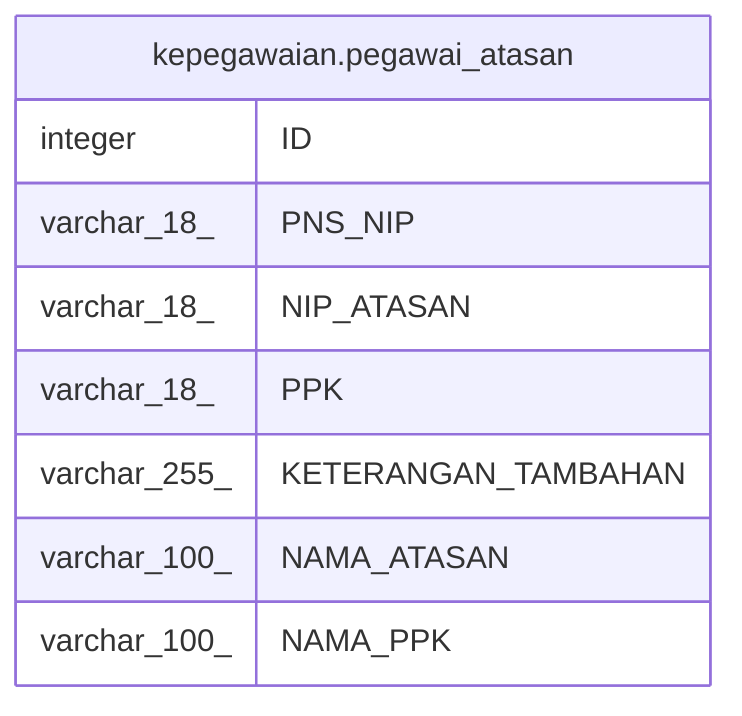

# kepegawaian.pegawai_atasan

## Description

## Columns

| Name | Type | Default | Nullable | Children | Parents | Comment |
| ---- | ---- | ------- | -------- | -------- | ------- | ------- |
| ID | integer | nextval('kepegawaian."pegawai_atasan_ID_seq"'::regclass) | false |  |  |  |
| PNS_NIP | varchar(18) |  | true |  |  |  |
| NIP_ATASAN | varchar(18) |  | true |  |  |  |
| PPK | varchar(18) |  | true |  |  |  |
| KETERANGAN_TAMBAHAN | varchar(255) |  | true |  |  |  |
| NAMA_ATASAN | varchar(100) |  | true |  |  |  |
| NAMA_PPK | varchar(100) |  | true |  |  |  |

## Constraints

| Name | Type | Definition |
| ---- | ---- | ---------- |
| pegawai_atasan_pkey | PRIMARY KEY | PRIMARY KEY ("ID") |

## Indexes

| Name | Definition |
| ---- | ---------- |
| pegawai_atasan_pkey | CREATE UNIQUE INDEX pegawai_atasan_pkey ON kepegawaian.pegawai_atasan USING btree ("ID") |

## Relations

---

> Generated by [tbls](https://github.com/k1LoW/tbls)
