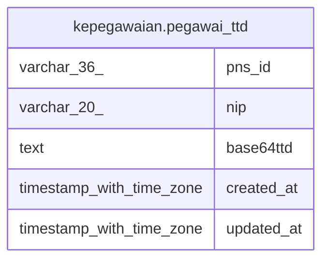

# kepegawaian.pegawai_ttd

## Description

## Columns

| Name | Type | Default | Nullable | Children | Parents | Comment |
| ---- | ---- | ------- | -------- | -------- | ------- | ------- |
| pns_id | varchar(36) |  | false |  |  |  |
| nip | varchar(20) |  | false |  |  |  |
| base64ttd | text |  | false |  |  |  |
| created_at | timestamp with time zone | now() | true |  |  |  |
| updated_at | timestamp with time zone | now() | true |  |  |  |

## Constraints

| Name | Type | Definition |
| ---- | ---- | ---------- |
| pegawai_ttd_pkey | PRIMARY KEY | PRIMARY KEY (pns_id) |

## Indexes

| Name | Definition |
| ---- | ---------- |
| pegawai_ttd_pkey | CREATE UNIQUE INDEX pegawai_ttd_pkey ON kepegawaian.pegawai_ttd USING btree (pns_id) |
| pegawai_ttd_nip_idx | CREATE INDEX pegawai_ttd_nip_idx ON kepegawaian.pegawai_ttd USING btree (nip) |

## Relations

---

> Generated by [tbls](https://github.com/k1LoW/tbls)
