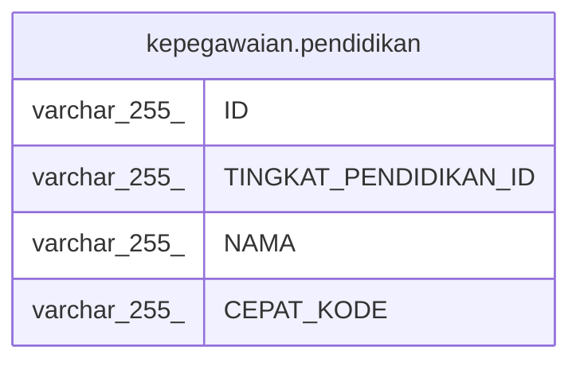

# kepegawaian.pendidikan

## Description

## Columns

| Name | Type | Default | Nullable | Children | Parents | Comment |
| ---- | ---- | ------- | -------- | -------- | ------- | ------- |
| ID | varchar(255) |  | false |  |  |  |
| TINGKAT_PENDIDIKAN_ID | varchar(255) |  | true |  |  |  |
| NAMA | varchar(255) |  | true |  |  |  |
| CEPAT_KODE | varchar(255) |  | true |  |  |  |

## Constraints

| Name | Type | Definition |
| ---- | ---- | ---------- |
| pendidikan_pkey | PRIMARY KEY | PRIMARY KEY ("ID") |

## Indexes

| Name | Definition |
| ---- | ---------- |
| pendidikan_pkey | CREATE UNIQUE INDEX pendidikan_pkey ON kepegawaian.pendidikan USING btree ("ID") |

## Relations

---

> Generated by [tbls](https://github.com/k1LoW/tbls)
