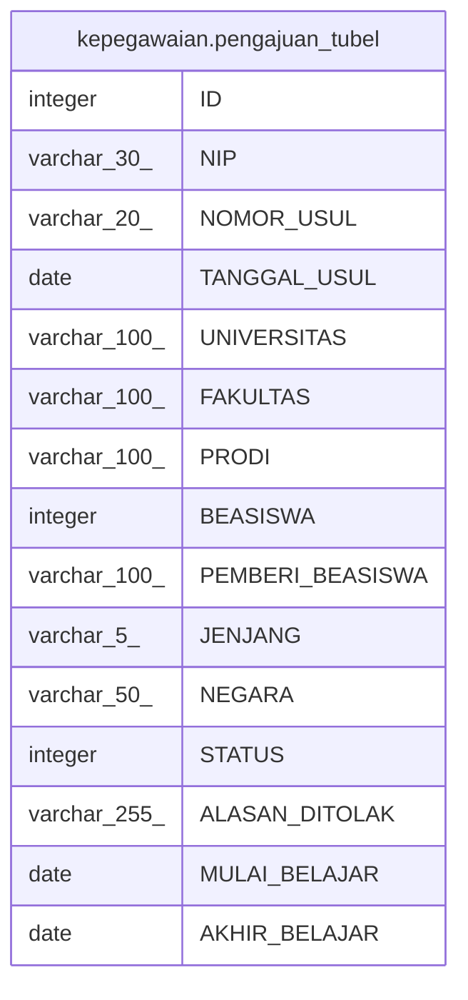

# kepegawaian.pengajuan_tubel

## Description

## Columns

| Name | Type | Default | Nullable | Children | Parents | Comment |
| ---- | ---- | ------- | -------- | -------- | ------- | ------- |
| ID | integer | nextval('kepegawaian."pengajuan_tubel_ID_seq"'::regclass) | false |  |  |  |
| NIP | varchar(30) |  | true |  |  |  |
| NOMOR_USUL | varchar(20) |  | true |  |  |  |
| TANGGAL_USUL | date |  | true |  |  |  |
| UNIVERSITAS | varchar(100) |  | true |  |  |  |
| FAKULTAS | varchar(100) |  | true |  |  |  |
| PRODI | varchar(100) |  | true |  |  |  |
| BEASISWA | integer |  | true |  |  |  |
| PEMBERI_BEASISWA | varchar(100) |  | true |  |  |  |
| JENJANG | varchar(5) |  | true |  |  |  |
| NEGARA | varchar(50) |  | true |  |  |  |
| STATUS | integer | 1 | true |  |  |  |
| ALASAN_DITOLAK | varchar(255) |  | true |  |  |  |
| MULAI_BELAJAR | date |  | true |  |  |  |
| AKHIR_BELAJAR | date |  | true |  |  |  |

## Constraints

| Name | Type | Definition |
| ---- | ---- | ---------- |
| pk_pengajuan_tubel | PRIMARY KEY | PRIMARY KEY ("ID") |

## Indexes

| Name | Definition |
| ---- | ---------- |
| pk_pengajuan_tubel | CREATE UNIQUE INDEX pk_pengajuan_tubel ON kepegawaian.pengajuan_tubel USING btree ("ID") |

## Relations

---

> Generated by [tbls](https://github.com/k1LoW/tbls)
