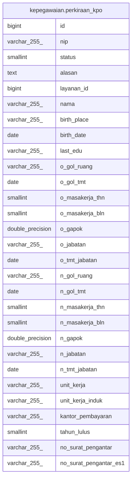

# kepegawaian.perkiraan_kpo

## Description

## Columns

| Name | Type | Default | Nullable | Children | Parents | Comment |
| ---- | ---- | ------- | -------- | -------- | ------- | ------- |
| id | bigint | nextval('kepegawaian.perkiraan_kpo_id_seq'::regclass) | false |  |  |  |
| nip | varchar(255) |  | true |  |  |  |
| status | smallint |  | true |  |  | tms/ms |
| alasan | text |  | true |  |  |  |
| layanan_id | bigint |  | true |  |  |  |
| nama | varchar(255) |  | true |  |  |  |
| birth_place | varchar(255) |  | true |  |  |  |
| birth_date | date |  | true |  |  |  |
| last_edu | varchar(255) |  | true |  |  |  |
| o_gol_ruang | varchar(255) |  | true |  |  |  |
| o_gol_tmt | date |  | true |  |  |  |
| o_masakerja_thn | smallint |  | true |  |  |  |
| o_masakerja_bln | smallint |  | true |  |  |  |
| o_gapok | double precision |  | true |  |  |  |
| o_jabatan | varchar(255) |  | true |  |  |  |
| o_tmt_jabatan | date |  | true |  |  |  |
| n_gol_ruang | varchar(255) |  | true |  |  |  |
| n_gol_tmt | date |  | true |  |  |  |
| n_masakerja_thn | smallint |  | true |  |  |  |
| n_masakerja_bln | smallint |  | true |  |  |  |
| n_gapok | double precision |  | true |  |  |  |
| n_jabatan | varchar(255) |  | true |  |  |  |
| n_tmt_jabatan | date |  | true |  |  |  |
| unit_kerja | varchar(255) |  | true |  |  |  |
| unit_kerja_induk | varchar(255) |  | true |  |  |  |
| kantor_pembayaran | varchar(255) |  | true |  |  |  |
| tahun_lulus | smallint |  | true |  |  |  |
| no_surat_pengantar | varchar(255) |  | true |  |  |  |
| no_surat_pengantar_es1 | varchar(255) |  | true |  |  |  |

## Constraints

| Name | Type | Definition |
| ---- | ---- | ---------- |
| perkiraan_kpo_pkey | PRIMARY KEY | PRIMARY KEY (id) |

## Indexes

| Name | Definition |
| ---- | ---------- |
| perkiraan_kpo_pkey | CREATE UNIQUE INDEX perkiraan_kpo_pkey ON kepegawaian.perkiraan_kpo USING btree (id) |

## Relations

---

> Generated by [tbls](https://github.com/k1LoW/tbls)
