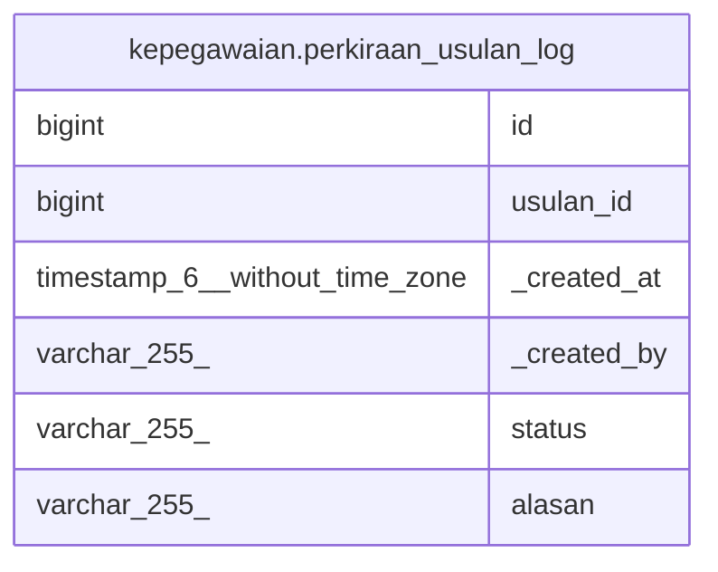

# kepegawaian.perkiraan_usulan_log

## Description

## Columns

| Name | Type | Default | Nullable | Children | Parents | Comment |
| ---- | ---- | ------- | -------- | -------- | ------- | ------- |
| id | bigint | nextval('kepegawaian.perkiraan_usulan_log_id_seq'::regclass) | false |  |  |  |
| usulan_id | bigint |  | true |  |  |  |
| _created_at | timestamp(6) without time zone | now() | true |  |  |  |
| _created_by | varchar(255) |  | true |  |  |  |
| status | varchar(255) |  | true |  |  |  |
| alasan | varchar(255) |  | true |  |  |  |

## Relations

---

> Generated by [tbls](https://github.com/k1LoW/tbls)
