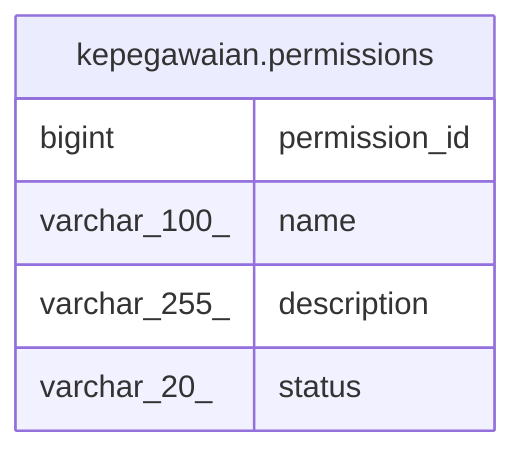

# kepegawaian.permissions

## Description

## Columns

| Name | Type | Default | Nullable | Children | Parents | Comment |
| ---- | ---- | ------- | -------- | -------- | ------- | ------- |
| permission_id | bigint | nextval('kepegawaian.permissions_permission_id_seq'::regclass) | false |  |  |  |
| name | varchar(100) |  | true |  |  |  |
| description | varchar(255) |  | true |  |  |  |
| status | varchar(20) |  | true |  |  |  |

## Constraints

| Name | Type | Definition |
| ---- | ---- | ---------- |
| permissions_pkey | PRIMARY KEY | PRIMARY KEY (permission_id) |

## Indexes

| Name | Definition |
| ---- | ---------- |
| permissions_pkey | CREATE UNIQUE INDEX permissions_pkey ON kepegawaian.permissions USING btree (permission_id) |

## Relations

---

> Generated by [tbls](https://github.com/k1LoW/tbls)
