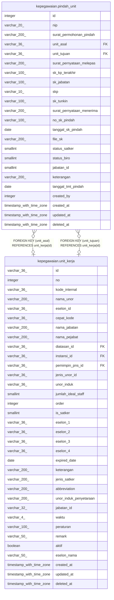

# kepegawaian.pindah_unit

## Description

Riwayat perpindahan unit kerja

## Columns

| Name | Type | Default | Nullable | Children | Parents | Comment |
| ---- | ---- | ------- | -------- | -------- | ------- | ------- |
| id | integer | nextval('pindah_unit_id_seq'::regclass) | false |  |  | id pindah unit |
| nip | varchar(20) |  | false |  |  | NIP pegawai |
| surat_permohonan_pindah | varchar(200) |  | true |  |  | Lokasi penyimpanan berkas permohonan pindah |
| unit_asal | varchar(36) |  | true |  | [kepegawaian.unit_kerja](kepegawaian.unit_kerja.md) | Unit kerja asal (rujuk unit_kerja) |
| unit_tujuan | varchar(36) |  | true |  | [kepegawaian.unit_kerja](kepegawaian.unit_kerja.md) | Unit kerja tujuan (rujuk unit_kerja) |
| surat_pernyataan_melepas | varchar(200) |  | true |  |  | Lokasi penyimpanan berkas pernyataan melepas pegawai |
| sk_kp_terakhir | varchar(100) |  | true |  |  | Nomor SK kenaikan pangkat terakhir |
| sk_jabatan | varchar(100) |  | true |  |  | Nomor SK jabatan |
| skp | varchar(10) |  | true |  |  | Sasaran kinerja pegawai |
| sk_tunkin | varchar(100) |  | true |  |  | Nomor SK tunjangan kinerja |
| surat_pernyataan_menerima | varchar(200) |  | true |  |  | Lokasi penyimpanan berkas pernyataan menerima pegawai |
| no_sk_pindah | varchar(100) |  | true |  |  | Nomor SK pindah unit |
| tanggal_sk_pindah | date |  | true |  |  | Tanggal SK pindah unit |
| file_sk | varchar(200) |  | true |  |  | Lokasi penyimpanan berkas pindah unit |
| status_satker | smallint |  | true |  |  | Status pengajuan pindah unit kerja di satuan kerja |
| status_biro | smallint |  | true |  |  | Status pengajuan pindah unit kerja di biro |
| jabatan_id | smallint |  | true |  |  | id jabatan terkait pada proses pindah (bila diisi) |
| keterangan | varchar(200) |  | true |  |  | Keterangan tambahan |
| tanggal_tmt_pindah | date |  | true |  |  | TMT efektif perpindahan unit |
| created_by | integer |  | true |  |  | id user yang membuat data pindah unit |
| created_at | timestamp with time zone | now() | true |  |  | Waktu perekaman data |
| updated_at | timestamp with time zone | now() | true |  |  | Waktu terakhir pembaruan |
| deleted_at | timestamp with time zone |  | true |  |  | Waktu penghapusan data |

## Constraints

| Name | Type | Definition |
| ---- | ---- | ---------- |
| pindah_unit_id_not_null | n | NOT NULL id |
| pindah_unit_nip_not_null | n | NOT NULL nip |
| pindah_unit_pkey | PRIMARY KEY | PRIMARY KEY (id) |
| fk_pindah_unit_unit_asal | FOREIGN KEY | FOREIGN KEY (unit_asal) REFERENCES unit_kerja(id) |
| fk_pindah_unit_unit_tujuan | FOREIGN KEY | FOREIGN KEY (unit_tujuan) REFERENCES unit_kerja(id) |

## Indexes

| Name | Definition |
| ---- | ---------- |
| pindah_unit_pkey | CREATE UNIQUE INDEX pindah_unit_pkey ON kepegawaian.pindah_unit USING btree (id) |

## Relations

---

> Generated by [tbls](https://github.com/k1LoW/tbls)
