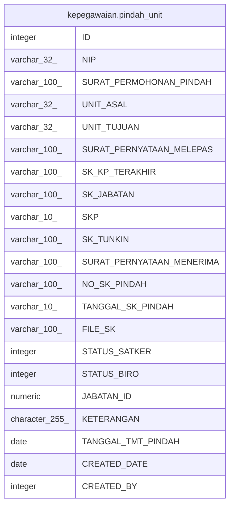

# kepegawaian.pindah_unit

## Description

## Columns

| Name | Type | Default | Nullable | Children | Parents | Comment |
| ---- | ---- | ------- | -------- | -------- | ------- | ------- |
| ID | integer | nextval('kepegawaian."pindah_unit_ID_seq"'::regclass) | false |  |  |  |
| NIP | varchar(32) |  | false |  |  |  |
| SURAT_PERMOHONAN_PINDAH | varchar(100) |  | true |  |  |  |
| UNIT_ASAL | varchar(32) |  | true |  |  |  |
| UNIT_TUJUAN | varchar(32) |  | true |  |  |  |
| SURAT_PERNYATAAN_MELEPAS | varchar(100) |  | true |  |  |  |
| SK_KP_TERAKHIR | varchar(100) |  | true |  |  |  |
| SK_JABATAN | varchar(100) |  | true |  |  |  |
| SKP | varchar(10) |  | true |  |  |  |
| SK_TUNKIN | varchar(100) |  | true |  |  |  |
| SURAT_PERNYATAAN_MENERIMA | varchar(100) |  | true |  |  |  |
| NO_SK_PINDAH | varchar(100) |  | true |  |  |  |
| TANGGAL_SK_PINDAH | varchar(10) |  | true |  |  |  |
| FILE_SK | varchar(100) |  | true |  |  |  |
| STATUS_SATKER | integer |  | true |  |  |  |
| STATUS_BIRO | integer |  | true |  |  |  |
| JABATAN_ID | numeric |  | true |  |  |  |
| KETERANGAN | character(255) |  | true |  |  |  |
| TANGGAL_TMT_PINDAH | date |  | true |  |  |  |
| CREATED_DATE | date |  | true |  |  |  |
| CREATED_BY | integer |  | true |  |  |  |

## Constraints

| Name | Type | Definition |
| ---- | ---- | ---------- |
| pk_pindah_unit | PRIMARY KEY | PRIMARY KEY ("ID") |

## Indexes

| Name | Definition |
| ---- | ---------- |
| pk_pindah_unit | CREATE UNIQUE INDEX pk_pindah_unit ON kepegawaian.pindah_unit USING btree ("ID") |

## Relations

---

> Generated by [tbls](https://github.com/k1LoW/tbls)
