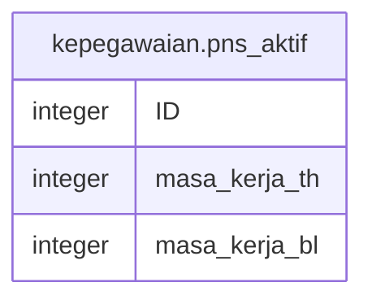

# kepegawaian.pns_aktif

## Description

<details>
<summary><strong>Table Definition</strong></summary>

```sql
CREATE VIEW pns_aktif AS (
 SELECT "ID",
        CASE
            WHEN ((masa_kerja[1] + bulan_swasta) >= 12) THEN ((masa_kerja[0] + tahun_swasta) + 1)
            ELSE (masa_kerja[0] + tahun_swasta)
        END AS masa_kerja_th,
        CASE
            WHEN ((masa_kerja[1] + bulan_swasta) >= 12) THEN ((masa_kerja[1] + bulan_swasta) - 12)
            ELSE (masa_kerja[1] + bulan_swasta)
        END AS masa_kerja_bl
   FROM ( SELECT pegawai."ID",
            kepegawaian.get_masa_kerja_arr(pegawai."TMT_CPNS", ('now'::text)::date) AS masa_kerja,
            pegawai."MK_TAHUN_SWASTA" AS tahun_swasta,
            pegawai."MK_BULAN_SWASTA" AS bulan_swasta
           FROM kepegawaian.pegawai
          WHERE ((pegawai.status_pegawai = 1) AND ((pegawai.terminated_date IS NULL) OR ((pegawai.terminated_date IS NOT NULL) AND (pegawai.terminated_date > ('now'::text)::date))))) temp
)
```

</details>

## Columns

| Name | Type | Default | Nullable | Children | Parents | Comment |
| ---- | ---- | ------- | -------- | -------- | ------- | ------- |
| ID | integer |  | true |  |  |  |
| masa_kerja_th | integer |  | true |  |  |  |
| masa_kerja_bl | integer |  | true |  |  |  |

## Referenced Tables

| Name | Columns | Comment | Type |
| ---- | ------- | ------- | ---- |
| [kepegawaian.pegawai](kepegawaian.pegawai.md) | 100 |  | BASE TABLE |

## Relations



---

> Generated by [tbls](https://github.com/k1LoW/tbls)
