# kepegawaian.ref_jabatan

## Description

Referensi jabatan

## Columns

| Name | Type | Default | Nullable | Children | Parents | Comment |
| ---- | ---- | ------- | -------- | -------- | ------- | ------- |
| kode_jabatan | varchar(36) |  | false | [kepegawaian.pegawai](kepegawaian.pegawai.md) [kepegawaian.riwayat_jabatan](kepegawaian.riwayat_jabatan.md) |  | Kode unik jabatan |
| id | integer | nextval('ref_jabatan_id_seq'::regclass) | false |  |  | id jabatan |
| nama_jabatan | varchar(400) |  | true |  |  | Nama jabatan |
| nama_jabatan_full | varchar(400) |  | true |  |  | Nama jabatan lengkap |
| jenis_jabatan | smallint |  | true |  |  | Kode jenis jabatan |
| kelas | smallint |  | true |  |  | Kelas jabatan |
| pensiun | smallint |  | true |  |  | Usia pensiun jabatan terkait |
| kode_bkn | varchar(36) |  | true |  |  | Kode pada sistem BKN |
| nama_jabatan_bkn | varchar(400) |  | true |  |  | Nama jabatan pada sistem BKN |
| kategori_jabatan | varchar(100) |  | true |  |  | Nama kategori jabatan |
| bkn_id | varchar(36) |  | true |  |  | id pada sistem BKN |
| created_at | timestamp with time zone | now() | true |  |  | Waktu perekaman data |
| updated_at | timestamp with time zone | now() | true |  |  | Waktu terakhir pembaruan |
| deleted_at | timestamp with time zone |  | true |  |  | Waktu penghapusan data |
| tunjangan_jabatan | bigint |  | true |  |  |  |
| no | integer | nextval('ref_jabatan_no_seq'::regclass) | false |  |  |  |

## Constraints

| Name | Type | Definition |
| ---- | ---- | ---------- |
| ref_jabatan_pkey | PRIMARY KEY | PRIMARY KEY (kode_jabatan) |

## Indexes

| Name | Definition |
| ---- | ---------- |
| ref_jabatan_pkey | CREATE UNIQUE INDEX ref_jabatan_pkey ON kepegawaian.ref_jabatan USING btree (kode_jabatan) |

## Relations

```mermaid
erDiagram

"kepegawaian.pegawai" }o--o| "kepegawaian.ref_jabatan" : "FOREIGN KEY (jabatan_id) REFERENCES ref_jabatan(kode_jabatan)"
"kepegawaian.pegawai" }o--o| "kepegawaian.ref_jabatan" : "FOREIGN KEY (jabatan_instansi_id) REFERENCES ref_jabatan(kode_jabatan)"
"kepegawaian.pegawai" }o--o| "kepegawaian.ref_jabatan" : "FOREIGN KEY (jabatan_instansi_real_id) REFERENCES ref_jabatan(kode_jabatan)"
"kepegawaian.riwayat_jabatan" }o--o| "kepegawaian.ref_jabatan" : "FOREIGN KEY (jabatan_id) REFERENCES ref_jabatan(kode_jabatan)"

"kepegawaian.ref_jabatan" {
  varchar_36_ kode_jabatan
  integer id
  varchar_400_ nama_jabatan
  varchar_400_ nama_jabatan_full
  smallint jenis_jabatan
  smallint kelas
  smallint pensiun
  varchar_36_ kode_bkn
  varchar_400_ nama_jabatan_bkn
  varchar_100_ kategori_jabatan
  varchar_36_ bkn_id
  timestamp_with_time_zone created_at
  timestamp_with_time_zone updated_at
  timestamp_with_time_zone deleted_at
  bigint tunjangan_jabatan
  integer no
}
"kepegawaian.pegawai" {
  integer id
  varchar_36_ pns_id
  varchar_9_ nip_lama
  varchar_20_ nip_baru
  varchar_100_ nama
  varchar_50_ gelar_depan
  varchar_50_ gelar_belakang
  varchar_50_ tempat_lahir_id
  date tanggal_lahir
  varchar_1_ jenis_kelamin
  smallint agama_id FK
  smallint jenis_kawin_id FK
  varchar_50_ nik
  varchar_60_ no_darurat
  varchar_60_ no_hp
  varchar_60_ email
  varchar_300_ alamat
  varchar_50_ npwp
  varchar_50_ bpjs
  smallint jenis_pegawai_id
  integer kedudukan_hukum_id
  varchar_20_ status_cpns_pns
  varchar_50_ kartu_pegawai
  varchar_100_ no_sk_cpns
  date tanggal_sk_cpns
  date tmt_cpns
  date tmt_pns
  smallint gol_awal_id FK
  smallint gol_id FK
  date tmt_golongan
  smallint mk_tahun
  smallint mk_bulan
  varchar_36_ jabatan_id FK
  date tmt_jabatan
  varchar_36_ pendidikan_id
  smallint tahun_lulus
  varchar_36_ kpkn_id FK
  varchar_36_ lokasi_kerja_id FK
  varchar_36_ unor_id FK
  varchar_36_ unor_induk_id
  varchar_36_ instansi_induk_id FK
  varchar_36_ instansi_kerja_id FK
  varchar_36_ satuan_kerja_induk_id
  varchar_36_ satuan_kerja_kerja_id
  varchar_10_ golongan_darah
  varchar_200_ foto
  date tmt_pensiun
  varchar_36_ lokasi_kerja
  smallint jml_istri
  smallint jml_anak
  varchar_100_ no_surat_dokter
  date tanggal_surat_dokter
  varchar_100_ no_bebas_narkoba
  date tanggal_bebas_narkoba
  varchar_100_ no_catatan_polisi
  date tanggal_catatan_polisi
  varchar_50_ akte_kelahiran
  varchar_15_ status_hidup
  varchar_50_ akte_meninggal
  date tanggal_meninggal
  varchar_100_ no_askes
  varchar_100_ no_taspen
  date tanggal_npwp
  varchar_100_ tempat_lahir
  smallint tingkat_pendidikan_id FK
  varchar_200_ tempat_lahir_nama
  varchar_200_ jenis_jabatan_nama
  varchar_300_ jabatan_nama
  varchar_200_ kpkn_nama
  varchar_200_ instansi_induk_nama
  varchar_200_ instansi_kerja_nama
  varchar_200_ satuan_kerja_induk_nama
  varchar_200_ satuan_kerja_nama
  varchar_36_ jabatan_instansi_id FK
  smallint bup
  varchar_400_ jabatan_instansi_nama
  smallint jenis_jabatan_id
  date terminated_date
  smallint status_pegawai
  varchar_200_ jabatan_ppnpn
  varchar_36_ jabatan_instansi_real_id FK
  integer created_by
  integer updated_by
  varchar_100_ email_dikbud_bak
  varchar_100_ email_dikbud
  varchar_100_ kodecepat
  smallint is_dosen
  smallint mk_tahun_swasta
  smallint mk_bulan_swasta
  varchar_30_ kk
  varchar_30_ nidn
  varchar_200_ ket
  varchar_100_ no_sk_pemberhentian
  smallint status_pegawai_backup
  varchar_50_ masa_kerja
  varchar_50_ kartu_asn
  timestamp_with_time_zone created_at
  timestamp_with_time_zone updated_at
  timestamp_with_time_zone deleted_at
}
"kepegawaian.riwayat_jabatan" {
  varchar_36_ bkn_id
  varchar_36_ pns_id FK
  varchar_20_ pns_nip
  varchar_100_ pns_nama
  varchar_36_ unor_id
  text unor
  integer jenis_jabatan_id
  varchar_250_ jenis_jabatan
  varchar_36_ jabatan_id FK
  text nama_jabatan
  varchar_36_ eselon_id
  varchar_100_ eselon
  date tmt_jabatan
  varchar_100_ no_sk
  date tanggal_sk
  varchar_36_ satuan_kerja_id FK
  date tmt_pelantikan
  smallint is_active
  text eselon1
  text eselon2
  text eselon3
  text eselon4
  bigint id
  varchar_250_ catatan
  varchar_100_ jenis_sk
  integer status_satker
  integer status_biro
  varchar_36_ jabatan_id_bkn
  varchar_36_ unor_id_bkn
  bigint tabel_mutasi_id
  timestamp_with_time_zone created_at
  timestamp_with_time_zone updated_at
  timestamp_with_time_zone deleted_at
  boolean status_plt
  integer kelas_jabatan_id FK
  date periode_jabatan_start_date
  date periode_jabatan_end_date
  text file_base64
  varchar_200_ keterangan_berkas
}
```

---

> Generated by [tbls](https://github.com/k1LoW/tbls)
