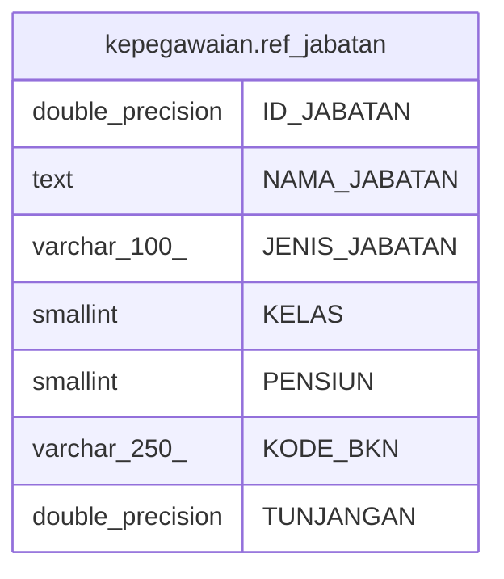

# kepegawaian.ref_jabatan

## Description

## Columns

| Name | Type | Default | Nullable | Children | Parents | Comment |
| ---- | ---- | ------- | -------- | -------- | ------- | ------- |
| ID_JABATAN | double precision |  | false |  |  |  |
| NAMA_JABATAN | text |  | true |  |  |  |
| JENIS_JABATAN | varchar(100) |  | true |  |  |  |
| KELAS | smallint |  | true |  |  |  |
| PENSIUN | smallint |  | true |  |  |  |
| KODE_BKN | varchar(250) |  | true |  |  |  |
| TUNJANGAN | double precision |  | true |  |  |  |

## Constraints

| Name | Type | Definition |
| ---- | ---- | ---------- |
| ref_jabatan_pkey | PRIMARY KEY | PRIMARY KEY ("ID_JABATAN") |

## Indexes

| Name | Definition |
| ---- | ---------- |
| ref_jabatan_pkey | CREATE UNIQUE INDEX ref_jabatan_pkey ON kepegawaian.ref_jabatan USING btree ("ID_JABATAN") |

## Relations

---

> Generated by [tbls](https://github.com/k1LoW/tbls)
