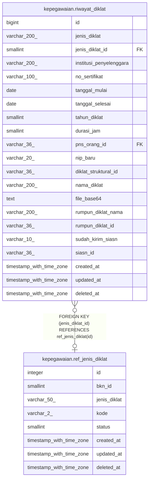

# kepegawaian.ref_jenis_diklat

## Description

Referensi jenis diklat

## Columns

| Name | Type | Default | Nullable | Children | Parents | Comment |
| ---- | ---- | ------- | -------- | -------- | ------- | ------- |
| id | integer | nextval('ref_jenis_diklat_id_seq'::regclass) | false | [kepegawaian.riwayat_diklat](kepegawaian.riwayat_diklat.md) |  | id jenis diklat |
| bkn_id | smallint |  | true |  |  | id pada sistem BKN |
| jenis_diklat | varchar(50) |  | true |  |  | Nama jenis diklat |
| kode | varchar(2) |  | true |  |  | kode jenis diklat |
| status | smallint |  | true |  |  | status jenis diklat |
| created_at | timestamp with time zone | now() | true |  |  | Waktu perekaman data |
| updated_at | timestamp with time zone | now() | true |  |  | Waktu terakhir pembaruan |
| deleted_at | timestamp with time zone |  | true |  |  | Waktu penghapusan data |

## Constraints

| Name | Type | Definition |
| ---- | ---- | ---------- |
| ref_jenis_diklat_pkey | PRIMARY KEY | PRIMARY KEY (id) |

## Indexes

| Name | Definition |
| ---- | ---------- |
| ref_jenis_diklat_pkey | CREATE UNIQUE INDEX ref_jenis_diklat_pkey ON kepegawaian.ref_jenis_diklat USING btree (id) |

## Relations

---

> Generated by [tbls](https://github.com/k1LoW/tbls)
