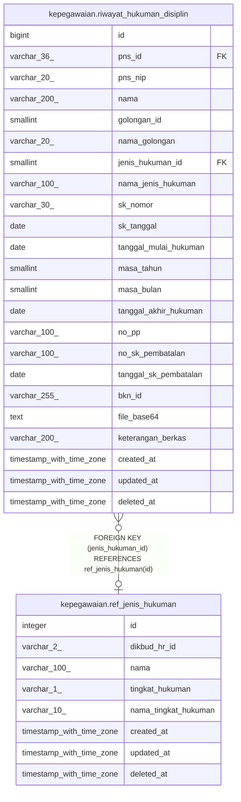

# kepegawaian.ref_jenis_hukuman

## Description

Referensi jenis hukuman disiplin

## Columns

| Name | Type | Default | Nullable | Extra Definition | Children | Parents | Comment |
| ---- | ---- | ------- | -------- | ---------------- | -------- | ------- | ------- |
| id | integer | nextval('ref_jenis_hukuman_id_seq'::regclass) | false |  | [kepegawaian.riwayat_hukuman_disiplin](kepegawaian.riwayat_hukuman_disiplin.md) |  | id jenis hukuman disiplin |
| dikbud_hr_id | varchar(2) |  | true | GENERATED ALWAYS AS lpad((id)::text, 2, '0'::text) STORED |  |  | id jenis hukuman disiplin pada Dikbud HR |
| nama | varchar(100) |  | true |  |  |  | Nama jenis hukuman disiplin |
| tingkat_hukuman | varchar(1) |  | true |  |  |  | Nama pendek jenis hukuman disiplin, R: Ringan, S: Sedang, B: Berat |
| nama_tingkat_hukuman | varchar(10) |  | true |  |  |  | Nama jenis tingkat hukuman disiplin |
| created_at | timestamp with time zone | now() | true |  |  |  | Waktu perekaman data |
| updated_at | timestamp with time zone | now() | true |  |  |  | Waktu terakhir pembaruan |
| deleted_at | timestamp with time zone |  | true |  |  |  | Waktu penghapusan data |

## Constraints

| Name | Type | Definition |
| ---- | ---- | ---------- |
| ref_jenis_hukuman_pkey | PRIMARY KEY | PRIMARY KEY (id) |

## Indexes

| Name | Definition |
| ---- | ---------- |
| ref_jenis_hukuman_pkey | CREATE UNIQUE INDEX ref_jenis_hukuman_pkey ON kepegawaian.ref_jenis_hukuman USING btree (id) |

## Relations

---

> Generated by [tbls](https://github.com/k1LoW/tbls)
