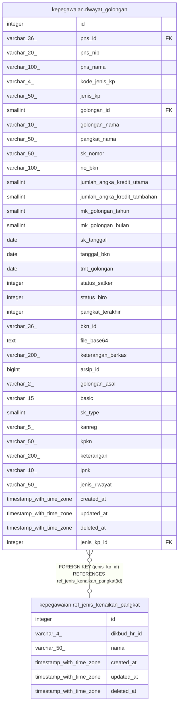

# kepegawaian.ref_jenis_kenaikan_pangkat

## Description

Referensi jenis kenaikan pangkat

## Columns

| Name | Type | Default | Nullable | Extra Definition | Children | Parents | Comment |
| ---- | ---- | ------- | -------- | ---------------- | -------- | ------- | ------- |
| id | integer | nextval('ref_jenis_kp_id_seq'::regclass) | false |  | [kepegawaian.riwayat_golongan](kepegawaian.riwayat_golongan.md) |  | id jenis kenaikan pangkat |
| dikbud_hr_id | varchar(4) |  | true | GENERATED ALWAYS AS lpad((id)::text, 4, '0'::text) STORED |  |  | id jenis kenaikan pangkat pada Dikbud HR |
| nama | varchar(50) |  | true |  |  |  | Nama jenis kenaikan pangkat |
| created_at | timestamp with time zone | now() | true |  |  |  | Waktu perekaman data |
| updated_at | timestamp with time zone | now() | true |  |  |  | Waktu terakhir pembaruan |
| deleted_at | timestamp with time zone |  | true |  |  |  | Waktu penghapusan data |

## Constraints

| Name | Type | Definition |
| ---- | ---- | ---------- |
| ref_jenis_kp_pkey | PRIMARY KEY | PRIMARY KEY (id) |

## Indexes

| Name | Definition |
| ---- | ---------- |
| ref_jenis_kp_pkey | CREATE UNIQUE INDEX ref_jenis_kp_pkey ON kepegawaian.ref_jenis_kenaikan_pangkat USING btree (id) |

## Relations

---

> Generated by [tbls](https://github.com/k1LoW/tbls)
