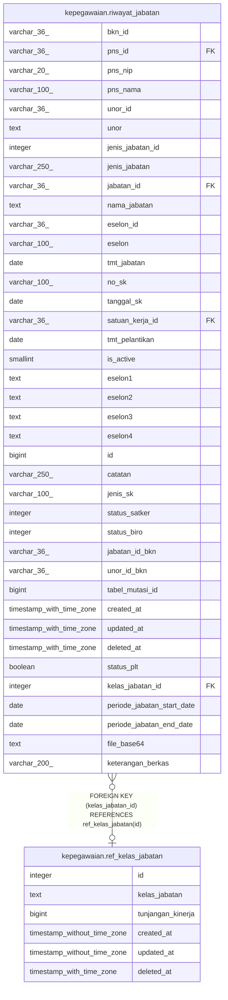

# kepegawaian.ref_kelas_jabatan

## Description

Referensi kelas jabatan

## Columns

| Name | Type | Default | Nullable | Children | Parents | Comment |
| ---- | ---- | ------- | -------- | -------- | ------- | ------- |
| id | integer | nextval('ref_kelas_jabatan_id_seq'::regclass) | false | [kepegawaian.riwayat_jabatan](kepegawaian.riwayat_jabatan.md) |  | id kelas jabatan |
| kelas_jabatan | text |  | true |  |  | Nama kelas jabatan |
| tunjangan_kinerja | bigint |  | true |  |  | Nilai tunjangan kinerja pada kelas jabatan terkait |
| created_at | timestamp without time zone | now() | true |  |  | Waktu perekaman data |
| updated_at | timestamp without time zone | now() | true |  |  | Waktu terakhir pembaruan |
| deleted_at | timestamp with time zone |  | true |  |  |  |

## Constraints

| Name | Type | Definition |
| ---- | ---- | ---------- |
| ref_kelas_jabatan_pkey | PRIMARY KEY | PRIMARY KEY (id) |

## Indexes

| Name | Definition |
| ---- | ---------- |
| ref_kelas_jabatan_pkey | CREATE UNIQUE INDEX ref_kelas_jabatan_pkey ON kepegawaian.ref_kelas_jabatan USING btree (id) |

## Relations

---

> Generated by [tbls](https://github.com/k1LoW/tbls)
