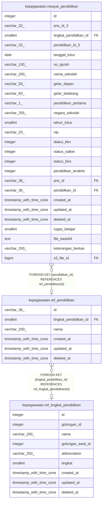

# kepegawaian.ref_pendidikan

## Description

Referensi pendidikan

## Columns

| Name | Type | Default | Nullable | Children | Parents | Comment |
| ---- | ---- | ------- | -------- | -------- | ------- | ------- |
| id | varchar(36) |  | false | [kepegawaian.riwayat_pendidikan](kepegawaian.riwayat_pendidikan.md) |  | id pendidikan (UUID) |
| tingkat_pendidikan_id | smallint |  | true |  | [kepegawaian.ref_tingkat_pendidikan](kepegawaian.ref_tingkat_pendidikan.md) | Tingkat pendidikan (rujuk tingkat_pendidikan) |
| nama | varchar(200) |  | true |  |  | Nama program/jurusan/pendidikan |
| created_at | timestamp with time zone | now() | true |  |  | Waktu perekaman data |
| updated_at | timestamp with time zone | now() | true |  |  | Waktu terakhir pembaruan |
| deleted_at | timestamp with time zone |  | true |  |  | Waktu penghapusan data |

## Constraints

| Name | Type | Definition |
| ---- | ---- | ---------- |
| pendidikan_pkey | PRIMARY KEY | PRIMARY KEY (id) |
| fk_pendidikan_tingkat | FOREIGN KEY | FOREIGN KEY (tingkat_pendidikan_id) REFERENCES ref_tingkat_pendidikan(id) |

## Indexes

| Name | Definition |
| ---- | ---------- |
| pendidikan_pkey | CREATE UNIQUE INDEX pendidikan_pkey ON kepegawaian.ref_pendidikan USING btree (id) |

## Relations

---

> Generated by [tbls](https://github.com/k1LoW/tbls)
