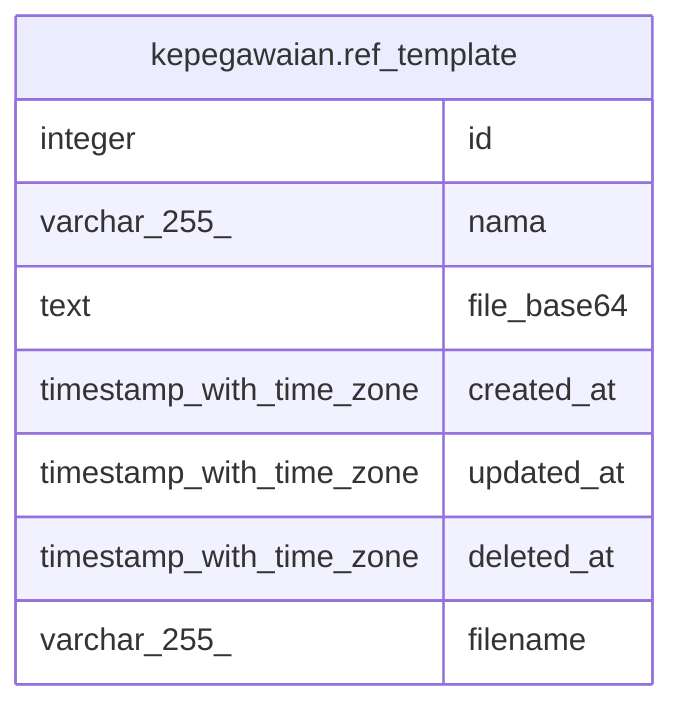

# kepegawaian.ref_template

## Description

## Columns

| Name | Type | Default | Nullable | Children | Parents | Comment |
| ---- | ---- | ------- | -------- | -------- | ------- | ------- |
| id | integer | nextval('ref_template_id_seq'::regclass) | false |  |  |  |
| nama | varchar(255) |  | false |  |  |  |
| file_base64 | text |  | true |  |  |  |
| created_at | timestamp with time zone | now() | true |  |  |  |
| updated_at | timestamp with time zone | now() | true |  |  |  |
| deleted_at | timestamp with time zone |  | true |  |  |  |
| filename | varchar(255) |  | false |  |  |  |

## Constraints

| Name | Type | Definition |
| ---- | ---- | ---------- |
| ref_template_pkey | PRIMARY KEY | PRIMARY KEY (id) |

## Indexes

| Name | Definition |
| ---- | ---------- |
| ref_template_pkey | CREATE UNIQUE INDEX ref_template_pkey ON kepegawaian.ref_template USING btree (id) |

## Relations

---

> Generated by [tbls](https://github.com/k1LoW/tbls)
