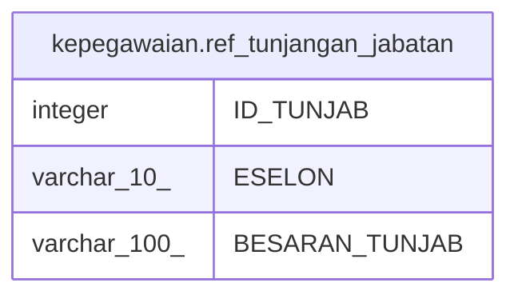

# kepegawaian.ref_tunjangan_jabatan

## Description

## Columns

| Name | Type | Default | Nullable | Children | Parents | Comment |
| ---- | ---- | ------- | -------- | -------- | ------- | ------- |
| ID_TUNJAB | integer |  | false |  |  |  |
| ESELON | varchar(10) |  | true |  |  |  |
| BESARAN_TUNJAB | varchar(100) |  | true |  |  |  |

## Constraints

| Name | Type | Definition |
| ---- | ---- | ---------- |
| data_jabatan_tunjab_pkey | PRIMARY KEY | PRIMARY KEY ("ID_TUNJAB") |

## Indexes

| Name | Definition |
| ---- | ---------- |
| data_jabatan_tunjab_pkey | CREATE UNIQUE INDEX data_jabatan_tunjab_pkey ON kepegawaian.ref_tunjangan_jabatan USING btree ("ID_TUNJAB") |

## Relations

---

> Generated by [tbls](https://github.com/k1LoW/tbls)
