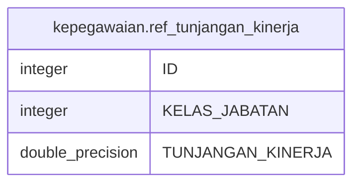

# kepegawaian.ref_tunjangan_kinerja

## Description

## Columns

| Name | Type | Default | Nullable | Children | Parents | Comment |
| ---- | ---- | ------- | -------- | -------- | ------- | ------- |
| ID | integer | nextval('kepegawaian."ref_tunjangan_kinerja_ID_seq"'::regclass) | false |  |  |  |
| KELAS_JABATAN | integer |  | true |  |  |  |
| TUNJANGAN_KINERJA | double precision |  | true |  |  |  |

## Relations

---

> Generated by [tbls](https://github.com/k1LoW/tbls)
