# kepegawaian.ref_unit_kerja

## Description

Referensi referensi unit kerja

## Columns

| Name | Type | Default | Nullable | Children | Parents | Comment |
| ---- | ---- | ------- | -------- | -------- | ------- | ------- |
| id | varchar(60) |  | false | [kepegawaian.pegawai](kepegawaian.pegawai.md) [kepegawaian.pindah_unit](kepegawaian.pindah_unit.md) [kepegawaian.riwayat_asesmen](kepegawaian.riwayat_asesmen.md) [kepegawaian.riwayat_jabatan](kepegawaian.riwayat_jabatan.md) [kepegawaian.ref_unit_kerja](kepegawaian.ref_unit_kerja.md) |  | id unit organisasi (UUID) |
| no | integer |  | true |  |  | Nomor urut unit kerja |
| kode_internal | varchar(60) |  | true |  |  | Kode internal unit organisasi |
| nama_unor | varchar(200) |  | true |  |  | Nama unit organisasi |
| eselon_id | varchar(60) |  | true |  |  | id eselon unit (bila berlaku) |
| cepat_kode | varchar(60) |  | true |  |  | Kode cepat untuk pencarian unit kerja |
| nama_jabatan | varchar(200) |  | true |  |  | Nama jabatan dalam unit kerja |
| nama_pejabat | varchar(200) |  | true |  |  | Nama pejabat yang menjabat |
| diatasan_id | varchar(60) |  | true |  | [kepegawaian.ref_unit_kerja](kepegawaian.ref_unit_kerja.md) | Unit atasan langsung (self-reference ke unit_kerja) |
| instansi_id | varchar(60) |  | true |  | [kepegawaian.ref_instansi](kepegawaian.ref_instansi.md) | id instansi pemilik unit (rujuk ref_instansi) |
| pemimpin_pns_id | varchar(60) |  | true |  | [kepegawaian.pegawai](kepegawaian.pegawai.md) | ID PNS yang memimpin unit kerja |
| jenis_unor_id | varchar(60) |  | true |  |  | Jenis unit organisasi (bila digunakan) |
| unor_induk | varchar(60) |  | true |  |  | Unit organisasi induk |
| jumlah_ideal_staff | smallint |  | true |  |  | Jumlah ideal staf dalam unit kerja |
| order | integer |  | true |  |  | Urutan tampilan unit kerja |
| is_satker | boolean | false | false |  |  | Penanda apakah unit merupakan Satuan Kerja |
| eselon_1 | varchar(60) |  | true |  |  | Kode eselon 1 unit kerja |
| eselon_2 | varchar(60) |  | true |  |  | Kode eselon 2 unit kerja |
| eselon_3 | varchar(60) |  | true |  |  | Kode eselon 3 unit kerja |
| eselon_4 | varchar(60) |  | true |  |  | Kode eselon 4 unit kerja |
| expired_date | date |  | true |  |  | Tanggal kedaluwarsa unit kerja |
| keterangan | varchar(200) |  | true |  |  | Keterangan tambahan untuk unit kerja |
| jenis_satker | varchar(200) |  | true |  |  | Jenis satuan kerja |
| abbreviation | varchar(200) |  | true |  |  | Singkatan unit organisasi |
| unor_induk_penyetaraan | varchar(200) |  | true |  |  | Penyetaraan unit organisasi induk |
| jabatan_id | varchar(60) |  | true |  |  | ID jabatan yang terkait dengan unit kerja |
| waktu | varchar(4) |  | true |  |  | Waktu pencatatan data unit kerja |
| peraturan | varchar(100) |  | true |  |  | Peraturan yang mendasari unit kerja |
| remark | varchar(50) |  | true |  |  | Catatan tambahan untuk unit kerja |
| aktif | boolean |  | true |  |  | Status keaktifan unit |
| eselon_nama | varchar(50) |  | true |  |  | Nama eselon unit kerja |
| created_at | timestamp with time zone | now() | true |  |  | Waktu perekaman data |
| updated_at | timestamp with time zone | now() | true |  |  | Waktu terakhir data diperbarui |
| deleted_at | timestamp with time zone |  | true |  |  | Waktu penghapusan data |

## Constraints

| Name | Type | Definition |
| ---- | ---- | ---------- |
| fk_unit_kerja_instansi | FOREIGN KEY | FOREIGN KEY (instansi_id) REFERENCES ref_instansi(id) |
| fk_unit_kerja_pemimpin | FOREIGN KEY | FOREIGN KEY (pemimpin_pns_id) REFERENCES pegawai(pns_id) |
| fk_unit_kerja_diatasan | FOREIGN KEY | FOREIGN KEY (diatasan_id) REFERENCES ref_unit_kerja(id) |
| unit_kerja_pkey | PRIMARY KEY | PRIMARY KEY (id) |

## Indexes

| Name | Definition |
| ---- | ---------- |
| unit_kerja_pkey | CREATE UNIQUE INDEX unit_kerja_pkey ON kepegawaian.ref_unit_kerja USING btree (id) |

## Relations

```mermaid
erDiagram

"kepegawaian.pegawai" }o--o| "kepegawaian.ref_unit_kerja" : "FOREIGN KEY (unor_id) REFERENCES ref_unit_kerja(id)"
"kepegawaian.pindah_unit" }o--o| "kepegawaian.ref_unit_kerja" : "FOREIGN KEY (unit_asal) REFERENCES ref_unit_kerja(id)"
"kepegawaian.pindah_unit" }o--o| "kepegawaian.ref_unit_kerja" : "FOREIGN KEY (unit_tujuan) REFERENCES ref_unit_kerja(id)"
"kepegawaian.riwayat_asesmen" }o--o| "kepegawaian.ref_unit_kerja" : "FOREIGN KEY (unit_org_id) REFERENCES ref_unit_kerja(id)"
"kepegawaian.riwayat_jabatan" }o--o| "kepegawaian.ref_unit_kerja" : "FOREIGN KEY (satuan_kerja_id) REFERENCES ref_unit_kerja(id)"
"kepegawaian.ref_unit_kerja" }o--o| "kepegawaian.ref_unit_kerja" : "FOREIGN KEY (diatasan_id) REFERENCES ref_unit_kerja(id)"
"kepegawaian.ref_unit_kerja" }o--o| "kepegawaian.ref_instansi" : "FOREIGN KEY (instansi_id) REFERENCES ref_instansi(id)"
"kepegawaian.ref_unit_kerja" }o--o| "kepegawaian.pegawai" : "FOREIGN KEY (pemimpin_pns_id) REFERENCES pegawai(pns_id)"

"kepegawaian.ref_unit_kerja" {
  varchar_60_ id
  integer no
  varchar_60_ kode_internal
  varchar_200_ nama_unor
  varchar_60_ eselon_id
  varchar_60_ cepat_kode
  varchar_200_ nama_jabatan
  varchar_200_ nama_pejabat
  varchar_60_ diatasan_id FK
  varchar_60_ instansi_id FK
  varchar_60_ pemimpin_pns_id FK
  varchar_60_ jenis_unor_id
  varchar_60_ unor_induk
  smallint jumlah_ideal_staff
  integer order
  boolean is_satker
  varchar_60_ eselon_1
  varchar_60_ eselon_2
  varchar_60_ eselon_3
  varchar_60_ eselon_4
  date expired_date
  varchar_200_ keterangan
  varchar_200_ jenis_satker
  varchar_200_ abbreviation
  varchar_200_ unor_induk_penyetaraan
  varchar_60_ jabatan_id
  varchar_4_ waktu
  varchar_100_ peraturan
  varchar_50_ remark
  boolean aktif
  varchar_50_ eselon_nama
  timestamp_with_time_zone created_at
  timestamp_with_time_zone updated_at
  timestamp_with_time_zone deleted_at
}
"kepegawaian.pegawai" {
  integer id
  varchar_36_ pns_id
  varchar_9_ nip_lama
  varchar_20_ nip_baru
  varchar_100_ nama
  varchar_50_ gelar_depan
  varchar_50_ gelar_belakang
  varchar_50_ tempat_lahir_id
  date tanggal_lahir
  varchar_1_ jenis_kelamin
  smallint agama_id FK
  smallint jenis_kawin_id FK
  varchar_50_ nik
  varchar_60_ no_darurat
  varchar_60_ no_hp
  varchar_60_ email
  varchar_300_ alamat
  varchar_50_ npwp
  varchar_50_ bpjs
  smallint jenis_pegawai_id
  integer kedudukan_hukum_id
  varchar_20_ status_cpns_pns
  varchar_50_ kartu_pegawai
  varchar_100_ no_sk_cpns
  date tanggal_sk_cpns
  date tmt_cpns
  date tmt_pns
  smallint gol_awal_id FK
  smallint gol_id FK
  date tmt_golongan
  smallint mk_tahun
  smallint mk_bulan
  varchar_36_ jabatan_id FK
  date tmt_jabatan
  varchar_36_ pendidikan_id
  smallint tahun_lulus
  varchar_36_ kpkn_id FK
  varchar_36_ lokasi_kerja_id FK
  varchar_36_ unor_id FK
  varchar_36_ unor_induk_id
  varchar_36_ instansi_induk_id FK
  varchar_36_ instansi_kerja_id FK
  varchar_36_ satuan_kerja_induk_id
  varchar_36_ satuan_kerja_id
  varchar_10_ golongan_darah
  varchar_200_ foto
  date tmt_pensiun
  varchar_36_ lokasi_kerja
  smallint jml_pasangan
  smallint jml_anak
  varchar_100_ no_surat_dokter
  date tanggal_surat_dokter
  varchar_100_ no_bebas_narkoba
  date tanggal_bebas_narkoba
  varchar_100_ no_catatan_polisi
  date tanggal_catatan_polisi
  varchar_50_ akte_kelahiran
  varchar_15_ status_hidup
  varchar_50_ akte_meninggal
  date tanggal_meninggal
  varchar_100_ no_askes
  varchar_100_ no_taspen
  date tanggal_npwp
  varchar_100_ tempat_lahir
  smallint tingkat_pendidikan_id FK
  varchar_200_ tempat_lahir_nama
  varchar_200_ jenis_jabatan_nama
  varchar_300_ jabatan_nama
  varchar_200_ kpkn_nama
  varchar_200_ instansi_induk_nama
  varchar_200_ instansi_kerja_nama
  varchar_200_ satuan_kerja_induk_nama
  varchar_200_ satuan_kerja_nama
  varchar_36_ jabatan_instansi_id FK
  smallint bup
  varchar_400_ jabatan_instansi_nama
  smallint jenis_jabatan_id
  date terminated_date
  smallint status_pegawai
  varchar_200_ jabatan_ppnpn
  varchar_36_ jabatan_instansi_real_id FK
  integer created_by
  integer updated_by
  varchar_100_ email_dikbud_bak
  varchar_100_ email_dikbud
  varchar_100_ kodecepat
  smallint is_dosen
  smallint mk_tahun_swasta
  smallint mk_bulan_swasta
  varchar_30_ kk
  varchar_30_ nidn
  varchar_200_ ket
  varchar_100_ no_sk_pemberhentian
  smallint status_pegawai_backup
  varchar_50_ masa_kerja
  varchar_50_ kartu_asn
  timestamp_with_time_zone created_at
  timestamp_with_time_zone updated_at
  timestamp_with_time_zone deleted_at
}
"kepegawaian.pindah_unit" {
  integer id
  varchar_36_ nip
  varchar_200_ surat_permohonan_pindah
  varchar_36_ unit_asal FK
  varchar_36_ unit_tujuan FK
  varchar_200_ surat_pernyataan_melepas
  varchar_100_ sk_kp_terakhir
  varchar_100_ sk_jabatan
  varchar_10_ skp
  varchar_100_ sk_tunkin
  varchar_200_ surat_pernyataan_menerima
  varchar_100_ no_sk_pindah
  date tanggal_sk_pindah
  varchar_200_ file_sk
  smallint status_satker
  smallint status_biro
  smallint jabatan_id
  varchar_200_ keterangan
  date tanggal_tmt_pindah
  integer created_by
  timestamp_with_time_zone created_at
  timestamp_with_time_zone updated_at
  timestamp_with_time_zone deleted_at
}
"kepegawaian.riwayat_asesmen" {
  integer id
  varchar_36_ pns_id FK
  varchar_20_ pns_nip
  smallint tahun
  varchar_200_ file_upload
  real nilai
  real nilai_kinerja
  varchar_10_ tahun_penilaian_id
  varchar_50_ tahun_penilaian_title
  varchar_100_ nama_lengkap
  varchar_20_ posisi_id
  varchar_36_ unit_org_id FK
  varchar_200_ nama_unor
  text saran_pengembangan
  varchar_200_ file_upload_fb_potensi
  varchar_200_ file_upload_lengkap_pt
  varchar_200_ file_upload_fb_pt
  smallint file_upload_exists
  varchar_36_ satker_id
  timestamp_with_time_zone created_at
  timestamp_with_time_zone updated_at
  timestamp_with_time_zone deleted_at
}
"kepegawaian.riwayat_jabatan" {
  varchar_36_ bkn_id
  varchar_36_ pns_id FK
  varchar_20_ pns_nip
  varchar_100_ pns_nama
  varchar_36_ unor_id
  text unor
  integer jenis_jabatan_id
  varchar_250_ jenis_jabatan
  varchar_36_ jabatan_id FK
  text nama_jabatan
  varchar_36_ eselon_id
  varchar_100_ eselon
  date tmt_jabatan
  varchar_100_ no_sk
  date tanggal_sk
  varchar_36_ satuan_kerja_id FK
  date tmt_pelantikan
  smallint is_active
  text eselon1
  text eselon2
  text eselon3
  text eselon4
  bigint id
  varchar_250_ catatan
  varchar_100_ jenis_sk
  integer status_satker
  integer status_biro
  varchar_36_ jabatan_id_bkn
  varchar_36_ unor_id_bkn
  bigint tabel_mutasi_id
  timestamp_with_time_zone created_at
  timestamp_with_time_zone updated_at
  timestamp_with_time_zone deleted_at
  boolean status_plt
  integer kelas_jabatan_id FK
  date periode_jabatan_start_date
  date periode_jabatan_end_date
  text file_base64
  varchar_200_ keterangan_berkas
  bigint s3_file_id FK
}
"kepegawaian.ref_instansi" {
  varchar_36_ id
  varchar_100_ nama
  timestamp_with_time_zone created_at
  timestamp_with_time_zone updated_at
  timestamp_with_time_zone deleted_at
}
```

---

> Generated by [tbls](https://github.com/k1LoW/tbls)
