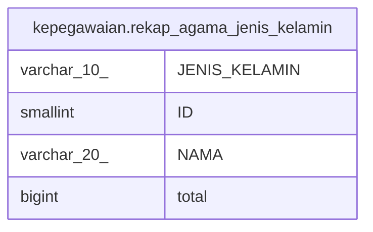

# kepegawaian.rekap_agama_jenis_kelamin

## Description

<details>
<summary><strong>Table Definition</strong></summary>

```sql
CREATE VIEW rekap_agama_jenis_kelamin AS (
 SELECT pegawai."JENIS_KELAMIN",
    agama."ID",
    agama."NAMA",
    count(*) AS total
   FROM (kepegawaian.pegawai
     LEFT JOIN kepegawaian.agama ON ((pegawai."AGAMA_ID" = agama."ID")))
  GROUP BY pegawai."JENIS_KELAMIN", agama."ID", agama."NAMA"
  ORDER BY agama."NAMA"
)
```

</details>

## Columns

| Name | Type | Default | Nullable | Children | Parents | Comment |
| ---- | ---- | ------- | -------- | -------- | ------- | ------- |
| JENIS_KELAMIN | varchar(10) |  | true |  |  |  |
| ID | smallint |  | true |  |  |  |
| NAMA | varchar(20) |  | true |  |  |  |
| total | bigint |  | true |  |  |  |

## Referenced Tables

| Name | Columns | Comment | Type |
| ---- | ------- | ------- | ---- |
| [kepegawaian.pegawai](kepegawaian.pegawai.md) | 100 |  | BASE TABLE |
| [kepegawaian.agama](kepegawaian.agama.md) | 4 |  | BASE TABLE |

## Relations



---

> Generated by [tbls](https://github.com/k1LoW/tbls)
