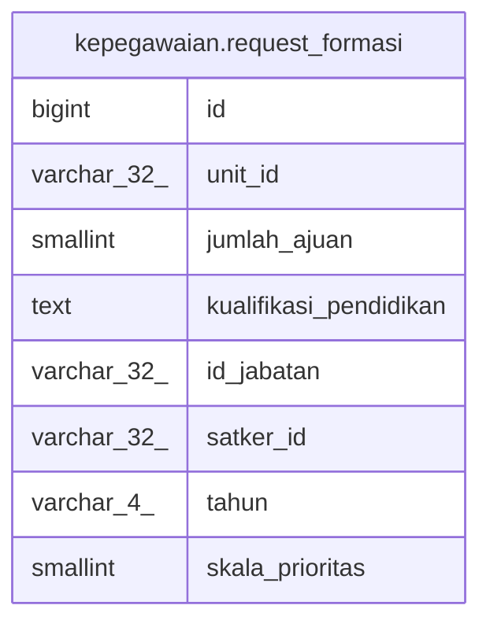

# kepegawaian.request_formasi

## Description

## Columns

| Name | Type | Default | Nullable | Children | Parents | Comment |
| ---- | ---- | ------- | -------- | -------- | ------- | ------- |
| id | bigint | nextval('kepegawaian.request_formasi_id_seq'::regclass) | false |  |  |  |
| unit_id | varchar(32) |  | true |  |  |  |
| jumlah_ajuan | smallint |  | true |  |  |  |
| kualifikasi_pendidikan | text |  | true |  |  |  |
| id_jabatan | varchar(32) |  | true |  |  |  |
| satker_id | varchar(32) |  | true |  |  |  |
| tahun | varchar(4) |  | true |  |  |  |
| skala_prioritas | smallint |  | true |  |  |  |

## Constraints

| Name | Type | Definition |
| ---- | ---- | ---------- |
| request_formasi_pkey | PRIMARY KEY | PRIMARY KEY (id) |

## Indexes

| Name | Definition |
| ---- | ---------- |
| request_formasi_pkey | CREATE UNIQUE INDEX request_formasi_pkey ON kepegawaian.request_formasi USING btree (id) |

## Relations

---

> Generated by [tbls](https://github.com/k1LoW/tbls)
