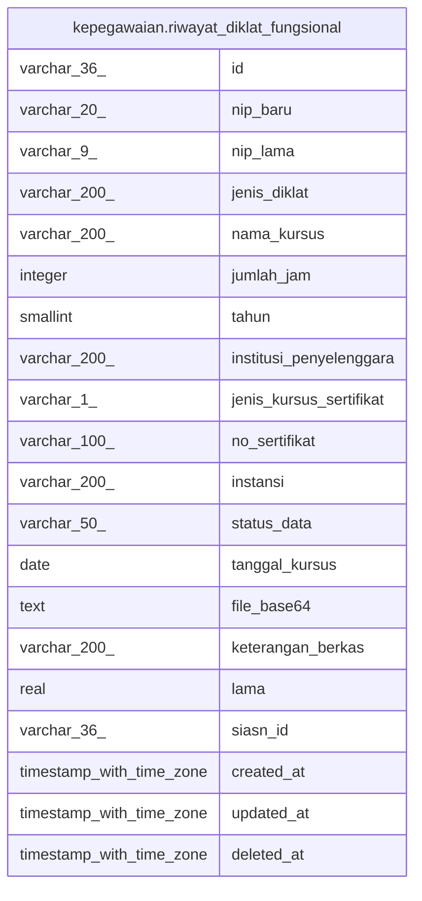

# kepegawaian.riwayat_diklat_fungsional

## Description

Riwayat diklat fungsional pegawai

## Columns

| Name | Type | Default | Nullable | Children | Parents | Comment |
| ---- | ---- | ------- | -------- | -------- | ------- | ------- |
| id | varchar(36) |  | false |  |  |  |
| nip_baru | varchar(20) |  | true |  |  |  |
| nip_lama | varchar(9) |  | true |  |  |  |
| jenis_diklat | varchar(200) |  | true |  |  |  |
| nama_kursus | varchar(200) |  | true |  |  |  |
| jumlah_jam | integer |  | true |  |  |  |
| tahun | smallint |  | true |  |  |  |
| institusi_penyelenggara | varchar(200) |  | true |  |  |  |
| jenis_kursus_sertifikat | varchar(1) |  | true |  |  |  |
| no_sertifikat | varchar(100) |  | true |  |  |  |
| instansi | varchar(200) |  | true |  |  |  |
| status_data | varchar(50) |  | true |  |  |  |
| tanggal_kursus | date |  | true |  |  |  |
| file_base64 | text |  | true |  |  |  |
| keterangan_berkas | varchar(200) |  | true |  |  |  |
| lama | real |  | true |  |  |  |
| siasn_id | varchar(36) |  | true |  |  |  |
| created_at | timestamp with time zone | now() | true |  |  |  |
| updated_at | timestamp with time zone | now() | true |  |  |  |
| deleted_at | timestamp with time zone |  | true |  |  |  |

## Constraints

| Name | Type | Definition |
| ---- | ---- | ---------- |
| riwayat_diklat_fungsional_id_not_null | n | NOT NULL id |
| riwayat_diklat_fungsional_pkey | PRIMARY KEY | PRIMARY KEY (id) |

## Indexes

| Name | Definition |
| ---- | ---------- |
| riwayat_diklat_fungsional_pkey | CREATE UNIQUE INDEX riwayat_diklat_fungsional_pkey ON kepegawaian.riwayat_diklat_fungsional USING btree (id) |

## Relations

---

> Generated by [tbls](https://github.com/k1LoW/tbls)
