# kepegawaian.riwayat_golongan

## Description

Riwayat golongan pegawai

## Columns

| Name | Type | Default | Nullable | Children | Parents | Comment |
| ---- | ---- | ------- | -------- | -------- | ------- | ------- |
| id | integer | nextval('riwayat_golongan_id_seq'::regclass) | false |  |  | id riwayat golongan |
| pns_id | varchar(36) |  | true |  | [kepegawaian.pegawai](kepegawaian.pegawai.md) | Referensi pegawai (rujuk pegawai) |
| pns_nip | varchar(20) |  | true |  |  | NIP pegawai |
| pns_nama | varchar(100) |  | true |  |  | Nama pegawai |
| kode_jenis_kp | varchar(4) |  | true |  |  | Kode jenis kp |
| jenis_kp | varchar(50) |  | true |  |  | Jenis kp |
| golongan_id | smallint |  | true |  | [kepegawaian.ref_golongan](kepegawaian.ref_golongan.md) | id golongan pegawai |
| golongan_nama | varchar(10) |  | true |  |  | Nama golongan pegawai |
| pangkat_nama | varchar(50) |  | true |  |  | Nama pangkat |
| sk_nomor | varchar(50) |  | true |  |  | Nomor SK pemberian golongan |
| no_bkn | varchar(100) |  | true |  |  | Nomor BKN |
| jumlah_angka_kredit_utama | smallint |  | true |  |  | Jumlah angka kredit utama |
| jumlah_angka_kredit_tambahan | smallint |  | true |  |  | Jumlah angka kredit tambahan |
| mk_golongan_tahun | smallint |  | true |  |  | Tahun pemberian golongan |
| mk_golongan_bulan | smallint |  | true |  |  | Bulan pemberian golongan |
| sk_tanggal | date |  | true |  |  | Tanggal SK pemberian golongan |
| tanggal_bkn | date |  | true |  |  | Tanggal BKN |
| tmt_golongan | date |  | true |  |  | Tanggal mulai efektif golongan |
| status_satker | integer |  | true |  |  | Status verifikasi di tingkat satuan kerja |
| status_biro | integer |  | true |  |  | Status verifikasi di tingkat biro |
| pangkat_terakhir | integer |  | true |  |  | Penanda apakah golongan merupakan golongan terakhir |
| bkn_id | varchar(36) |  | true |  |  | id pada sistem BKN |
| file_base64 | text |  | true |  |  | Berkas dalam format base64 |
| keterangan_berkas | varchar(200) |  | true |  |  | Keterangan berkas |
| arsip_id | bigint |  | true |  |  | id referensi arsip |
| golongan_asal | varchar(2) |  | true |  |  | Golongan asal pegawai |
| basic | varchar(15) |  | true |  |  | Penanda golongan basic |
| sk_type | smallint |  | true |  |  | Jenis SK pemberian golongan |
| kanreg | varchar(5) |  | true |  |  | Penanda apakah pegawai memiliki keterangan reguler |
| kpkn | varchar(50) |  | true |  |  | Keterangan kpkn |
| keterangan | varchar(200) |  | true |  |  | Keterangan golongan |
| lpnk | varchar(10) |  | true |  |  | Keterangan lpnk |
| jenis_riwayat | varchar(50) |  | true |  |  | Jenis riwayat |
| created_at | timestamp with time zone | now() | true |  |  | Waktu perekaman data |
| updated_at | timestamp with time zone | now() | true |  |  | Waktu terakhir pembaruan |
| deleted_at | timestamp with time zone |  | true |  |  | Waktu penghapusan data |
| jenis_kp_id | integer |  | true |  | [kepegawaian.ref_jenis_kp](kepegawaian.ref_jenis_kp.md) | Jenis kp (rujuk ref_jenis_kp) |

## Constraints

| Name | Type | Definition |
| ---- | ---- | ---------- |
| riwayat_golongan_id_not_null | n | NOT NULL id |
| fk_riwayat_golongan_golongan | FOREIGN KEY | FOREIGN KEY (golongan_id) REFERENCES ref_golongan(id) |
| fk_riwayat_golongan_jenis_kp | FOREIGN KEY | FOREIGN KEY (jenis_kp_id) REFERENCES ref_jenis_kp(id) |
| fk_riwayat_golongan_pns_id | FOREIGN KEY | FOREIGN KEY (pns_id) REFERENCES pegawai(pns_id) |
| riwayat_golongan_pkey | PRIMARY KEY | PRIMARY KEY (id) |

## Indexes

| Name | Definition |
| ---- | ---------- |
| riwayat_golongan_pkey | CREATE UNIQUE INDEX riwayat_golongan_pkey ON kepegawaian.riwayat_golongan USING btree (id) |

## Relations

```mermaid
erDiagram

"kepegawaian.riwayat_golongan" }o--o| "kepegawaian.pegawai" : "FOREIGN KEY (pns_id) REFERENCES pegawai(pns_id)"
"kepegawaian.riwayat_golongan" }o--o| "kepegawaian.ref_golongan" : "FOREIGN KEY (golongan_id) REFERENCES ref_golongan(id)"
"kepegawaian.riwayat_golongan" }o--o| "kepegawaian.ref_jenis_kp" : "FOREIGN KEY (jenis_kp_id) REFERENCES ref_jenis_kp(id)"

"kepegawaian.riwayat_golongan" {
  integer id
  varchar_36_ pns_id FK
  varchar_20_ pns_nip
  varchar_100_ pns_nama
  varchar_4_ kode_jenis_kp
  varchar_50_ jenis_kp
  smallint golongan_id FK
  varchar_10_ golongan_nama
  varchar_50_ pangkat_nama
  varchar_50_ sk_nomor
  varchar_100_ no_bkn
  smallint jumlah_angka_kredit_utama
  smallint jumlah_angka_kredit_tambahan
  smallint mk_golongan_tahun
  smallint mk_golongan_bulan
  date sk_tanggal
  date tanggal_bkn
  date tmt_golongan
  integer status_satker
  integer status_biro
  integer pangkat_terakhir
  varchar_36_ bkn_id
  text file_base64
  varchar_200_ keterangan_berkas
  bigint arsip_id
  varchar_2_ golongan_asal
  varchar_15_ basic
  smallint sk_type
  varchar_5_ kanreg
  varchar_50_ kpkn
  varchar_200_ keterangan
  varchar_10_ lpnk
  varchar_50_ jenis_riwayat
  timestamp_with_time_zone created_at
  timestamp_with_time_zone updated_at
  timestamp_with_time_zone deleted_at
  integer jenis_kp_id FK
}
"kepegawaian.pegawai" {
  integer id
  varchar_36_ pns_id
  varchar_9_ nip_lama
  varchar_20_ nip_baru
  varchar_100_ nama
  varchar_50_ gelar_depan
  varchar_50_ gelar_belakang
  varchar_50_ tempat_lahir_id
  date tgl_lahir
  varchar_1_ jenis_kelamin
  smallint agama_id FK
  smallint jenis_kawin_id FK
  varchar_50_ nik
  varchar_60_ no_darurat
  varchar_60_ no_hp
  varchar_60_ email
  varchar_300_ alamat
  varchar_50_ npwp
  varchar_50_ bpjs
  smallint jenis_pegawai_id
  integer kedudukan_hukum_id
  varchar_20_ status_cpns_pns
  varchar_50_ kartu_pegawai
  varchar_100_ no_sk_cpns
  date tgl_sk_cpns
  date tmt_cpns
  date tmt_pns
  smallint gol_awal_id FK
  smallint gol_id FK
  date tmt_golongan
  smallint mk_tahun
  smallint mk_bulan
  varchar_36_ jabatan_id FK
  date tmt_jabatan
  varchar_36_ pendidikan_id
  smallint tahun_lulus
  varchar_36_ kpkn_id FK
  varchar_36_ lokasi_kerja_id FK
  varchar_36_ unor_id FK
  varchar_36_ unor_induk_id
  varchar_36_ instansi_induk_id FK
  varchar_36_ instansi_kerja_id FK
  varchar_36_ satuan_kerja_induk_id
  varchar_36_ satuan_kerja_kerja_id
  varchar_10_ golongan_darah
  varchar_200_ foto
  date tmt_pensiun
  varchar_36_ lokasi_kerja
  smallint jml_istri
  smallint jml_anak
  varchar_100_ no_surat_dokter
  date tgl_surat_dokter
  varchar_100_ no_bebas_narkoba
  date tgl_bebas_narkoba
  varchar_100_ no_catatan_polisi
  date tgl_catatan_polisi
  varchar_50_ akte_kelahiran
  varchar_15_ status_hidup
  varchar_50_ akte_meninggal
  date tgl_meninggal
  varchar_100_ no_askes
  varchar_100_ no_taspen
  date tgl_npwp
  varchar_100_ tempat_lahir
  smallint tingkat_pendidikan_id FK
  varchar_200_ tempat_lahir_nama
  varchar_200_ jenis_jabatan_nama
  varchar_300_ jabatan_nama
  varchar_200_ kpkn_nama
  varchar_200_ instansi_induk_nama
  varchar_200_ instansi_kerja_nama
  varchar_200_ satuan_kerja_induk_nama
  varchar_200_ satuan_kerja_nama
  varchar_36_ jabatan_instansi_id FK
  smallint bup
  varchar_400_ jabatan_instansi_nama
  smallint jenis_jabatan_id
  date terminated_date
  smallint status_pegawai
  varchar_200_ jabatan_ppnpn
  varchar_36_ jabatan_instansi_real_id FK
  integer created_by
  integer updated_by
  varchar_100_ email_dikbud_bak
  varchar_100_ email_dikbud
  varchar_100_ kodecepat
  smallint is_dosen
  smallint mk_tahun_swasta
  smallint mk_bulan_swasta
  varchar_30_ kk
  varchar_30_ nidn
  varchar_200_ ket
  varchar_100_ no_sk_pemberhentian
  integer status_pegawai_backup
  varchar_50_ masa_kerja
  varchar_50_ kartu_asn
  timestamp_with_time_zone created_at
  timestamp_with_time_zone updated_at
  timestamp_with_time_zone deleted_at
}
"kepegawaian.ref_golongan" {
  integer id
  varchar_10_ nama
  varchar_50_ nama_pangkat
  varchar_10_ nama_2
  smallint gol
  varchar_10_ gol_pppk
  timestamp_with_time_zone created_at
  timestamp_with_time_zone updated_at
  timestamp_with_time_zone deleted_at
}
"kepegawaian.ref_jenis_kp" {
  integer id
  varchar_4_ dikbud_hr_id
  varchar_50_ nama
  timestamp_with_time_zone created_at
  timestamp_with_time_zone updated_at
  timestamp_with_time_zone deleted_at
}
```

---

> Generated by [tbls](https://github.com/k1LoW/tbls)
