# kepegawaian.riwayat_hukdis

## Description

## Columns

| Name | Type | Default | Nullable | Children | Parents | Comment |
| ---- | ---- | ------- | -------- | -------- | ------- | ------- |
| id | bigint | nextval('riwayat_hukdis_id_seq'::regclass) | false |  |  |  |
| pns_id | varchar(36) |  | true |  | [kepegawaian.pegawai](kepegawaian.pegawai.md) |  |
| pns_nip | varchar(20) |  | true |  |  |  |
| nama | varchar(200) |  | true |  |  |  |
| golongan_id | smallint |  | true |  |  |  |
| nama_golongan | varchar(20) |  | true |  |  |  |
| jenis_hukuman_id | smallint |  | true |  | [kepegawaian.ref_jenis_hukuman](kepegawaian.ref_jenis_hukuman.md) |  |
| nama_jenis_hukuman | varchar(100) |  | true |  |  |  |
| sk_nomor | varchar(30) |  | true |  |  |  |
| sk_tanggal | date |  | true |  |  |  |
| tanggal_mulai_hukuman | date |  | true |  |  |  |
| masa_tahun | smallint |  | true |  |  |  |
| masa_bulan | smallint |  | true |  |  |  |
| tanggal_akhir_hukuman | date |  | true |  |  |  |
| no_pp | varchar(100) |  | true |  |  |  |
| no_sk_pembatalan | varchar(100) |  | true |  |  |  |
| tanggal_sk_pembatalan | date |  | true |  |  |  |
| bkn_id | varchar(255) |  | true |  |  |  |
| file_base64 | text |  | true |  |  |  |
| keterangan_berkas | varchar(200) |  | true |  |  |  |
| created_at | timestamp with time zone | now() | true |  |  |  |
| updated_at | timestamp with time zone | now() | true |  |  |  |
| deleted_at | timestamp with time zone |  | true |  |  |  |

## Constraints

| Name | Type | Definition |
| ---- | ---- | ---------- |
| fk_riwayat_hukdis_jenis_hukuman | FOREIGN KEY | FOREIGN KEY (jenis_hukuman_id) REFERENCES ref_jenis_hukuman(id) |
| fk_riwayat_hukdis_pns_id | FOREIGN KEY | FOREIGN KEY (pns_id) REFERENCES pegawai(pns_id) |
| riwayat_hukdis_pkey | PRIMARY KEY | PRIMARY KEY (id) |

## Indexes

| Name | Definition |
| ---- | ---------- |
| riwayat_hukdis_pkey | CREATE UNIQUE INDEX riwayat_hukdis_pkey ON kepegawaian.riwayat_hukdis USING btree (id) |

## Relations

```mermaid
erDiagram

"kepegawaian.riwayat_hukdis" }o--o| "kepegawaian.pegawai" : "FOREIGN KEY (pns_id) REFERENCES pegawai(pns_id)"
"kepegawaian.riwayat_hukdis" }o--o| "kepegawaian.ref_jenis_hukuman" : "FOREIGN KEY (jenis_hukuman_id) REFERENCES ref_jenis_hukuman(id)"

"kepegawaian.riwayat_hukdis" {
  bigint id
  varchar_36_ pns_id FK
  varchar_20_ pns_nip
  varchar_200_ nama
  smallint golongan_id
  varchar_20_ nama_golongan
  smallint jenis_hukuman_id FK
  varchar_100_ nama_jenis_hukuman
  varchar_30_ sk_nomor
  date sk_tanggal
  date tanggal_mulai_hukuman
  smallint masa_tahun
  smallint masa_bulan
  date tanggal_akhir_hukuman
  varchar_100_ no_pp
  varchar_100_ no_sk_pembatalan
  date tanggal_sk_pembatalan
  varchar_255_ bkn_id
  text file_base64
  varchar_200_ keterangan_berkas
  timestamp_with_time_zone created_at
  timestamp_with_time_zone updated_at
  timestamp_with_time_zone deleted_at
}
"kepegawaian.pegawai" {
  integer id
  varchar_36_ pns_id
  varchar_9_ nip_lama
  varchar_20_ nip_baru
  varchar_100_ nama
  varchar_20_ gelar_depan
  varchar_50_ gelar_belakang
  varchar_50_ tempat_lahir_id
  date tgl_lahir
  varchar_1_ jenis_kelamin
  smallint agama_id FK
  smallint jenis_kawin_id FK
  varchar_20_ nik
  varchar_60_ no_darurat
  varchar_60_ no_hp
  varchar_60_ email
  varchar_200_ alamat
  varchar_20_ npwp
  varchar_20_ bpjs
  smallint jenis_pegawai_id
  integer kedudukan_hukum_id
  varchar_20_ status_cpns_pns
  varchar_30_ kartu_pegawai
  varchar_100_ no_sk_cpns
  date tgl_sk_cpns
  date tmt_cpns
  date tmt_pns
  smallint gol_awal_id FK
  smallint gol_id FK
  date tmt_golongan
  smallint mk_tahun
  smallint mk_bulan
  varchar_36_ jabatan_id FK
  date tmt_jabatan
  varchar_36_ pendidikan_id
  smallint tahun_lulus
  varchar_36_ kpkn_id FK
  varchar_36_ lokasi_kerja_id FK
  varchar_36_ unor_id FK
  varchar_36_ unor_induk_id
  varchar_36_ instansi_induk_id FK
  varchar_36_ instansi_kerja_id FK
  varchar_36_ satuan_kerja_induk_id
  varchar_36_ satuan_kerja_kerja_id
  varchar_10_ golongan_darah
  varchar_200_ foto
  date tmt_pensiun
  varchar_36_ lokasi_kerja
  smallint jml_istri
  smallint jml_anak
  varchar_100_ no_surat_dokter
  date tgl_surat_dokter
  varchar_100_ no_bebas_narkoba
  date tgl_bebas_narkoba
  varchar_100_ no_catatan_polisi
  date tgl_catatan_polisi
  varchar_50_ akte_kelahiran
  varchar_15_ status_hidup
  varchar_50_ akte_meninggal
  date tgl_meninggal
  varchar_100_ no_askes
  varchar_100_ no_taspen
  date tgl_npwp
  varchar_100_ tempat_lahir
  smallint tingkat_pendidikan_id FK
  varchar_200_ tempat_lahir_nama
  varchar_200_ jenis_jabatan_nama
  varchar_200_ jabatan_nama
  varchar_200_ kpkn_nama
  varchar_200_ instansi_induk_nama
  varchar_200_ instansi_kerja_nama
  varchar_200_ satuan_kerja_induk_nama
  varchar_200_ satuan_kerja_nama
  integer jabatan_instansi_id
  smallint bup
  varchar_200_ jabatan_instansi_nama
  smallint jenis_jabatan_id
  date terminated_date
  smallint status_pegawai
  varchar_200_ jabatan_ppnpn
  integer jabatan_instansi_real_id
  integer created_by
  integer updated_by
  varchar_100_ email_dikbud_bak
  varchar_100_ email_dikbud
  varchar_100_ kodecepat
  smallint is_dosen
  smallint mk_tahun_swasta
  smallint mk_bulan_swasta
  varchar_30_ kk
  varchar_30_ nidn
  varchar_200_ ket
  varchar_100_ no_sk_pemberhentian
  smallint status_pegawai_backup
  varchar_50_ masa_kerja
  varchar_50_ kartu_asn
  timestamp_with_time_zone created_at
  timestamp_with_time_zone updated_at
  timestamp_with_time_zone deleted_at
}
"kepegawaian.ref_jenis_hukuman" {
  integer id
  varchar_2_ dikbud_hr_id
  varchar_100_ nama
  varchar_1_ tingkat_hukuman
  varchar_10_ nama_tingkat_hukuman
  timestamp_with_time_zone created_at
  timestamp_with_time_zone updated_at
  timestamp_with_time_zone deleted_at
}
```

---

> Generated by [tbls](https://github.com/k1LoW/tbls)
