# kepegawaian.riwayat_jabatan

## Description

Riwayat jabatan pegawai

## Columns

| Name | Type | Default | Nullable | Children | Parents | Comment |
| ---- | ---- | ------- | -------- | -------- | ------- | ------- |
| bkn_id | varchar(36) |  | true |  |  | id pada sistem BKN |
| pns_id | varchar(36) |  | true |  | [kepegawaian.pegawai](kepegawaian.pegawai.md) | Referensi pegawai (rujuk pegawai.pns_id) |
| pns_nip | varchar(20) |  | true |  |  | NIP pegawai |
| pns_nama | varchar(100) |  | true |  |  | Nama pegawai |
| unor_id | varchar(36) |  | true |  |  | id unit organisasi saat jabatan (rujuk unit_kerja) |
| unor | text |  | true |  |  | Nama unit organisasi |
| jenis_jabatan_id | integer |  | true |  |  | id jenis jabatan (struktural/fungsional/dll) |
| jenis_jabatan | varchar(250) |  | true |  |  | Nama jenis jabatan |
| jabatan_id | varchar(36) |  | true |  | [kepegawaian.ref_jabatan](kepegawaian.ref_jabatan.md) | id jabatan (rujuk ref_jabatan) |
| nama_jabatan | text |  | true |  |  | Nama jabatan (teks) |
| eselon_id | varchar(36) |  | true |  |  | id eselon jabatan |
| eselon | varchar(100) |  | true |  |  | Nama eselon jabatan |
| tmt_jabatan | date |  | true |  |  | Tanggal mulai memangku jabatan |
| no_sk | varchar(100) |  | true |  |  | Nomor SK jabatan |
| tanggal_sk | date |  | true |  |  | Tanggal SK jabatan |
| satuan_kerja_id | varchar(36) |  | true |  | [kepegawaian.ref_unit_kerja](kepegawaian.ref_unit_kerja.md) | Satuan kerja terkait jabatan (rujuk unit_kerja) |
| tmt_pelantikan | date |  | true |  |  | Tanggal mulai pelantikan |
| is_active | smallint |  | true |  |  | Penanda apakah jabatan masih aktif saat ini |
| eselon1 | text |  | true |  |  | Unit eselon 1 terkait jabatan |
| eselon2 | text |  | true |  |  | Unit eselon 2 terkait jabatan |
| eselon3 | text |  | true |  |  | Unit eselon 3 terkait jabatan |
| eselon4 | text |  | true |  |  | Unit eselon 4 terkait jabatan |
| id | bigint | nextval('riwayat_jabatan_id_seq'::regclass) | false |  |  | id riwayat jabatan |
| catatan | varchar(250) |  | true |  |  | Catatan atas riwayat jabatan |
| jenis_sk | varchar(100) |  | true |  |  | Kategori/jenis SK jabatan |
| status_satker | integer |  | true |  |  | Status persetujuan satuan kerja |
| status_biro | integer |  | true |  |  | Status persetujuan biro kepegawaian |
| jabatan_id_bkn | varchar(36) |  | true |  |  | id jabatan pada sistem BKN |
| unor_id_bkn | varchar(36) |  | true |  |  | id unit organisasi saat jabatan pada sistem BKN |
| tabel_mutasi_id | bigint |  | true |  |  | Referensi ke tabel mutasi |
| created_at | timestamp with time zone | now() | true |  |  | Waktu perekaman data |
| updated_at | timestamp with time zone | now() | true |  |  | Waktu terakhir pembaruan |
| deleted_at | timestamp with time zone |  | true |  |  | Waktu penghapusan data |
| status_plt | boolean |  | true |  |  | Status pelaksana tugas (PLT) |
| kelas_jabatan_id | integer |  | true |  | [kepegawaian.ref_kelas_jabatan](kepegawaian.ref_kelas_jabatan.md) | id kelas jabatan |
| periode_jabatan_start_date | date |  | true |  |  | Tanggal mulai periode jabatan |
| periode_jabatan_end_date | date |  | true |  |  | Tanggal akhir periode jabatan |
| file_base64 | text |  | true |  |  |  |
| keterangan_berkas | varchar(200) |  | true |  |  |  |

## Constraints

| Name | Type | Definition |
| ---- | ---- | ---------- |
| fk_riwayat_jabatan_jabatan_id | FOREIGN KEY | FOREIGN KEY (jabatan_id) REFERENCES ref_jabatan(kode_jabatan) |
| fk_riwayat_jabatan_pns_id | FOREIGN KEY | FOREIGN KEY (pns_id) REFERENCES pegawai(pns_id) |
| riwayat_jabatan_pkey | PRIMARY KEY | PRIMARY KEY (id) |
| riwayat_jabatan_kelas_jabatan_id_fkey | FOREIGN KEY | FOREIGN KEY (kelas_jabatan_id) REFERENCES ref_kelas_jabatan(id) |
| fk_riwayat_jabatan_satuan_kerja | FOREIGN KEY | FOREIGN KEY (satuan_kerja_id) REFERENCES ref_unit_kerja(id) |

## Indexes

| Name | Definition |
| ---- | ---------- |
| riwayat_jabatan_pkey | CREATE UNIQUE INDEX riwayat_jabatan_pkey ON kepegawaian.riwayat_jabatan USING btree (id) |

## Relations

```mermaid
erDiagram

"kepegawaian.riwayat_jabatan" }o--o| "kepegawaian.pegawai" : "FOREIGN KEY (pns_id) REFERENCES pegawai(pns_id)"
"kepegawaian.riwayat_jabatan" }o--o| "kepegawaian.ref_jabatan" : "FOREIGN KEY (jabatan_id) REFERENCES ref_jabatan(kode_jabatan)"
"kepegawaian.riwayat_jabatan" }o--o| "kepegawaian.ref_unit_kerja" : "FOREIGN KEY (satuan_kerja_id) REFERENCES ref_unit_kerja(id)"
"kepegawaian.riwayat_jabatan" }o--o| "kepegawaian.ref_kelas_jabatan" : "FOREIGN KEY (kelas_jabatan_id) REFERENCES ref_kelas_jabatan(id)"

"kepegawaian.riwayat_jabatan" {
  varchar_36_ bkn_id
  varchar_36_ pns_id FK
  varchar_20_ pns_nip
  varchar_100_ pns_nama
  varchar_36_ unor_id
  text unor
  integer jenis_jabatan_id
  varchar_250_ jenis_jabatan
  varchar_36_ jabatan_id FK
  text nama_jabatan
  varchar_36_ eselon_id
  varchar_100_ eselon
  date tmt_jabatan
  varchar_100_ no_sk
  date tanggal_sk
  varchar_36_ satuan_kerja_id FK
  date tmt_pelantikan
  smallint is_active
  text eselon1
  text eselon2
  text eselon3
  text eselon4
  bigint id
  varchar_250_ catatan
  varchar_100_ jenis_sk
  integer status_satker
  integer status_biro
  varchar_36_ jabatan_id_bkn
  varchar_36_ unor_id_bkn
  bigint tabel_mutasi_id
  timestamp_with_time_zone created_at
  timestamp_with_time_zone updated_at
  timestamp_with_time_zone deleted_at
  boolean status_plt
  integer kelas_jabatan_id FK
  date periode_jabatan_start_date
  date periode_jabatan_end_date
  text file_base64
  varchar_200_ keterangan_berkas
}
"kepegawaian.pegawai" {
  integer id
  varchar_36_ pns_id
  varchar_9_ nip_lama
  varchar_20_ nip_baru
  varchar_100_ nama
  varchar_50_ gelar_depan
  varchar_50_ gelar_belakang
  varchar_50_ tempat_lahir_id
  date tanggal_lahir
  varchar_1_ jenis_kelamin
  smallint agama_id FK
  smallint jenis_kawin_id FK
  varchar_50_ nik
  varchar_60_ no_darurat
  varchar_60_ no_hp
  varchar_60_ email
  varchar_300_ alamat
  varchar_50_ npwp
  varchar_50_ bpjs
  smallint jenis_pegawai_id
  integer kedudukan_hukum_id
  varchar_20_ status_cpns_pns
  varchar_50_ kartu_pegawai
  varchar_100_ no_sk_cpns
  date tanggal_sk_cpns
  date tmt_cpns
  date tmt_pns
  smallint gol_awal_id FK
  smallint gol_id FK
  date tmt_golongan
  smallint mk_tahun
  smallint mk_bulan
  varchar_36_ jabatan_id FK
  date tmt_jabatan
  varchar_36_ pendidikan_id
  smallint tahun_lulus
  varchar_36_ kpkn_id FK
  varchar_36_ lokasi_kerja_id FK
  varchar_36_ unor_id FK
  varchar_36_ unor_induk_id
  varchar_36_ instansi_induk_id FK
  varchar_36_ instansi_kerja_id FK
  varchar_36_ satuan_kerja_induk_id
  varchar_36_ satuan_kerja_id
  varchar_10_ golongan_darah
  varchar_200_ foto
  date tmt_pensiun
  varchar_36_ lokasi_kerja
  smallint jml_pasangan
  smallint jml_anak
  varchar_100_ no_surat_dokter
  date tanggal_surat_dokter
  varchar_100_ no_bebas_narkoba
  date tanggal_bebas_narkoba
  varchar_100_ no_catatan_polisi
  date tanggal_catatan_polisi
  varchar_50_ akte_kelahiran
  varchar_15_ status_hidup
  varchar_50_ akte_meninggal
  date tanggal_meninggal
  varchar_100_ no_askes
  varchar_100_ no_taspen
  date tanggal_npwp
  varchar_100_ tempat_lahir
  smallint tingkat_pendidikan_id FK
  varchar_200_ tempat_lahir_nama
  varchar_200_ jenis_jabatan_nama
  varchar_300_ jabatan_nama
  varchar_200_ kpkn_nama
  varchar_200_ instansi_induk_nama
  varchar_200_ instansi_kerja_nama
  varchar_200_ satuan_kerja_induk_nama
  varchar_200_ satuan_kerja_nama
  varchar_36_ jabatan_instansi_id FK
  smallint bup
  varchar_400_ jabatan_instansi_nama
  smallint jenis_jabatan_id
  date terminated_date
  smallint status_pegawai
  varchar_200_ jabatan_ppnpn
  varchar_36_ jabatan_instansi_real_id FK
  integer created_by
  integer updated_by
  varchar_100_ email_dikbud_bak
  varchar_100_ email_dikbud
  varchar_100_ kodecepat
  smallint is_dosen
  smallint mk_tahun_swasta
  smallint mk_bulan_swasta
  varchar_30_ kk
  varchar_30_ nidn
  varchar_200_ ket
  varchar_100_ no_sk_pemberhentian
  smallint status_pegawai_backup
  varchar_50_ masa_kerja
  varchar_50_ kartu_asn
  timestamp_with_time_zone created_at
  timestamp_with_time_zone updated_at
  timestamp_with_time_zone deleted_at
}
"kepegawaian.ref_jabatan" {
  varchar_36_ kode_jabatan
  integer id
  varchar_400_ nama_jabatan
  varchar_400_ nama_jabatan_full
  smallint jenis_jabatan
  smallint kelas
  smallint pensiun
  varchar_36_ kode_bkn
  varchar_400_ nama_jabatan_bkn
  varchar_100_ kategori_jabatan
  varchar_36_ bkn_id
  timestamp_with_time_zone created_at
  timestamp_with_time_zone updated_at
  timestamp_with_time_zone deleted_at
  bigint tunjangan_jabatan
  integer no
}
"kepegawaian.ref_unit_kerja" {
  varchar_60_ id
  integer no
  varchar_60_ kode_internal
  varchar_200_ nama_unor
  varchar_60_ eselon_id
  varchar_60_ cepat_kode
  varchar_200_ nama_jabatan
  varchar_200_ nama_pejabat
  varchar_60_ diatasan_id FK
  varchar_60_ instansi_id FK
  varchar_60_ pemimpin_pns_id FK
  varchar_60_ jenis_unor_id
  varchar_60_ unor_induk
  smallint jumlah_ideal_staff
  integer order
  boolean is_satker
  varchar_60_ eselon_1
  varchar_60_ eselon_2
  varchar_60_ eselon_3
  varchar_60_ eselon_4
  date expired_date
  varchar_200_ keterangan
  varchar_200_ jenis_satker
  varchar_200_ abbreviation
  varchar_200_ unor_induk_penyetaraan
  varchar_60_ jabatan_id
  varchar_4_ waktu
  varchar_100_ peraturan
  varchar_50_ remark
  boolean aktif
  varchar_50_ eselon_nama
  timestamp_with_time_zone created_at
  timestamp_with_time_zone updated_at
  timestamp_with_time_zone deleted_at
}
"kepegawaian.ref_kelas_jabatan" {
  integer id
  text kelas_jabatan
  bigint tunjangan_kinerja
  timestamp_without_time_zone created_at
  timestamp_without_time_zone updated_at
  timestamp_with_time_zone deleted_at
}
```

---

> Generated by [tbls](https://github.com/k1LoW/tbls)
