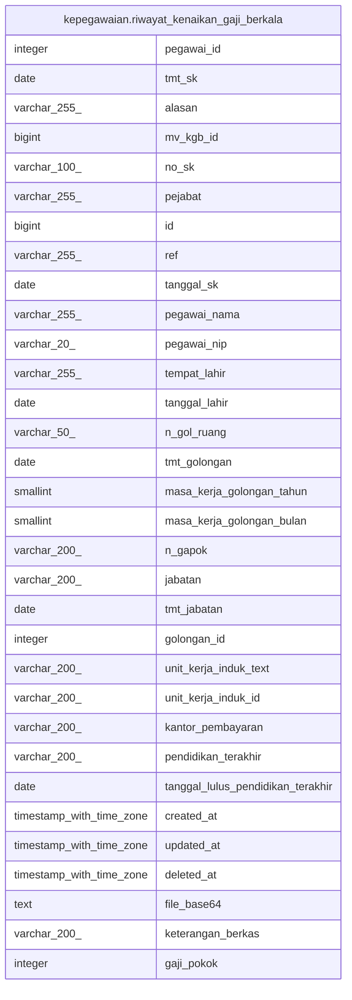

# kepegawaian.riwayat_kenaikan_gaji_berkala

## Description

Riwayat kenaikan gaji berkala pegawai

## Columns

| Name | Type | Default | Nullable | Children | Parents | Comment |
| ---- | ---- | ------- | -------- | -------- | ------- | ------- |
| pegawai_id | integer |  | true |  |  | Referensi ke data pegawai |
| tmt_sk | date |  | true |  |  | TMT SK kenaikan gaji berkala |
| alasan | varchar(255) |  | true |  |  | Alasan kenaikan gaji berkala |
| mv_kgb_id | bigint |  | true |  |  | Referensi ke materialized view KGB |
| no_sk | varchar(100) |  | true |  |  | Nomor SK kenaikan gaji berkala |
| pejabat | varchar(255) |  | true |  |  | Pejabat yang menandatangani |
| id | bigint | nextval('riwayat_kgb_id_seq'::regclass) | false |  |  | id riwayat kenaikan gaji berkala |
| ref | varchar(255) | uuid_generate_v4() | true |  |  | Nomor referensi |
| tanggal_sk | date |  | true |  |  | Tanggal SK kenaikan gaji berkala |
| pegawai_nama | varchar(255) |  | true |  |  | Nama pegawai |
| pegawai_nip | varchar(20) |  | true |  |  | NIP pegawai |
| tempat_lahir | varchar(255) |  | true |  |  | Tempat lahir pegawai |
| tanggal_lahir | date |  | true |  |  | Tanggal lahir pegawai |
| n_gol_ruang | varchar(50) |  | true |  |  | Golongan ruang |
| tmt_golongan | date |  | true |  |  | Tanggal mulai golongan terkait |
| masa_kerja_golongan_tahun | smallint |  | true |  |  | Masa kerja dalam tahun |
| masa_kerja_golongan_bulan | smallint |  | true |  |  | Masa kerja dalam bulan |
| n_gapok | varchar(200) |  | true |  |  | Nilai gaji pokok |
| jabatan | varchar(200) |  | true |  |  | Nama jabatan |
| tmt_jabatan | date |  | true |  |  | Tanggal mulai memangku jabatan |
| golongan_id | integer |  | true |  |  | Referensi ke golongan |
| unit_kerja_induk_text | varchar(200) |  | true |  |  | Nama unit kerja induk |
| unit_kerja_induk_id | varchar(200) |  | true |  |  | id unit kerja induk |
| kantor_pembayaran | varchar(200) |  | true |  |  | Kantor yang melakukan pembayaran gaji |
| pendidikan_terakhir | varchar(200) |  | true |  |  | Pendidikan terakhir |
| tanggal_lulus_pendidikan_terakhir | date |  | true |  |  | Tanggal lulus pendidikan terakhir |
| created_at | timestamp with time zone | now() | true |  |  | Waktu perekaman data |
| updated_at | timestamp with time zone | now() | true |  |  | Waktu terakhir pembaruan |
| deleted_at | timestamp with time zone |  | true |  |  | Waktu penghapusan data |
| file_base64 | text |  | true |  |  |  |
| keterangan_berkas | varchar(200) |  | true |  |  |  |
| gaji_pokok | integer |  | true |  |  |  |

## Constraints

| Name | Type | Definition |
| ---- | ---- | ---------- |
| riwayat_kgb_pkey | PRIMARY KEY | PRIMARY KEY (id) |

## Indexes

| Name | Definition |
| ---- | ---------- |
| riwayat_kgb_pkey | CREATE UNIQUE INDEX riwayat_kgb_pkey ON kepegawaian.riwayat_kenaikan_gaji_berkala USING btree (id) |

## Relations

---

> Generated by [tbls](https://github.com/k1LoW/tbls)
