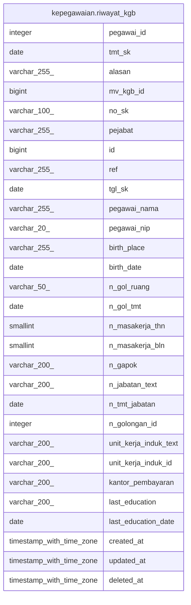

# kepegawaian.riwayat_kgb

## Description

## Columns

| Name | Type | Default | Nullable | Children | Parents | Comment |
| ---- | ---- | ------- | -------- | -------- | ------- | ------- |
| pegawai_id | integer |  | true |  |  |  |
| tmt_sk | date |  | true |  |  |  |
| alasan | varchar(255) |  | true |  |  |  |
| mv_kgb_id | bigint |  | true |  |  |  |
| no_sk | varchar(100) |  | true |  |  |  |
| pejabat | varchar(255) |  | true |  |  |  |
| id | bigint | nextval('riwayat_kgb_id_seq'::regclass) | false |  |  |  |
| ref | varchar(255) | uuid_generate_v4() | true |  |  |  |
| tgl_sk | date |  | true |  |  |  |
| pegawai_nama | varchar(255) |  | true |  |  |  |
| pegawai_nip | varchar(20) |  | true |  |  |  |
| birth_place | varchar(255) |  | true |  |  |  |
| birth_date | date |  | true |  |  |  |
| n_gol_ruang | varchar(50) |  | true |  |  |  |
| n_gol_tmt | date |  | true |  |  |  |
| n_masakerja_thn | smallint |  | true |  |  |  |
| n_masakerja_bln | smallint |  | true |  |  |  |
| n_gapok | varchar(200) |  | true |  |  |  |
| n_jabatan_text | varchar(200) |  | true |  |  |  |
| n_tmt_jabatan | date |  | true |  |  |  |
| n_golongan_id | integer |  | true |  |  |  |
| unit_kerja_induk_text | varchar(200) |  | true |  |  |  |
| unit_kerja_induk_id | varchar(200) |  | true |  |  |  |
| kantor_pembayaran | varchar(200) |  | true |  |  |  |
| last_education | varchar(200) |  | true |  |  |  |
| last_education_date | date |  | true |  |  |  |
| created_at | timestamp with time zone | now() | true |  |  |  |
| updated_at | timestamp with time zone | now() | true |  |  |  |
| deleted_at | timestamp with time zone |  | true |  |  |  |

## Constraints

| Name | Type | Definition |
| ---- | ---- | ---------- |
| riwayat_kgb_pkey | PRIMARY KEY | PRIMARY KEY (id) |

## Indexes

| Name | Definition |
| ---- | ---------- |
| riwayat_kgb_pkey | CREATE UNIQUE INDEX riwayat_kgb_pkey ON kepegawaian.riwayat_kgb USING btree (id) |

## Relations

---

> Generated by [tbls](https://github.com/k1LoW/tbls)
