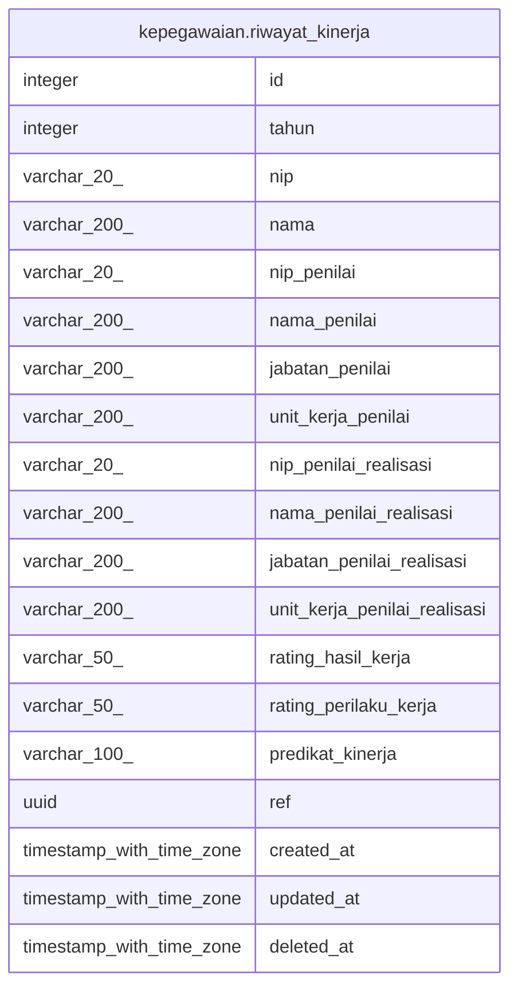

# kepegawaian.riwayat_kinerja

## Description

Riwayat kinerja pegawai

## Columns

| Name | Type | Default | Nullable | Children | Parents | Comment |
| ---- | ---- | ------- | -------- | -------- | ------- | ------- |
| id | integer | nextval('riwayat_kinerja_id_seq'::regclass) | false |  |  | id riwayat kinerja |
| tahun | integer |  | true |  |  | Tahun penilaian |
| nip | varchar(20) |  | true |  |  | Nomor Induk Pegawai |
| nama | varchar(200) |  | true |  |  | Nama pegawai |
| nip_penilai | varchar(20) |  | true |  |  | NIP pejabat penilai |
| nama_penilai | varchar(200) |  | true |  |  | Nama pejabat penilai |
| jabatan_penilai | varchar(200) |  | true |  |  | Jabatan pejabat penilai |
| unit_kerja_penilai | varchar(200) |  | true |  |  | Unit kerja pejabat penilai |
| nip_penilai_realisasi | varchar(20) |  | true |  |  | NIP pejabat penilai hasil aktual |
| nama_penilai_realisasi | varchar(200) |  | true |  |  | Nama pejabat penilai hasil aktual |
| jabatan_penilai_realisasi | varchar(200) |  | true |  |  | Jabatan pejabat penilai hasil aktual |
| unit_kerja_penilai_realisasi | varchar(200) |  | true |  |  | Unit kerja pejabat penilai hasil aktual |
| rating_hasil_kerja | varchar(50) |  | true |  |  | Nilai hasil kerja |
| rating_perilaku_kerja | varchar(50) |  | true |  |  | Nilai perilaku kerja |
| predikat_kinerja | varchar(100) |  | true |  |  | Predikat penilaian kinerja |
| ref | uuid | uuid_generate_v4() | true |  |  | Nomor referensi |
| created_at | timestamp with time zone | now() | true |  |  | Waktu pembuatan data |
| updated_at | timestamp with time zone | now() | true |  |  | Waktu terakhir pembaruan |
| deleted_at | timestamp with time zone |  | true |  |  | Waktu penghapusan data |

## Constraints

| Name | Type | Definition |
| ---- | ---- | ---------- |
| riwayat_kinerja_pkey | PRIMARY KEY | PRIMARY KEY (id) |

## Indexes

| Name | Definition |
| ---- | ---------- |
| riwayat_kinerja_pkey | CREATE UNIQUE INDEX riwayat_kinerja_pkey ON kepegawaian.riwayat_kinerja USING btree (id) |

## Relations

---

> Generated by [tbls](https://github.com/k1LoW/tbls)
