# kepegawaian.riwayat_pendidikan

## Description

Riwayat pendidikan pegawai

## Columns

| Name | Type | Default | Nullable | Children | Parents | Comment |
| ---- | ---- | ------- | -------- | -------- | ------- | ------- |
| id | integer | nextval('riwayat_pendidikan_id_seq'::regclass) | false |  |  | id riwayat pendidikan pegawai |
| pns_id_3 | varchar(32) |  | true |  |  | id PNS versi 3 |
| tingkat_pendidikan_id | smallint |  | true |  | [kepegawaian.ref_tingkat_pendidikan](kepegawaian.ref_tingkat_pendidikan.md) | Tingkat pendidikan (rujuk tingkat_pendidikan) |
| pendidikan_id_3 | varchar(32) |  | true |  |  | id pendidikan versi 3 |
| tanggal_lulus | date |  | true |  |  | Tanggal kelulusan |
| no_ijazah | varchar(100) |  | true |  |  | Nomor ijazah |
| nama_sekolah | varchar(200) |  | true |  |  | Nama institusi pendidikan |
| gelar_depan | varchar(50) |  | true |  |  | Gelar depan terkait pendidikan |
| gelar_belakang | varchar(60) |  | true |  |  | Gelar belakang terkait pendidikan |
| pendidikan_pertama | varchar(1) |  | true |  |  | Penanda pendidikan pertama |
| negara_sekolah | varchar(255) |  | true |  |  | Negara tempat sekolah/pendidikan |
| tahun_lulus | smallint |  | true |  |  | Tahun kelulusan |
| nip | varchar(20) |  | true |  |  | Nomor Induk Pegawai |
| diakui_bkn | integer |  | true |  |  | Penanda pengakuan oleh BKN |
| status_satker | integer |  | true |  |  | Status verifikasi di tingkat satuan kerja |
| status_biro | integer |  | true |  |  | Status verifikasi di tingkat biro |
| pendidikan_terakhir | integer |  | true |  |  | Penanda pendidikan terakhir |
| pns_id | varchar(36) |  | true |  | [kepegawaian.pegawai](kepegawaian.pegawai.md) | Referensi pegawai (rujuk pegawai.pns_id) |
| pendidikan_id | varchar(36) |  | true |  | [kepegawaian.ref_pendidikan](kepegawaian.ref_pendidikan.md) | Program pendidikan (rujuk pendidikan) |
| created_at | timestamp with time zone | now() | true |  |  | Waktu perekaman data |
| updated_at | timestamp with time zone | now() | true |  |  | Waktu terakhir pembaruan |
| deleted_at | timestamp with time zone |  | true |  |  | Waktu penghapusan data |
| tugas_belajar | smallint |  | true |  |  | Tugas belajar |
| file_base64 | text |  | true |  |  | File berkas dalam format base64 |
| keterangan_berkas | varchar(200) |  | true |  |  | Keterangan berkas |
| s3_file_id | bigint |  | true |  | [kepegawaian.s3_files](kepegawaian.s3_files.md) |  |

## Constraints

| Name | Type | Definition |
| ---- | ---- | ---------- |
| fk_riwayat_pendidikan_pns_id | FOREIGN KEY | FOREIGN KEY (pns_id) REFERENCES pegawai(pns_id) |
| fk_riwayat_pendidikan_pendidikan | FOREIGN KEY | FOREIGN KEY (pendidikan_id) REFERENCES ref_pendidikan(id) |
| riwayat_pendidikan_pkey | PRIMARY KEY | PRIMARY KEY (id) |
| fk_riwayat_pendidikan_tingkat | FOREIGN KEY | FOREIGN KEY (tingkat_pendidikan_id) REFERENCES ref_tingkat_pendidikan(id) |
| riwayat_pendidikan_s3_file_id_fkey | FOREIGN KEY | FOREIGN KEY (s3_file_id) REFERENCES s3_files(id) |

## Indexes

| Name | Definition |
| ---- | ---------- |
| riwayat_pendidikan_pkey | CREATE UNIQUE INDEX riwayat_pendidikan_pkey ON kepegawaian.riwayat_pendidikan USING btree (id) |

## Relations

```mermaid
erDiagram

"kepegawaian.riwayat_pendidikan" }o--o| "kepegawaian.ref_tingkat_pendidikan" : "FOREIGN KEY (tingkat_pendidikan_id) REFERENCES ref_tingkat_pendidikan(id)"
"kepegawaian.riwayat_pendidikan" }o--o| "kepegawaian.pegawai" : "FOREIGN KEY (pns_id) REFERENCES pegawai(pns_id)"
"kepegawaian.riwayat_pendidikan" }o--o| "kepegawaian.ref_pendidikan" : "FOREIGN KEY (pendidikan_id) REFERENCES ref_pendidikan(id)"
"kepegawaian.riwayat_pendidikan" }o--o| "kepegawaian.s3_files" : "FOREIGN KEY (s3_file_id) REFERENCES s3_files(id)"

"kepegawaian.riwayat_pendidikan" {
  integer id
  varchar_32_ pns_id_3
  smallint tingkat_pendidikan_id FK
  varchar_32_ pendidikan_id_3
  date tanggal_lulus
  varchar_100_ no_ijazah
  varchar_200_ nama_sekolah
  varchar_50_ gelar_depan
  varchar_60_ gelar_belakang
  varchar_1_ pendidikan_pertama
  varchar_255_ negara_sekolah
  smallint tahun_lulus
  varchar_20_ nip
  integer diakui_bkn
  integer status_satker
  integer status_biro
  integer pendidikan_terakhir
  varchar_36_ pns_id FK
  varchar_36_ pendidikan_id FK
  timestamp_with_time_zone created_at
  timestamp_with_time_zone updated_at
  timestamp_with_time_zone deleted_at
  smallint tugas_belajar
  text file_base64
  varchar_200_ keterangan_berkas
  bigint s3_file_id FK
}
"kepegawaian.ref_tingkat_pendidikan" {
  integer id
  integer golongan_id
  varchar_200_ nama
  integer golongan_awal_id
  varchar_200_ abbreviation
  smallint tingkat
  timestamp_with_time_zone created_at
  timestamp_with_time_zone updated_at
  timestamp_with_time_zone deleted_at
}
"kepegawaian.pegawai" {
  integer id
  varchar_36_ pns_id
  varchar_9_ nip_lama
  varchar_20_ nip_baru
  varchar_100_ nama
  varchar_50_ gelar_depan
  varchar_50_ gelar_belakang
  varchar_50_ tempat_lahir_id
  date tanggal_lahir
  varchar_1_ jenis_kelamin
  smallint agama_id FK
  smallint jenis_kawin_id FK
  varchar_50_ nik
  varchar_60_ no_darurat
  varchar_60_ no_hp
  varchar_60_ email
  varchar_300_ alamat
  varchar_50_ npwp
  varchar_50_ bpjs
  smallint jenis_pegawai_id
  integer kedudukan_hukum_id
  varchar_20_ status_cpns_pns
  varchar_50_ kartu_pegawai
  varchar_100_ no_sk_cpns
  date tanggal_sk_cpns
  date tmt_cpns
  date tmt_pns
  smallint gol_awal_id FK
  smallint gol_id FK
  date tmt_golongan
  smallint mk_tahun
  smallint mk_bulan
  varchar_36_ jabatan_id FK
  date tmt_jabatan
  varchar_36_ pendidikan_id
  smallint tahun_lulus
  varchar_36_ kpkn_id FK
  varchar_36_ lokasi_kerja_id FK
  varchar_36_ unor_id FK
  varchar_36_ unor_induk_id
  varchar_36_ instansi_induk_id FK
  varchar_36_ instansi_kerja_id FK
  varchar_36_ satuan_kerja_induk_id
  varchar_36_ satuan_kerja_id
  varchar_10_ golongan_darah
  varchar_200_ foto
  date tmt_pensiun
  varchar_36_ lokasi_kerja
  smallint jml_pasangan
  smallint jml_anak
  varchar_100_ no_surat_dokter
  date tanggal_surat_dokter
  varchar_100_ no_bebas_narkoba
  date tanggal_bebas_narkoba
  varchar_100_ no_catatan_polisi
  date tanggal_catatan_polisi
  varchar_50_ akte_kelahiran
  varchar_15_ status_hidup
  varchar_50_ akte_meninggal
  date tanggal_meninggal
  varchar_100_ no_askes
  varchar_100_ no_taspen
  date tanggal_npwp
  varchar_100_ tempat_lahir
  smallint tingkat_pendidikan_id FK
  varchar_200_ tempat_lahir_nama
  varchar_200_ jenis_jabatan_nama
  varchar_300_ jabatan_nama
  varchar_200_ kpkn_nama
  varchar_200_ instansi_induk_nama
  varchar_200_ instansi_kerja_nama
  varchar_200_ satuan_kerja_induk_nama
  varchar_200_ satuan_kerja_nama
  varchar_36_ jabatan_instansi_id FK
  smallint bup
  varchar_400_ jabatan_instansi_nama
  smallint jenis_jabatan_id
  date terminated_date
  smallint status_pegawai
  varchar_200_ jabatan_ppnpn
  varchar_36_ jabatan_instansi_real_id FK
  integer created_by
  integer updated_by
  varchar_100_ email_dikbud_bak
  varchar_100_ email_dikbud
  varchar_100_ kodecepat
  smallint is_dosen
  smallint mk_tahun_swasta
  smallint mk_bulan_swasta
  varchar_30_ kk
  varchar_30_ nidn
  varchar_200_ ket
  varchar_100_ no_sk_pemberhentian
  smallint status_pegawai_backup
  varchar_50_ masa_kerja
  varchar_50_ kartu_asn
  timestamp_with_time_zone created_at
  timestamp_with_time_zone updated_at
  timestamp_with_time_zone deleted_at
}
"kepegawaian.ref_pendidikan" {
  varchar_36_ id
  smallint tingkat_pendidikan_id FK
  varchar_200_ nama
  timestamp_with_time_zone created_at
  timestamp_with_time_zone updated_at
  timestamp_with_time_zone deleted_at
}
"kepegawaian.s3_files" {
  bigint id
  text object_bucket
  text object_key
  timestamp_with_time_zone created_at
  timestamp_with_time_zone updated_at
  timestamp_with_time_zone deleted_at
}
```

---

> Generated by [tbls](https://github.com/k1LoW/tbls)
