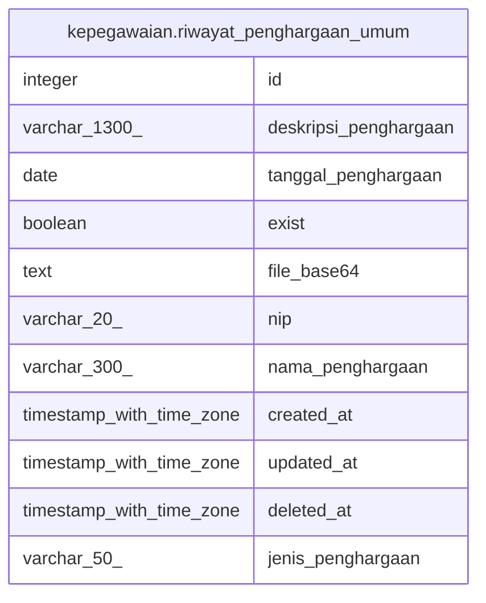

# kepegawaian.riwayat_penghargaan_umum

## Description

Riwayat penghargaan umum pegawai

## Columns

| Name | Type | Default | Nullable | Children | Parents | Comment |
| ---- | ---- | ------- | -------- | -------- | ------- | ------- |
| id | integer | nextval('riwayat_penghargaan_umum_id_seq'::regclass) | false |  |  | ID unik data penghargaan |
| deskripsi_penghargaan | varchar(1300) |  | true |  |  | Deskripsi lengkap penghargaan yang diterima |
| tanggal_penghargaan | date |  | true |  |  | Tanggal penerimaan penghargaan |
| exist | boolean | true | true |  |  | Penanda keberadaan data |
| file_base64 | text |  | true |  |  | Berkas bukti penghargaan dalam format base64 |
| nip | varchar(20) |  | true |  |  | NIP pegawai |
| nama_penghargaan | varchar(300) |  | true |  |  | Nama penghargaan yang diterima |
| created_at | timestamp with time zone | now() | true |  |  | Waktu pembuatan data |
| updated_at | timestamp with time zone | now() | true |  |  | Waktu terakhir pembaruan data |
| deleted_at | timestamp with time zone |  | true |  |  | Waktu penghapusan data |
| jenis_penghargaan | varchar(50) |  | true |  |  |  |

## Constraints

| Name | Type | Definition |
| ---- | ---- | ---------- |
| riwayat_penghargaan_umum_pkey | PRIMARY KEY | PRIMARY KEY (id) |

## Indexes

| Name | Definition |
| ---- | ---------- |
| riwayat_penghargaan_umum_pkey | CREATE UNIQUE INDEX riwayat_penghargaan_umum_pkey ON kepegawaian.riwayat_penghargaan_umum USING btree (id) |

## Relations

---

> Generated by [tbls](https://github.com/k1LoW/tbls)
