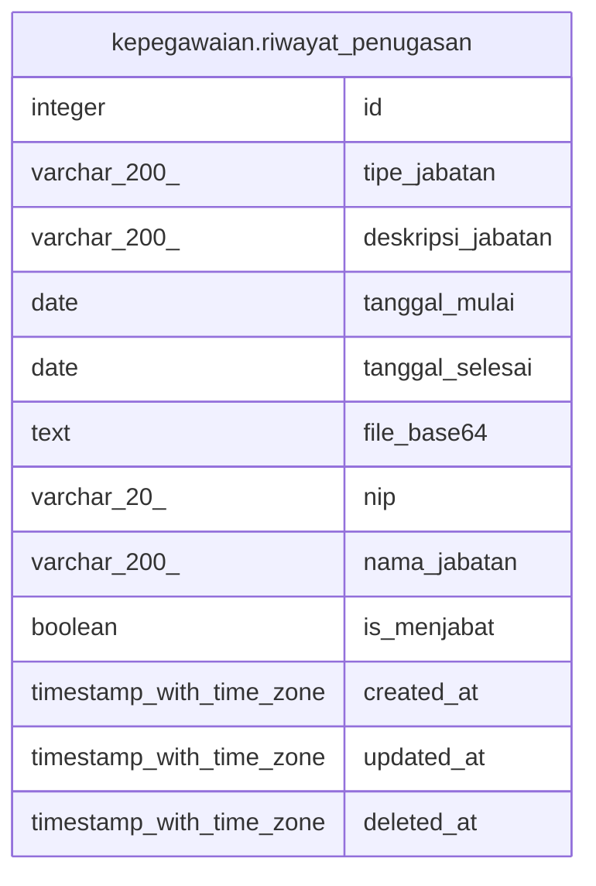

# kepegawaian.riwayat_penugasan

## Description

Riwayat penugasan pegawai

## Columns

| Name | Type | Default | Nullable | Children | Parents | Comment |
| ---- | ---- | ------- | -------- | -------- | ------- | ------- |
| id | integer | nextval('riwayat_penugasan_id_seq'::regclass) | false |  |  | ID unik data penugasan |
| tipe_jabatan | varchar(200) |  | true |  |  | Tipe jabatan |
| deskripsi_jabatan | varchar(200) |  | true |  |  | Deskripsi jabatan |
| tanggal_mulai | date |  | true |  |  | Tanggal mulai penugasan |
| tanggal_selesai | date |  | true |  |  | Tanggal selesai penugasan |
| file_base64 | text |  | true |  |  | Berkas bukti penugasan dalam format base64 |
| nip | varchar(20) |  | true |  |  | NIP pegawai |
| nama_jabatan | varchar(200) |  | true |  |  | Nama jabatan |
| is_menjabat | boolean |  | true |  |  | Penanda apakah pegawai masih menjabat |
| created_at | timestamp with time zone | now() | true |  |  | Waktu perekaman data |
| updated_at | timestamp with time zone | now() | true |  |  | Waktu terakhir pembaruan data |
| deleted_at | timestamp with time zone |  | true |  |  | Waktu penghapusan data |

## Constraints

| Name | Type | Definition |
| ---- | ---- | ---------- |
| riwayat_penugasan_pkey | PRIMARY KEY | PRIMARY KEY (id) |

## Indexes

| Name | Definition |
| ---- | ---------- |
| riwayat_penugasan_pkey | CREATE UNIQUE INDEX riwayat_penugasan_pkey ON kepegawaian.riwayat_penugasan USING btree (id) |

## Relations

---

> Generated by [tbls](https://github.com/k1LoW/tbls)
