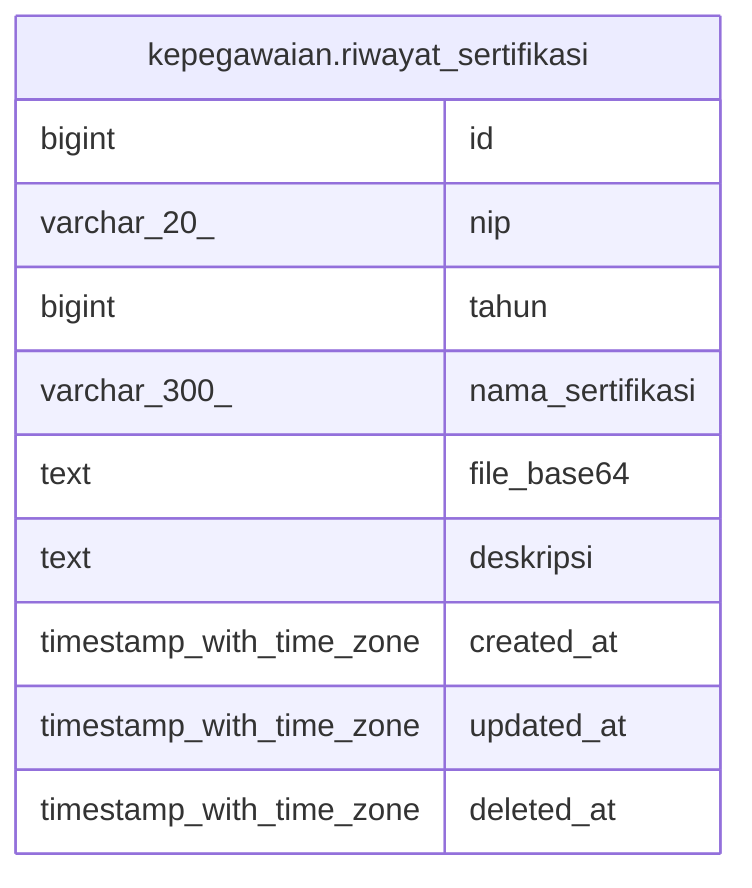

# kepegawaian.riwayat_sertifikasi

## Description

Riwayat sertifikasi pegawai

## Columns

| Name | Type | Default | Nullable | Children | Parents | Comment |
| ---- | ---- | ------- | -------- | -------- | ------- | ------- |
| id | bigint | nextval('riwayat_sertifikasi_id_seq'::regclass) | false |  |  | id unik data sertifikasi |
| nip | varchar(20) |  | true |  |  | NIP pegawai |
| tahun | bigint |  | true |  |  | Tahun sertifikasi |
| nama_sertifikasi | varchar(300) |  | true |  |  | Nama sertifikasi |
| file_base64 | text |  | true |  |  | Berkas bukti sertifikasi dalam format base64 |
| deskripsi | text |  | true |  |  | Deskripsi sertifikasi |
| created_at | timestamp with time zone | now() | true |  |  | Waktu perekaman data |
| updated_at | timestamp with time zone | now() | true |  |  | Waktu terakhir pembaruan data |
| deleted_at | timestamp with time zone |  | true |  |  | Waktu penghapusan data |

## Relations

---

> Generated by [tbls](https://github.com/k1LoW/tbls)
