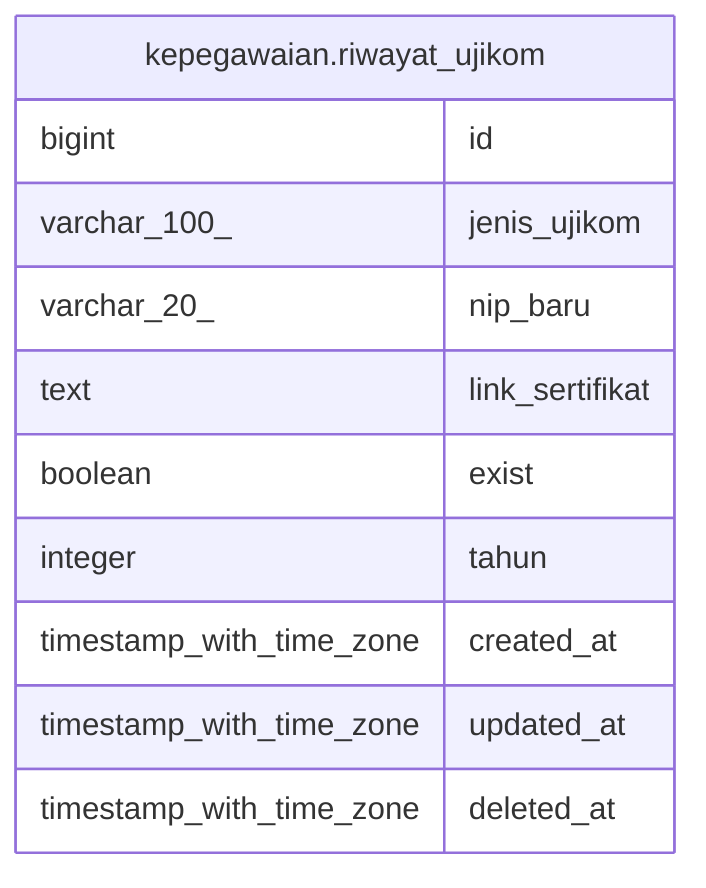

# kepegawaian.riwayat_ujikom

## Description

Riwayat uji kompetensi pegawai

## Columns

| Name | Type | Default | Nullable | Children | Parents | Comment |
| ---- | ---- | ------- | -------- | -------- | ------- | ------- |
| id | bigint | nextval('riwayat_ujikom_id_seq'::regclass) | false |  |  | id unik data uji kompetensi |
| jenis_ujikom | varchar(100) |  | true |  |  | Jenis uji kompetensi |
| nip_baru | varchar(20) |  | true |  |  | NIP pegawai |
| link_sertifikat | text |  | true |  |  | Link sertifikat |
| exist | boolean |  | true |  |  | Status apakah uji kompetensi sudah ada |
| tahun | integer |  | true |  |  | Tahun uji kompetensi |
| created_at | timestamp with time zone | now() | true |  |  | Waktu perekaman data |
| updated_at | timestamp with time zone | now() | true |  |  | Waktu terakhir pembaruan data |
| deleted_at | timestamp with time zone |  | true |  |  | Waktu penghapusan data |

## Constraints

| Name | Type | Definition |
| ---- | ---- | ---------- |
| riwayat_ujikom_id_not_null | n | NOT NULL id |
| riwayat_ujikom_pkey | PRIMARY KEY | PRIMARY KEY (id) |

## Indexes

| Name | Definition |
| ---- | ---------- |
| riwayat_ujikom_pkey | CREATE UNIQUE INDEX riwayat_ujikom_pkey ON kepegawaian.riwayat_ujikom USING btree (id) |

## Relations

---

> Generated by [tbls](https://github.com/k1LoW/tbls)
