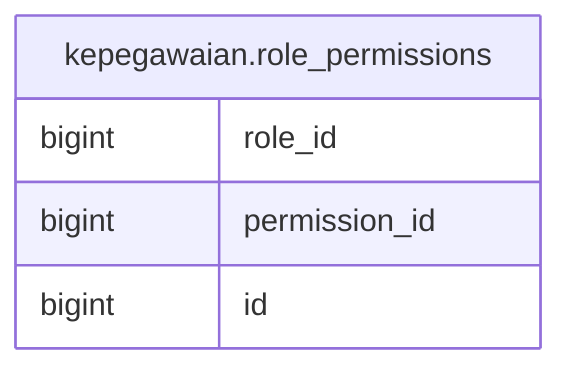

# kepegawaian.role_permissions

## Description

## Columns

| Name | Type | Default | Nullable | Children | Parents | Comment |
| ---- | ---- | ------- | -------- | -------- | ------- | ------- |
| role_id | bigint |  | true |  |  |  |
| permission_id | bigint |  | true |  |  |  |
| id | bigint | nextval('kepegawaian.role_permissions_id_seq'::regclass) | false |  |  |  |

## Constraints

| Name | Type | Definition |
| ---- | ---- | ---------- |
| role_permissions_pkey | PRIMARY KEY | PRIMARY KEY (id) |

## Indexes

| Name | Definition |
| ---- | ---------- |
| role_permissions_pkey | CREATE UNIQUE INDEX role_permissions_pkey ON kepegawaian.role_permissions USING btree (id) |

## Relations

---

> Generated by [tbls](https://github.com/k1LoW/tbls)
