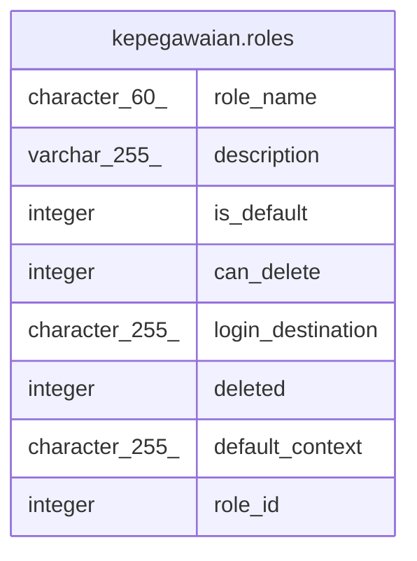

# kepegawaian.roles

## Description

## Columns

| Name | Type | Default | Nullable | Children | Parents | Comment |
| ---- | ---- | ------- | -------- | -------- | ------- | ------- |
| role_name | character(60) |  | false |  |  |  |
| description | varchar(255) | NULL::character varying | true |  |  |  |
| is_default | integer | 0 | false |  |  |  |
| can_delete | integer | 1 | false |  |  |  |
| login_destination | character(255) | '/'::bpchar | false |  |  |  |
| deleted | integer | 0 | false |  |  |  |
| default_context | character(255) | 'content'::bpchar | false |  |  |  |
| role_id | integer | nextval('kepegawaian.roles_role_id_seq'::regclass) | false |  |  |  |

## Constraints

| Name | Type | Definition |
| ---- | ---- | ---------- |
| roles_pkey | PRIMARY KEY | PRIMARY KEY (role_id) |

## Indexes

| Name | Definition |
| ---- | ---------- |
| roles_pkey | CREATE UNIQUE INDEX roles_pkey ON kepegawaian.roles USING btree (role_id) |

## Relations

---

> Generated by [tbls](https://github.com/k1LoW/tbls)
