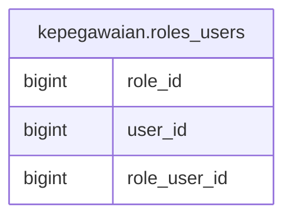

# kepegawaian.roles_users

## Description

## Columns

| Name | Type | Default | Nullable | Children | Parents | Comment |
| ---- | ---- | ------- | -------- | -------- | ------- | ------- |
| role_id | bigint |  | true |  |  |  |
| user_id | bigint |  | true |  |  |  |
| role_user_id | bigint | nextval('kepegawaian.roles_users_role_user_id_seq'::regclass) | false |  |  |  |

## Relations

---

> Generated by [tbls](https://github.com/k1LoW/tbls)
