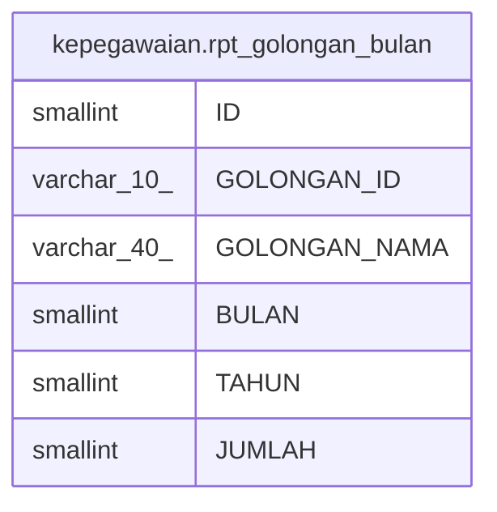

# kepegawaian.rpt_golongan_bulan

## Description

## Columns

| Name | Type | Default | Nullable | Children | Parents | Comment |
| ---- | ---- | ------- | -------- | -------- | ------- | ------- |
| ID | smallint | nextval('kepegawaian."rpt_golongan_bulan_ID_seq"'::regclass) | false |  |  |  |
| GOLONGAN_ID | varchar(10) |  | true |  |  |  |
| GOLONGAN_NAMA | varchar(40) |  | true |  |  |  |
| BULAN | smallint |  | true |  |  |  |
| TAHUN | smallint |  | true |  |  |  |
| JUMLAH | smallint |  | true |  |  |  |

## Constraints

| Name | Type | Definition |
| ---- | ---- | ---------- |
| rpt_golongan_bulan_pkey | PRIMARY KEY | PRIMARY KEY ("ID") |

## Indexes

| Name | Definition |
| ---- | ---------- |
| rpt_golongan_bulan_pkey | CREATE UNIQUE INDEX rpt_golongan_bulan_pkey ON kepegawaian.rpt_golongan_bulan USING btree ("ID") |

## Relations

---

> Generated by [tbls](https://github.com/k1LoW/tbls)
