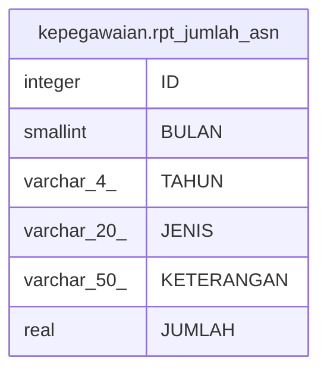

# kepegawaian.rpt_jumlah_asn

## Description

## Columns

| Name | Type | Default | Nullable | Children | Parents | Comment |
| ---- | ---- | ------- | -------- | -------- | ------- | ------- |
| ID | integer | nextval('kepegawaian."rpt_jumlah_asn_ID_seq"'::regclass) | false |  |  |  |
| BULAN | smallint |  | true |  |  |  |
| TAHUN | varchar(4) |  | true |  |  |  |
| JENIS | varchar(20) |  | true |  |  |  |
| KETERANGAN | varchar(50) |  | true |  |  |  |
| JUMLAH | real |  | true |  |  |  |

## Constraints

| Name | Type | Definition |
| ---- | ---- | ---------- |
| rpt_jumlah_asn_pkey | PRIMARY KEY | PRIMARY KEY ("ID") |

## Indexes

| Name | Definition |
| ---- | ---------- |
| rpt_jumlah_asn_pkey | CREATE UNIQUE INDEX rpt_jumlah_asn_pkey ON kepegawaian.rpt_jumlah_asn USING btree ("ID") |

## Relations

---

> Generated by [tbls](https://github.com/k1LoW/tbls)
