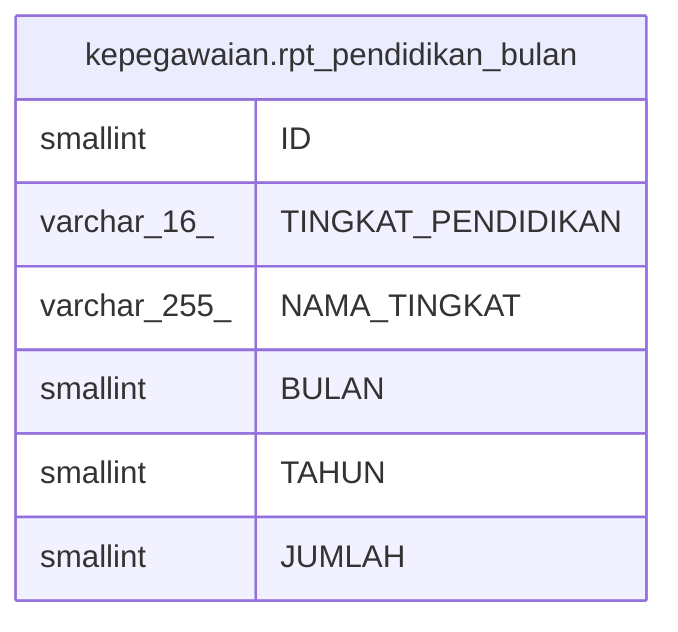

# kepegawaian.rpt_pendidikan_bulan

## Description

## Columns

| Name | Type | Default | Nullable | Children | Parents | Comment |
| ---- | ---- | ------- | -------- | -------- | ------- | ------- |
| ID | smallint | nextval('kepegawaian."rpt_pendidikan_bulan_ID_seq"'::regclass) | false |  |  |  |
| TINGKAT_PENDIDIKAN | varchar(16) |  | true |  |  |  |
| NAMA_TINGKAT | varchar(255) |  | true |  |  |  |
| BULAN | smallint |  | true |  |  |  |
| TAHUN | smallint |  | true |  |  |  |
| JUMLAH | smallint |  | true |  |  |  |

## Constraints

| Name | Type | Definition |
| ---- | ---- | ---------- |
| rpt_pendidikan_bulan_pkey | PRIMARY KEY | PRIMARY KEY ("ID") |

## Indexes

| Name | Definition |
| ---- | ---------- |
| rpt_pendidikan_bulan_pkey | CREATE UNIQUE INDEX rpt_pendidikan_bulan_pkey ON kepegawaian.rpt_pendidikan_bulan USING btree ("ID") |

## Relations

---

> Generated by [tbls](https://github.com/k1LoW/tbls)
