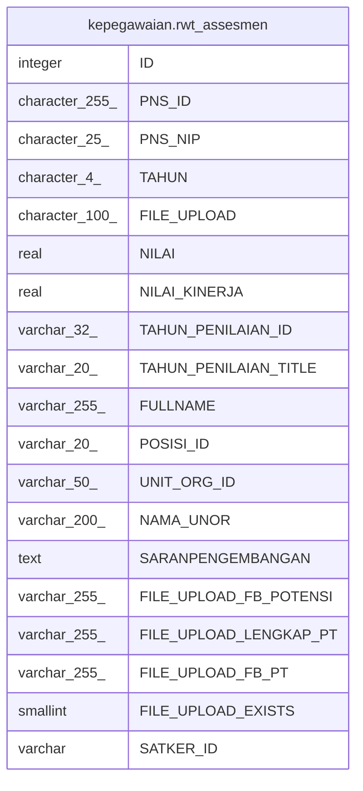

# kepegawaian.rwt_assesmen

## Description

## Columns

| Name | Type | Default | Nullable | Children | Parents | Comment |
| ---- | ---- | ------- | -------- | -------- | ------- | ------- |
| ID | integer | nextval('kepegawaian."rwt_assesmen_ID_seq"'::regclass) | false |  |  |  |
| PNS_ID | character(255) |  | true |  |  |  |
| PNS_NIP | character(25) |  | true |  |  |  |
| TAHUN | character(4) |  | true |  |  | tahun_penilaian_awal |
| FILE_UPLOAD | character(100) |  | true |  |  | file laporan lengkap potensi |
| NILAI | real |  | true |  |  | Nilai Potensi |
| NILAI_KINERJA | real |  | true |  |  |  |
| TAHUN_PENILAIAN_ID | varchar(32) |  | true |  |  |  |
| TAHUN_PENILAIAN_TITLE | varchar(20) |  | false |  |  |  |
| FULLNAME | varchar(255) |  | true |  |  |  |
| POSISI_ID | varchar(20) |  | true |  |  |  |
| UNIT_ORG_ID | varchar(50) |  | true |  |  |  |
| NAMA_UNOR | varchar(200) |  | true |  |  |  |
| SARANPENGEMBANGAN | text |  | true |  |  |  |
| FILE_UPLOAD_FB_POTENSI | varchar(255) |  | true |  |  |  |
| FILE_UPLOAD_LENGKAP_PT | varchar(255) |  | true |  |  |  |
| FILE_UPLOAD_FB_PT | varchar(255) |  | true |  |  |  |
| FILE_UPLOAD_EXISTS | smallint | 0 | true |  |  |  |
| SATKER_ID | varchar |  | true |  |  |  |

## Constraints

| Name | Type | Definition |
| ---- | ---- | ---------- |
| rwt_assesmen_pkey | PRIMARY KEY | PRIMARY KEY ("ID") |

## Indexes

| Name | Definition |
| ---- | ---------- |
| rwt_assesmen_pkey | CREATE UNIQUE INDEX rwt_assesmen_pkey ON kepegawaian.rwt_assesmen USING btree ("ID") |
| rwt_assesmen_nip | CREATE INDEX rwt_assesmen_nip ON kepegawaian.rwt_assesmen USING btree ("PNS_NIP") |
| rwt_assesmen_pns_id | CREATE INDEX rwt_assesmen_pns_id ON kepegawaian.rwt_assesmen USING btree ("PNS_ID") |

## Relations

---

> Generated by [tbls](https://github.com/k1LoW/tbls)
