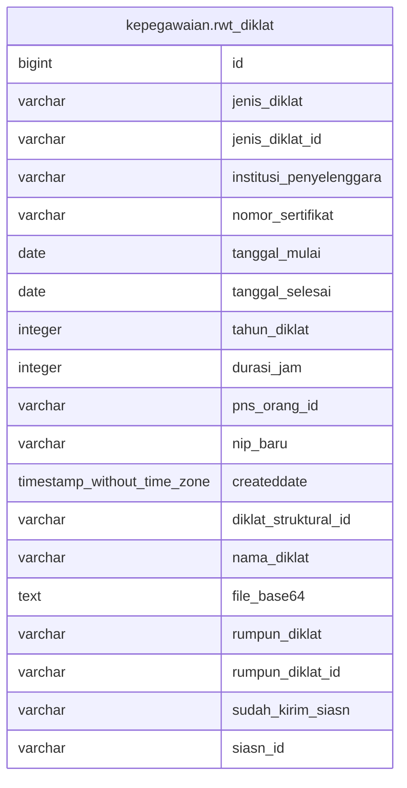

# kepegawaian.rwt_diklat

## Description

## Columns

| Name | Type | Default | Nullable | Children | Parents | Comment |
| ---- | ---- | ------- | -------- | -------- | ------- | ------- |
| id | bigint | nextval('kepegawaian.rwt_diklat_id_seq'::regclass) | false |  |  |  |
| jenis_diklat | varchar |  | true |  |  |  |
| jenis_diklat_id | varchar |  | true |  |  |  |
| institusi_penyelenggara | varchar |  | true |  |  |  |
| nomor_sertifikat | varchar |  | true |  |  |  |
| tanggal_mulai | date |  | true |  |  |  |
| tanggal_selesai | date |  | true |  |  |  |
| tahun_diklat | integer |  | true |  |  |  |
| durasi_jam | integer |  | true |  |  |  |
| pns_orang_id | varchar |  | true |  |  |  |
| nip_baru | varchar |  | true |  |  |  |
| createddate | timestamp without time zone | now() | true |  |  |  |
| diklat_struktural_id | varchar |  | true |  |  |  |
| nama_diklat | varchar |  | true |  |  |  |
| file_base64 | text |  | true |  |  |  |
| rumpun_diklat | varchar |  | true |  |  |  |
| rumpun_diklat_id | varchar |  | true |  |  |  |
| sudah_kirim_siasn | varchar | 'belum'::character varying | true |  |  |  |
| siasn_id | varchar |  | true |  |  |  |

## Constraints

| Name | Type | Definition |
| ---- | ---- | ---------- |
| rwt_diklat_pkey | PRIMARY KEY | PRIMARY KEY (id) |

## Indexes

| Name | Definition |
| ---- | ---------- |
| rwt_diklat_pkey | CREATE UNIQUE INDEX rwt_diklat_pkey ON kepegawaian.rwt_diklat USING btree (id) |

## Relations

---

> Generated by [tbls](https://github.com/k1LoW/tbls)
