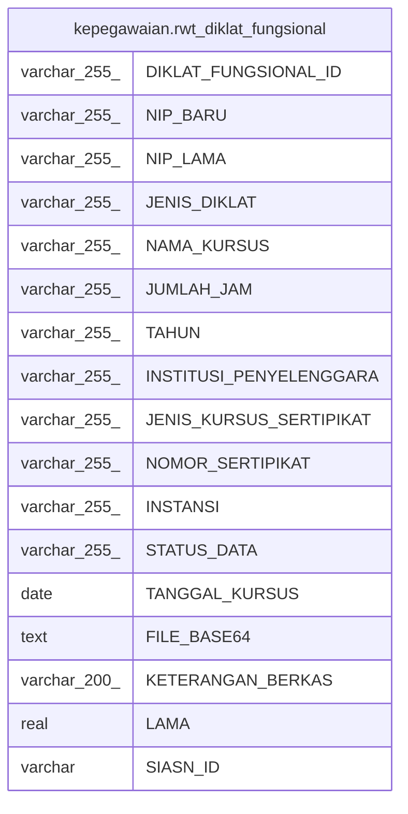

# kepegawaian.rwt_diklat_fungsional

## Description

## Columns

| Name | Type | Default | Nullable | Children | Parents | Comment |
| ---- | ---- | ------- | -------- | -------- | ------- | ------- |
| DIKLAT_FUNGSIONAL_ID | varchar(255) | nextval('kepegawaian."rwt_diklat_fungsional_ID_seq"'::regclass) | false |  |  |  |
| NIP_BARU | varchar(255) |  | true |  |  |  |
| NIP_LAMA | varchar(255) |  | true |  |  |  |
| JENIS_DIKLAT | varchar(255) |  | true |  |  |  |
| NAMA_KURSUS | varchar(255) |  | true |  |  |  |
| JUMLAH_JAM | varchar(255) |  | true |  |  |  |
| TAHUN | varchar(255) |  | true |  |  |  |
| INSTITUSI_PENYELENGGARA | varchar(255) |  | true |  |  |  |
| JENIS_KURSUS_SERTIPIKAT | varchar(255) |  | true |  |  |  |
| NOMOR_SERTIPIKAT | varchar(255) |  | true |  |  |  |
| INSTANSI | varchar(255) |  | true |  |  |  |
| STATUS_DATA | varchar(255) |  | true |  |  |  |
| TANGGAL_KURSUS | date |  | true |  |  |  |
| FILE_BASE64 | text |  | true |  |  |  |
| KETERANGAN_BERKAS | varchar(200) |  | true |  |  |  |
| LAMA | real |  | true |  |  |  |
| SIASN_ID | varchar |  | true |  |  |  |

## Constraints

| Name | Type | Definition |
| ---- | ---- | ---------- |
| rwt_diklat_fungsional_pkey | PRIMARY KEY | PRIMARY KEY ("DIKLAT_FUNGSIONAL_ID") |

## Indexes

| Name | Definition |
| ---- | ---------- |
| rwt_diklat_fungsional_pkey | CREATE UNIQUE INDEX rwt_diklat_fungsional_pkey ON kepegawaian.rwt_diklat_fungsional USING btree ("DIKLAT_FUNGSIONAL_ID") |
| rwt_diklat_fungsional_NIP | CREATE INDEX "rwt_diklat_fungsional_NIP" ON kepegawaian.rwt_diklat_fungsional USING btree ("NIP_BARU") |

## Relations

---

> Generated by [tbls](https://github.com/k1LoW/tbls)
