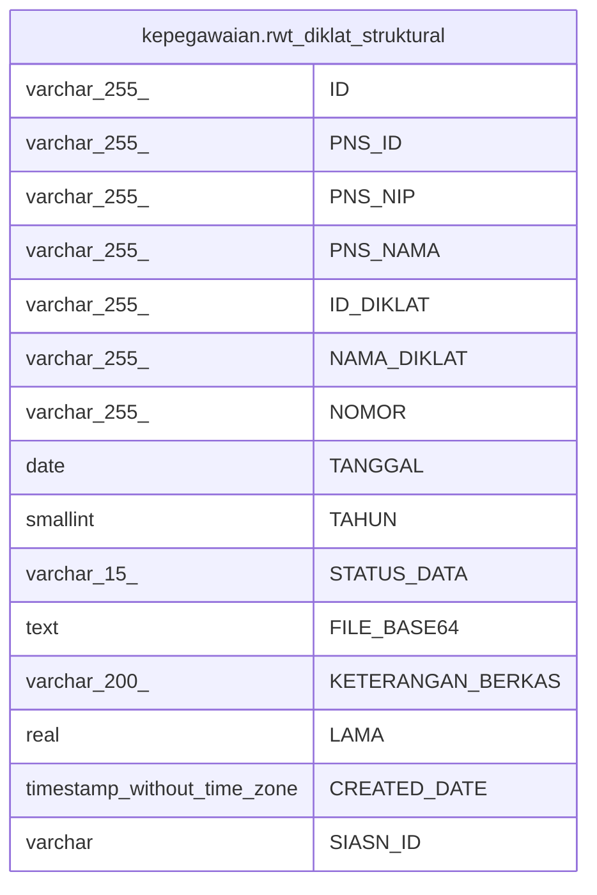

# kepegawaian.rwt_diklat_struktural

## Description

## Columns

| Name | Type | Default | Nullable | Children | Parents | Comment |
| ---- | ---- | ------- | -------- | -------- | ------- | ------- |
| ID | varchar(255) | nextval('kepegawaian."rwt_diklat_ID_seq"'::regclass) | false |  |  |  |
| PNS_ID | varchar(255) |  | true |  |  |  |
| PNS_NIP | varchar(255) |  | true |  |  |  |
| PNS_NAMA | varchar(255) |  | true |  |  |  |
| ID_DIKLAT | varchar(255) |  | true |  |  |  |
| NAMA_DIKLAT | varchar(255) |  | true |  |  |  |
| NOMOR | varchar(255) |  | true |  |  |  |
| TANGGAL | date |  | true |  |  |  |
| TAHUN | smallint |  | true |  |  |  |
| STATUS_DATA | varchar(15) |  | true |  |  |  |
| FILE_BASE64 | text |  | true |  |  |  |
| KETERANGAN_BERKAS | varchar(200) |  | true |  |  |  |
| LAMA | real |  | true |  |  |  |
| CREATED_DATE | timestamp without time zone | now() | true |  |  |  |
| SIASN_ID | varchar |  | true |  |  |  |

## Constraints

| Name | Type | Definition |
| ---- | ---- | ---------- |
| rwt_diklat_struktural_pkey | PRIMARY KEY | PRIMARY KEY ("ID") |

## Indexes

| Name | Definition |
| ---- | ---------- |
| rwt_diklat_struktural_pkey | CREATE UNIQUE INDEX rwt_diklat_struktural_pkey ON kepegawaian.rwt_diklat_struktural USING btree ("ID") |
| rwt_diklat_struktural_NIP | CREATE INDEX "rwt_diklat_struktural_NIP" ON kepegawaian.rwt_diklat_struktural USING btree ("PNS_NIP") |
| rwt_diklat_struktural_pns_id | CREATE INDEX rwt_diklat_struktural_pns_id ON kepegawaian.rwt_diklat_struktural USING btree ("PNS_ID") |

## Relations

---

> Generated by [tbls](https://github.com/k1LoW/tbls)
