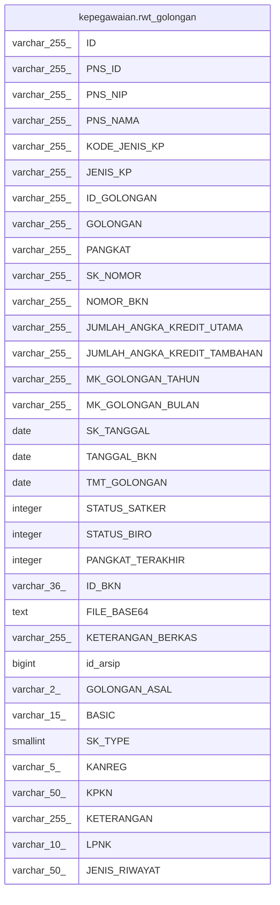

# kepegawaian.rwt_golongan

## Description

## Columns

| Name | Type | Default | Nullable | Children | Parents | Comment |
| ---- | ---- | ------- | -------- | -------- | ------- | ------- |
| ID | varchar(255) | nextval('kepegawaian.rwt_golongan_id_seq'::regclass) | false |  |  |  |
| PNS_ID | varchar(255) |  | true |  |  |  |
| PNS_NIP | varchar(255) |  | true |  |  |  |
| PNS_NAMA | varchar(255) |  | true |  |  |  |
| KODE_JENIS_KP | varchar(255) |  | true |  |  |  |
| JENIS_KP | varchar(255) |  | true |  |  |  |
| ID_GOLONGAN | varchar(255) |  | true |  |  |  |
| GOLONGAN | varchar(255) |  | true |  |  |  |
| PANGKAT | varchar(255) |  | true |  |  |  |
| SK_NOMOR | varchar(255) |  | true |  |  |  |
| NOMOR_BKN | varchar(255) |  | true |  |  |  |
| JUMLAH_ANGKA_KREDIT_UTAMA | varchar(255) |  | true |  |  |  |
| JUMLAH_ANGKA_KREDIT_TAMBAHAN | varchar(255) |  | true |  |  |  |
| MK_GOLONGAN_TAHUN | varchar(255) |  | true |  |  |  |
| MK_GOLONGAN_BULAN | varchar(255) |  | true |  |  |  |
| SK_TANGGAL | date |  | true |  |  |  |
| TANGGAL_BKN | date |  | true |  |  |  |
| TMT_GOLONGAN | date |  | true |  |  |  |
| STATUS_SATKER | integer |  | true |  |  |  |
| STATUS_BIRO | integer |  | true |  |  |  |
| PANGKAT_TERAKHIR | integer |  | true |  |  |  |
| ID_BKN | varchar(36) |  | true |  |  |  |
| FILE_BASE64 | text |  | true |  |  |  |
| KETERANGAN_BERKAS | varchar(255) |  | true |  |  |  |
| id_arsip | bigint |  | true |  |  |  |
| GOLONGAN_ASAL | varchar(2) |  | true |  |  |  |
| BASIC | varchar(15) |  | true |  |  |  |
| SK_TYPE | smallint |  | true |  |  |  |
| KANREG | varchar(5) |  | true |  |  |  |
| KPKN | varchar(50) |  | true |  |  |  |
| KETERANGAN | varchar(255) |  | true |  |  |  |
| LPNK | varchar(10) |  | true |  |  |  |
| JENIS_RIWAYAT | varchar(50) |  | true |  |  |  |

## Constraints

| Name | Type | Definition |
| ---- | ---- | ---------- |
| rwt_golongan_pkey | PRIMARY KEY | PRIMARY KEY ("ID") |

## Indexes

| Name | Definition |
| ---- | ---------- |
| rwt_golongan_pkey | CREATE UNIQUE INDEX rwt_golongan_pkey ON kepegawaian.rwt_golongan USING btree ("ID") |

## Relations

---

> Generated by [tbls](https://github.com/k1LoW/tbls)
